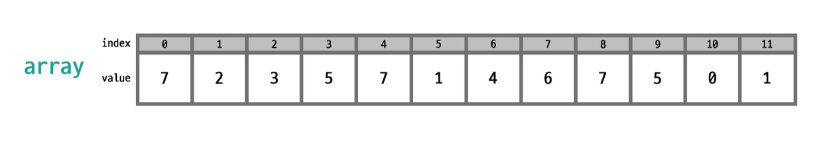
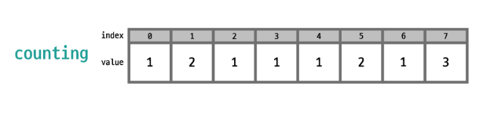
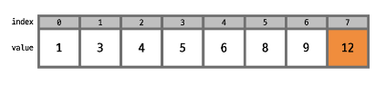
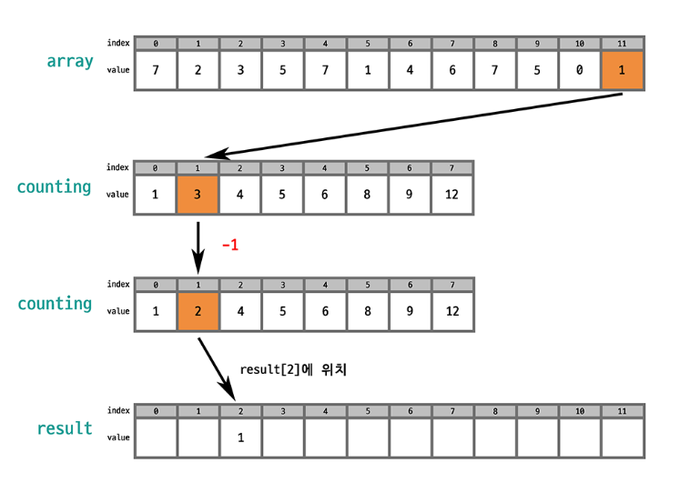
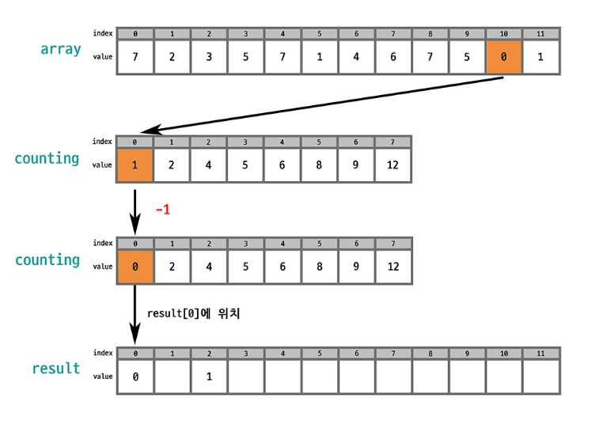
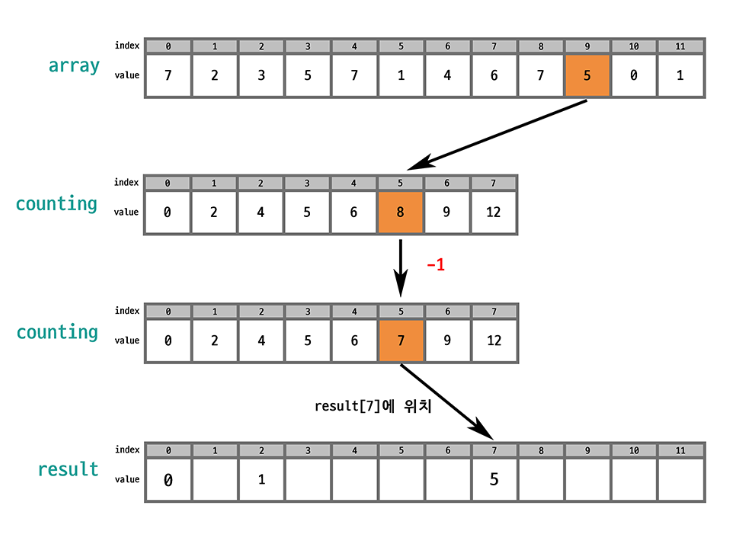

## **계수 정렬(Counting Sort)**

- 계수 정렬은 데이터 값을 직접 비교하지 않고, 단순하게 각 숫자가 몇 개 있는지 개수를 세어 저장한 후에 정렬
- 기존의 정렬 알고리즘들은 위치를 바꾸며 정렬을 했는데, 계수 정렬에서는 크기를 기준으로 개수만 세면 되기 때문에 위치를 변경할 필요가 없다.
- 계수 정렬의 큰 특징은 값 비교가 일어나지 않기 때문에 속도가 빠르다는 것이다.
- 하지만, 개수를 저장하는 배열을 사용해야 하기 때문에 추가 공간이 필요하다.
- 정렬해야 할 수의 범위가 작을 때에만 유리하다.

### 동작과정

1. array를 한 번 순회하면서 각 값이 나올 때마다 해당 값을 index 로 하는 새로운 배열(counting)의 값을 1 증가시킨다.

1. counting 배열의 각 값을 누적합으로 변환시킨다.

**→ counting 배열의 각 값은 (시작점 - 1)을 알려준다는 것**이다. 즉, **각 값이 시작하는 위치(뒷쪽부터)**를 알려준다는 것이다.

1. counting 배열의 값을 하나씩 줄이면서(숫자 개수만큼) 결과 배열에 배치

### 시간복잡도 : O(N+K)

- K = 배열 내 최댓값
- K가 커질수록 무한대에 가까워져 성능이 떨어진다.
    - 입력값의 범위가 작을 때 높은 효율을 보인다.

최댓값이 주어지지 않은 경우, 전체 배열을 탐색해야 하므로 O(n), Counting Array에 개수를 카운팅하는 과정에서 O(n)이 소요된다. 이후 결과 배열에 값을 입력하여 정렬된 배열을 얻는 과정에도 O(n)이 소요되어 최종적으로 O(n)의 시간복잡도를 가지며, 정렬 시간은 K에 종속된다

---

## stable sort

[[알고리즘 개념] Stable Sort &Inplace](https://velog.io/@cookncoding/알고리즘-개념-Stable-Sort-Inplace)

[[알고리즘] stable sort 와 unstable sort](https://hyo-ue4study.tistory.com/421)