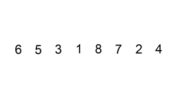

## 삽입정렬 Insertion Sort
값을 삽입하면서 이미 삽입한 값들과 비교해서 정렬해가면서 

전체 n개의 수에서 두번째 인덱스부터 그 전 인덱스와 값을 비교한다.

값이 작다면 swap하는 과정을 더 이상 값이 작지 않을 때까지 반복한다.

<br/>

### 시간 복잡도
**최악** = 평균 : 1 + 2 + 3 + ... + n-1 = **O(n^2)**
-> Big-O notation 최악 기준으로 표기

**최고** : 1 + 1 + ... + 1 = **O(n)**


무조건 위치를 변경하는 선택정렬과 시간 복잡도가 같지만, 필요할 때에 삽입한다는 점에서 연산수가 적어지므로 효율적

> 이미 정렬되어 있는 데이터가 많다면 빠른 알고리즘

<br/>

### 공간 복잡도
index N개의 배열만 있으면 되므로 **O(n)**

<br/>

### 그림으로 이해하기



<br/>

### Code
```java
int n = 10;
int[] arr = {7, 5, 9, 0, 3, 1, 6, 2, 4, 8};

for (int i = 1; i < n; i++) {
    // 인덱스 i부터 1까지 감소하며 반복하는 문법
    for (int j = i; j > 0; j--) {
        // 한 칸씩 왼쪽으로 이동
        if (arr[j] < arr[j - 1]) {
            // 스와프(Swap)
            int temp = arr[j];
            arr[j] = arr[j - 1];
            arr[j - 1] = temp;
        }
        // 자기보다 작은 데이터를 만나면 그 위치에서 멈춤
        else break;
    }
}

for(int i = 0; i < n; i++) {
    System.out.print(arr[i] + " ");
}
```