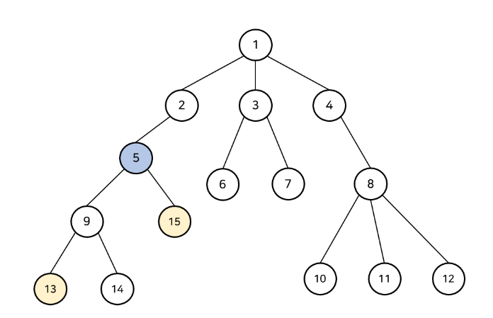

### 최소 공통 조상 : Lowest Common Ancestor

→ 트리 구조에서 임의의 두 정점이 갖는 가장 가까운 조상 정점



예시 ) 13, 15의 최소 공통 조상은 5

### 선형 탐색으로 구하기 : O(Depth)

두 포인터를 두고 가리키는 정점이 같아질 때까지 부모 노드로 거슬러 올라가기

x = Parent[x] 반복

**하지만 두 정점의 깊이가 다르다면 문제가 발생한다.**

13 → 9 → 5

15 → 5 → 2

동시에 올라가기 전에 두 정점의 깊이를 맞추고 선형 탐색을 해야 한다.

```json
[depth : 정점]
0 : 1
1 : 2,3,4
2 : 5,6,7,8
.
.
.
```

```json
int[] parent = { 0, 1, 1, 1, 2, 3, 3, 4 ... }
```

```json
while ( true ) {
	if(depth 가 일치 )
		if( 두 정점의 parent 일치? ) LCA 찾음 (종료)
		else 두 정점을 자신의 parent 정점 값으로 변경
	else (depth 불일치)
		더 depth가 깊은 정점을 해당 정점의 parent 정점으로
}
```

### LCA를 이분 탐색으로 구하기 : O(log(Depth))


Parent 배열을 2차원으로 두어,

**Parent[x][k] = “x번 정점의 2^k 번째 조상 노드의 번호”** 로 둔다.


DFS를 통해 Root 부터 트리를 구성한다면, 낮은 깊이의 노드를 반드시 먼저 탐색하므로 다음식이 성립한다.

<aside>
💡 Parent[x][k] = Parent[Parent[x][k-1]][k-1]

</aside>

Parent[13][2] = Parent[Parent[13][1]][1] = Parent[5][1]

부모 노드로 거슬러가는 과정을 2의 제곱수만큼 한 번에 건너뛸 수 있다.

<aside>
💡 [백준 11438 번 LCA 2](https://www.acmicpc.net/problem/11438)

</aside>

같은 깊이를 찾으러 가는 과정에서 해당 방식을 이용하여 같은 깊이나 더 높은 노드까지 2^k 번째 조상 노드를 찾아 올라간 후

두 노드의 깊이가 같아질 때까지 내려준다.

[출처 : https://4legs-study.tistory.com/121 ]
