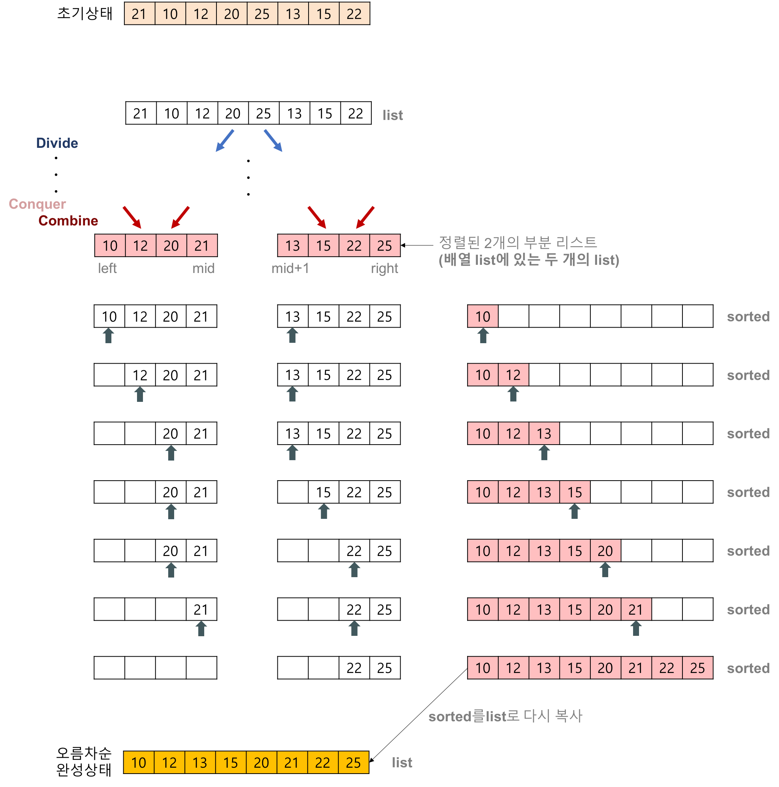

## 합병정렬

### 동작과정

1. 리스트의 길이가 0 또는 1이면 이미 정렬된 것으로 본다. 그렇지 않은 경우에는
2. 정렬되지 않은 리스트를 절반으로 잘라 비슷한 크기의 두 부분 리스트로 나눈다.
3. 각 부분 리스트를 재귀적으로 합병 정렬을 이용해 정렬한다.
4. 두 부분 리스트를 다시 하나의 정렬된 리스트로 합병한다.




1. 2개의 리스트의 값들을 처음부터 하나씩 비교하여 두 개의 리스트의 값 중에서 더 작은 값을 새로운 리스트(sorted)로 옮긴다.
2. 둘 중에서 하나가 끝날 때까지 이 과정을 되풀이한다.
3. 만약 둘 중에서 하나의 리스트가 먼저 끝나게 되면 나머지 리스트의 값들을 전부 새로운 리스트(sorted)로 복사한다.
4. 새로운 리스트(sorted)를 원래의 리스트(list)로 옮긴다.

### 합병 정렬(merge sort) 알고리즘의 특징

- 단점
    - 만약 레코드를 배열(Array)로 구성하면, 임시 배열이 필요하다.
    - 제자리 정렬(in-place sorting)이 아니다.
    - 레코드들의 크기가 큰 경우에는 이동 횟수가 많으므로 매우 큰 시간적 낭비를 초래한다.
- 장점
    - 안정적인 정렬 방법
    - 데이터의 분포에 영향을 덜 받는다. 즉, 입력 데이터가 무엇이든 간에 정렬되는 시간은 동일하다. (O(nlog₂n)로 동일)
    - 만약 레코드를 연결 리스트(Linked List)로 구성하면, 링크 인덱스만 변경되므로 데이터의 이동은 무시할 수 있을 정도로 작아진다.
        - 제자리 정렬(in-place sorting)로 구현할 수 있다.
    - 따라서 크기가 큰 레코드를 정렬할 경우에 연결 리스트를 사용한다면, 합병 정렬은 퀵 정렬을 포함한 다른 어떤 졍렬 방법보다 효율적이다.

### 합병 정렬(merge sort)의 시간복잡도


- 코드
    
    ```c
    // C program for Merge Sort
    #include <stdio.h>
    #include <stdlib.h>
    
    // Merges two subarrays of arr[].
    // First subarray is arr[l..m]
    // Second subarray is arr[m+1..r]
    void merge(int arr[], int l, int m, int r)
    {
        int i, j, k;
        int n1 = m - l + 1;
        int n2 = r - m;
    
        // Create temp arrays
        int L[n1], R[n2];
    
        // Copy data to temp arrays L[] and R[]
        for (i = 0; i < n1; i++)
            L[i] = arr[l + i];
        for (j = 0; j < n2; j++)
            R[j] = arr[m + 1 + j];
    
        // Merge the temp arrays back into arr[l..r
        i = 0;
        j = 0;
        k = l;
        while (i < n1 && j < n2) {
            if (L[i] <= R[j]) {
                arr[k] = L[i];
                i++;
            }
            else {
                arr[k] = R[j];
                j++;
            }
            k++;
        }
    
        // Copy the remaining elements of L[],
        // if there are any
        while (i < n1) {
            arr[k] = L[i];
            i++;
            k++;
        }
    
        // Copy the remaining elements of R[],
        // if there are any
        while (j < n2) {
            arr[k] = R[j];
            j++;
            k++;
        }
    }
    
    // l is for left index and r is right index of the
    // sub-array of arr to be sorted
    void mergeSort(int arr[], int l, int r)
    {
        if (l < r) {
            int m = l + (r - l) / 2;
    
            // Sort first and second halves
            mergeSort(arr, l, m);
            mergeSort(arr, m + 1, r);
    
            merge(arr, l, m, r);
        }
    }
    
    // Function to print an array
    void printArray(int A[], int size)
    {
        int i;
        for (i = 0; i < size; i++)
            printf("%d ", A[i]);
        printf("\n");
    }
    
    // Driver code
    int main()
    {
        int arr[] = { 12, 11, 13, 5, 6, 7 };
        int arr_size = sizeof(arr) / sizeof(arr[0]);
    
        printf("Given array is \n");
        printArray(arr, arr_size);
    
        mergeSort(arr, 0, arr_size - 1);
    
        printf("\nSorted array is \n");
        printArray(arr, arr_size);
        return 0;
    }
    
    ```