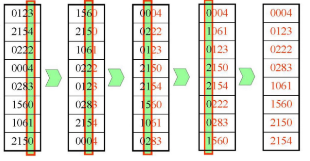

## **Radix Sort ( 기수 정렬 )**

1. **비교 기반 정렬이 아님**: 기수 정렬은 숫자의 자릿수를 이용하여 데이터를 분류하고 정렬하는 방식이다. 이를 통해 선형 시간 복잡도.
2. **안정 정렬**: 기수 정렬은 같은 값의 원소들이 정렬 과정에서 상대적인 순서가 유지되는 안정 정렬 알고리즘이다.
3. **대량 데이터 처리에 적합**: 기수 정렬은 선형 시간 복잡도를 가지므로, 대량의 데이터를 처리할 때 효율적입니다. 하지만 최대 자릿수에 따라 성능이 영향을 받음.
4. **추가 메모리 사용**: 기수 정렬은 버킷을 사용하여 데이터를 분류하고 정렬하는 과정에서 추가 메모리를 사용. 
5. **정수 및 문자열에 적합**: 기수 정렬은 정수와 문자열과 같이 자릿수를 기반으로 분류할 수 있는 데이터 유형에 적합합니다. 반면 실수, 사용자 정의 객체 등의 데이터 유형에는 적용하기 어렵다.

### 동작과정



### 장점

- **선형 시간 복잡도**: 기수 정렬은 O(nk)의 시간 복잡도를 가집니다. 여기서 n은 데이터의 개수이고 k는 최대 자릿수입니다. 비교 기반 정렬 알고리즘보다 빠른 성능을 보입니다.
- **안정성**: 같은 값의 원소들이 정렬 과정에서 상대적인 순서가 유지됩니다.

### 단점

- **제한된 데이터 유형**: 기수 정렬은 정수, 문자열 등의 비교가 아닌 데이터 유형에만 적용 가능합니다. 실수, 사용자 정의 객체 등의 데이터 유형에는 적용하기 어렵습니다.
- **추가 메모리 사용**: 버킷에 데이터를 저장하기 위해 추가 메모리가 필요합니다.

### 시간복잡도

기수 정렬은 데이터의 개수가 N이고 데이터의 최대 자릿수를 K라고 했을 때 N * K번의 연산을 하게 되고 **O(N)**의 시간 복잡도를 갖는다. 보통 기수 정렬은 계수 정렬에 비해 동작이 느리지만 처리할 수 있는 정수의 크기는 더 크다. 또한 기수 정렬의 탐색 과정을 보면 알 수 있듯이 최악, 최선의 경우가 존재하지 않아 항상 빠르고 안정된 성능을 보여준다. 

- 코드
    
    ```c
    void countSort(int arr[], int n, int exp) {
    	int buffer[n];
        int i, count[10] = {0};
        
        // exp의 자릿수에 해당하는 count 증가
        for (i = 0; i < n; i++){
            count[(arr[i] / exp) % 10]++;
        }
        // 누적합 구하기
        for (i = 1; i < 10; i++) {
            count[i] += count[i - 1];
        }
        // 일반적인 Counting sort 과정
        for (i = n - 1; i >= 0; i--) {
            buffer[count[(arr[i]/exp) % 10] - 1] = arr[i];
            count[(arr[i] / exp) % 10]--;
        }
        for (i = 0; i < n; i++){
            arr[i] = buffer[i];
        }
    }
    
    void radixsort(int arr[], int n) {
         // 최댓값 자리만큼 돌기
        int m = getMax(arr, n);
        
        // 최댓값을 나눴을 때, 0이 나오면 모든 숫자가 exp의 아래
        for (int exp = 1; m / exp > 0; exp *= 10) {
            countSort(arr, n, exp);
        }
    }
    int main() {
        int arr[] = {170, 45, 75, 90, 802, 24, 2, 66};
        int n = sizeof(arr) / sizeof(arr[0]);			// 좋은 습관
        radixsort(arr, n);
        
        for (int i = 0; i < n; i++){
            cout << arr[i] << " ";
        }
        return 0;
    }
    ```
    

### 질문

Q1) 왜 낮은 자리수부터 정렬을 합니까?

MSD (Most-Significant-Digit) 과 LSD (Least-Significant-Digit)을 비교하라는 질문

MSD는 가장 큰 자리수부터 Counting sort 하는 것을 의미하고, LSD는 가장 낮은 자리수부터 Counting sort 하는 것을 의미함. (즉, 둘 다 할 수 있음)

- LSD의 경우 1600000 과 1을 비교할 때, Digit의 갯수만큼 따져야하는 단점이 있음. 그에 반해 MSD는 마지막 자리수까지 확인해 볼 필요가 없음.
- LSD는 중간에 정렬 결과를 알 수 없음. (예) 10004와 70002의 비교) 반면, MSD는 중간에 중요한 숫자를 알 수 있음. 따라서 시간을 줄일 수 있음. 그러나, 정렬이 되었는지 확인하는 과정이 필요하고, 이 때문에 메모리를 더 사용
- LSD는 알고리즘이 일관됨 (Branch Free algorithm) 그러나 MSD는 일관되지 못함. --> 따라서 Radix sort는 주로 LSD를 언급함.
- LSD는 자릿수가 정해진 경우 좀 더 빠를 수 있음.