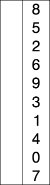

## 선택정렬 Selection Sort
전체 n개의 수에서 min/max 값을 찾아 첫 번째 인덱스에 넣고, 그 다음 n-1개의 수에서 min/max 값을 찾아서 두 번째 인덱스에 넣고 이 과정을 반복한다.

마지막 2개의 숫자를 탐색하면 정렬이 완료된다. min/max에 따라서 최소/최대 선택 정렬이라고 한다.

### 시간 복잡도
최고 = 최악 = 평균 : n + n-1 + n-2 + ... + 2 = **O(n^2)**

### 공간 복잡도
index N개의 배열만 있으면 되므로 **O(n)**

<br/>



<br/>

### Code
```java
public int[] solution(int[] arr) {
    if (arr == null) return null;
    int[] result = arr;
    int maxPos;

    for (int i = 0; i < result.length - 1; i++) {
        maxPos = i;
        for (int k = i + 1; k < result.length; k++) {
            if (result[maxPos] > result[k]) {
                maxPos = k;
            }
        }
        result = Utils.swapValue(result, i, maxPos);
    }
    return result;
}
```