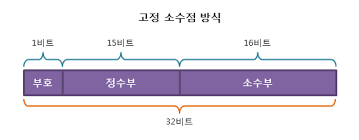
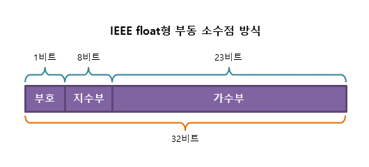

# 고정 소수점

- 소수점의 위치를 고정하여 숫자를 표현하는 방식
- 고정된 소수점 위치에 따라 정수부와 소수부가 나뉨.

### 장점
1. 간단한 연산: 덧셈, 뺄셈, 곱셈 등의 연산이 정수 연산과 유사하여 속도가 빠르고 구현이 간단함.
2. 일정한 정밀도: 소수점 위치가 고정되어 있어 항상 일정한 정밀도를 유지함.

### 단점
1. 범위 제한: 소수점 위치가 고정되어 있어 표현할 수 있는 숫자의 범위가 제한됨.
2. 정밀도 제한: 소수점 이하의 자릿수가 고정되어 있어 작은 수나 큰 수의 정밀도에 한계가 있음.

### 사용 예
1. 임베디드 시스템: 고정 소수점은 임베디드 시스템에서 많이 사용됨. 간단한 하드웨어 구현과 빠른 연산 속도가 요구되는 곳에서 유리함.
2. 디지털 신호 처리: 신호 처리에서 일정한 정밀도가 필요할 때 사용됨.

# 부동 소수점
- 소수점의 위치가 숫자에 따라 변하는 방식
- 매우 큰 숫자와 매우 작은 숫자를 표현할 수 있어 과학 계산, 그래픽, 엔지니어링 등에서 많이 사용됨.

### 구성 요소 
1. 부호 비트(Sign Bit): 숫자의 양수/음수를 나타냄.
2. 지수(Exponent): 소수점 위치를 나타내기 위해 사용되며, 특정 기준값(bias)에서 오프셋된 값으로 저장됨.
3. 가수(Mantissa or Significand): 실제 숫자를 나타내는 유효숫자 부분.

### 표현 방식
- 부동 소수점은 IEEE 754 표준에 따라 표현됨.
1. 단정도(32비트): 1비트 부호, 8비트 지수, 23비트 가수
2. 배정도(64비트): 1비트 부호, 11비트 지수, 52비트 가수

### 장점
1. 넓은 범위: 매우 큰 수와 작은 수를 모두 표현할 수 있어 다양한 계산에 적합함.
2. 정밀도 조절: 지수와 가수의 비율을 조정하여 정밀도와 범위를 유연하게 조절할 수 있음.

### 단점
1. 복잡한 연산: 연산이 복잡하고 시간이 많이 걸릴 수 있음.
2. 정밀도 문제: 유효숫자의 제한으로 인해 작은 수의 정밀도가 떨어질 수 있고, 이는 반올림 오류 등을 초래할 수 있음.

### 사용 예
1. 과학 계산: 매우 큰 수와 작은 수를 정확하게 계산해야 하는 분야에서 많이 사용됨.
2. 컴퓨터 그래픽스: 그래픽 렌더링에서 정밀한 계산이 요구되는 경우 사용됨.
3. 금융 계산: 복잡한 금융 모델링에서 부동 소수점을 사용하여 정확한 계산을 수행함.

### 부동 소수점의 예제
IEEE 754 단정도(32비트) 부동 소수점 형식에서 10진수 42.5를 표현하는 방법:
1. 부호 비트(Sign Bit): 0 (양수)
2. 101010.1(2) = 1.010101(2) × 2^5
3. 지수(Exponent): 10000100(2) (10진수로 132 -> bias 127 + 5)
4. 가수(Mantissa): 01010100000000000000000(2)
=> 0100 0010 0010 1010 0000 0000 0000 0000(2)

### 면접 질문
- **실수에서 오차가 생기는 원인은 무엇인가?**  
컴퓨터의 메모리는 한정되어 있어 실수 전체를 다 담을 수 없습니다.   
그렇기에, 표현할 수 있는 실수의 최대값과 최소값을 정해두고, 표현 가능한 값을 미리 지정하여 근사값으로 표현하게 되므로 오차가 발생하게 됩니다.

- **실수의 표현법(고정소수법, 부동소수법)을 설명해주세요.**  
고정 소수법의 경우 소수점의 위치를 고정하여 숫자를 표현하는 방식으로 구현이 편리하고 연산이 빠르다는 장점이 있지만   
수의 범위가 제한적이고 정밀도가 비교적 떨어진다는 단점이 있습니다.
부동 소수법의 경우 소수점의 위치를 숫자에 따라 변화시켜 고정 소수법에 비해 구현이 어렵고 연산이 느리지만
수의 범위가 훨씬 넓고 비교적으로 정밀도가 높다는 장점이 있습니다.

- **bias를 따로 두는 이유가 무엇인가요?**   
지수 부분에서 부호 없는 수 표현을 통해 실수 연산을 편리하게 할 수 있게 하기 위해 사용합니다.
