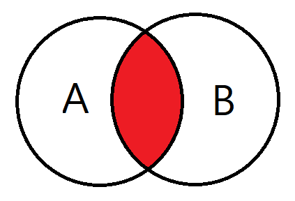
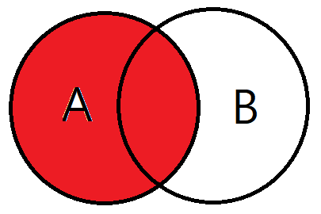
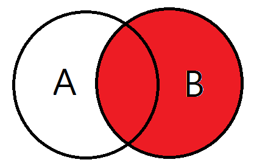
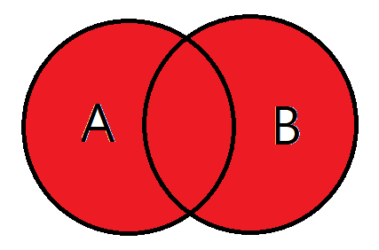
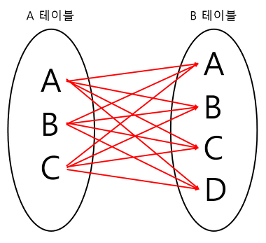
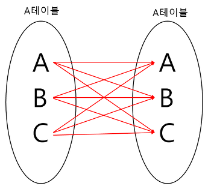

# Join

- 두 개 이상의 테이블이나 데이터베이스를 연결하여 데이터를 검색하는 방법

### INNER JOIN
- 두 테이블 간의 공통된 값을 가진 행만 결합

### LEFT OUTER JOIN
- 왼쪽 테이블의 모든 행과 오른쪽 테이블의 조인 조건을 만족하는 행들을 결합

### RIGHT OUTER JOIN
- 오른쪽 테이블의 모든 행과 왼쪽 테이블의 조인 조건을 만족하는 행들을 결합

### FULL OUTER JOIN
- 왼쪽 테이블과 오른쪽 테이블의 모든 행을 결합. 조인 조건을 만족하지 않는 행은 NULL로 채워짐.

### CROSS JOIN
- 두 테이블의 모든 행을 조합하여 결과 집합을 만듦. 조인 조건이 없기 때문에 두 테이블의 행 수의 곱만큼 결과가 나옴.

### SELF JOIN
- 동일한 테이블을 두 번 조인하는 방식. 테이블 간의 관계를 동일한 테이블 내에서 찾는 경우에 사용.

### Join 사용 시 주의사항
- 인덱스 사용 : 적절한 인덱스를 사용하여 성능을 최적화할 수 있음.
- 조인 조건 명확화  조인 조건을 명확히 하여 예상치 못한 결과를 방지해야 함.
- NULL 처리: LEFT JOIN, RIGHT JOIN, FULL JOIN에서는 NULL 값을 처리하는 로직을 추가해야 할 수도 있음.
- 테이블 및 열 이름 충돌 방지: 별칭을 사용하여 테이블과 열 이름의 충돌을 방지.

### 면접 질문
- **JOIN이란?**  
두 개 이상의 테이블이나 데이터베이스를 연결하여 데이터를 검색하는 방법입니다. 자신이 검색하고 싶은 컬럼이 다른 테이블에 있을경우 주로 사용하며 여러개의 테이블을 마치 하나의 테이블인 것처럼 활용하는 방법입니다.   
보통 Primary key혹은 Foreign key로 두 테이블을 연결합니다

 