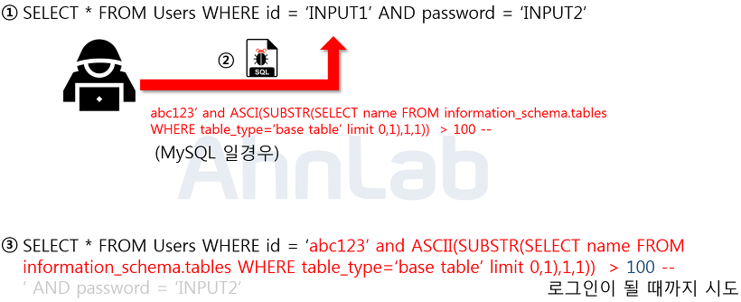
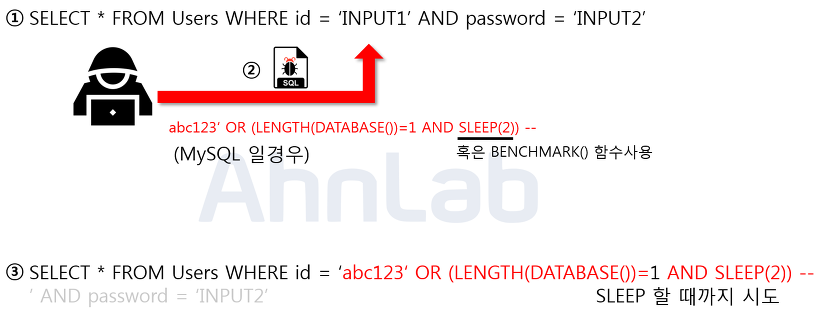

# **SQL Injection**

코드 인젝션의 방법으로, 클라이언트의 입력값을 조작하여 데이터베이스를 공격하는 방식

예를 들어  **GET 방식으로 동작하는 URL 쿼리 스트링을 추가하여 에러를 발생**

## 공격방식

### 1. Error based SQL Injection

- 논리적 에러를 이용한 방법, 가장 많이 쓰는 방법
- `OR 1=1` : 참으로 만든다. (원래는 id, password로 User find 해야함)
- `-` : 뒤에 오는 구문을 주석처리 한다 = password 검증을 못 하게 된다.
- Users 테이블에 있는 모든 데이터 조회

### 2. Union based SQL Injection

- Union 명령어를 이용한 SQL Injection, Union 하는 두 테이블의 컬럼수가 같아야하고 데이터 타입이 같야 한다.

### **3. Blind SQL Injection - Boolean based SQL**

- DB로 부터 특정한 값이나 데이터를 전달받지 않고, 참과 거짓의 정보만 알 수 있을때 까지 시도

### 4. Blind SQL Injection - Time based SQL

- 3번과 마찬가지로 서버로부터 특정한 응답대신 참,거짓의 응답을 통해 DB유출
  - SLEEP 함수 같은 시간 관련 함수를 사용하여 조작구문이 참이면 동작 거짓이면 미동작

### 5. **Stored Procedure SQL Injection**

- 일련의 쿼리를 마치 하나의 함수처럼 실행하기 위한 쿼리의 집합

### 6. Mass SQL Injection

- 다량의 SQL Injection 공격(DDOS)
- 보통 DB의 값을 변조시켜 DB에 악성스크립트를 삽입해서, 사용자가 변조된 사이트에 접속하면 좀비PC로 감염

## 방어방법

### 1. 입력 값에 대한 검증

- 서버 단에서 화이트리스트 기반으로 SQL Injection에 사용되는 기법, 키워드인지 아닌지 확인한다.
- 로그인 전, 검증 로직을 추가하여 미리 설정한 특수문자들이 들어왔을 때 요청을 막아낸다.

### 2. **Error Message 노출 금지**

- DB에러 발생시 처리를 하지 않았으면 에러가 발생한 쿼리문 + 에러관련내용을 반환한다.
  - 이 과정에서 테이블명, 컬럼명, 쿼리문이 유출될수 있다.

### 3. **Prepared Statement 사용**

- Prepared Statement를 사용하면 사용자의 입력값이 SQL의 파라미터로 들어가기전 DBMS가 미리 컴파일하여 실행하지 않고 대기
  → 입력 값만을 문자열로 인식하여 공격쿼리가 실행된다 해도 의도대로 작동하지 않는다
