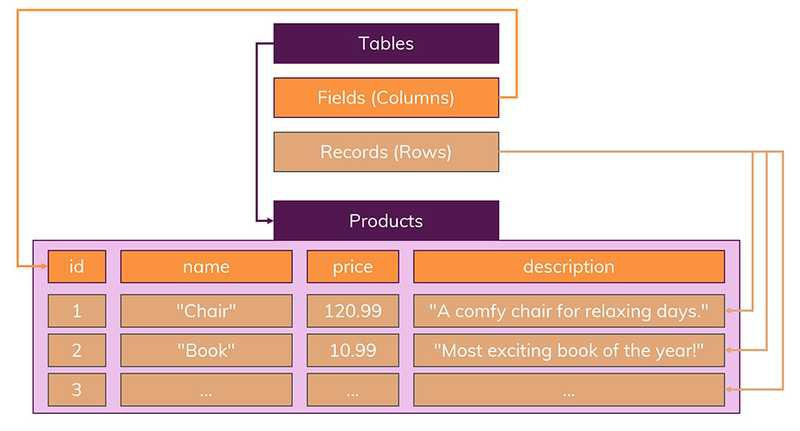
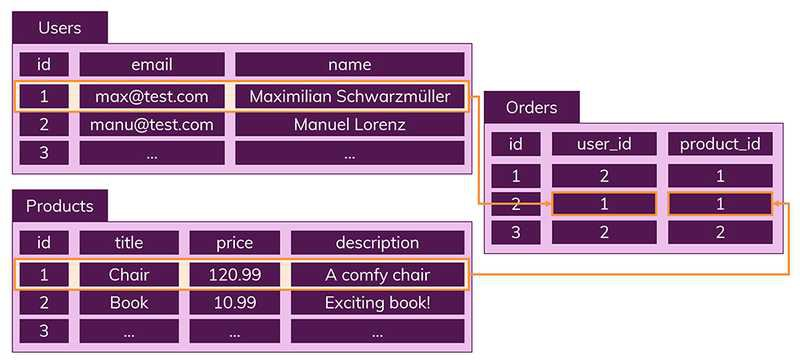
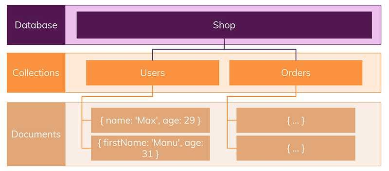
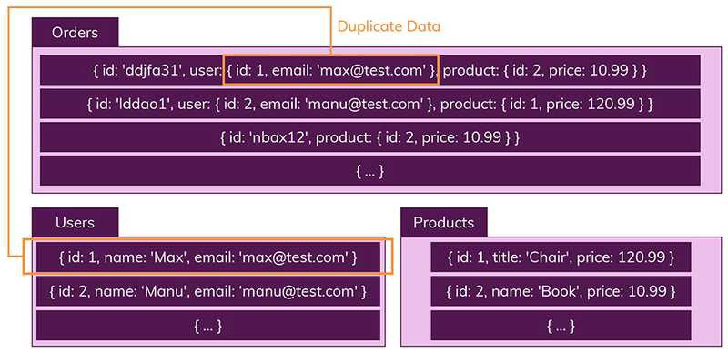
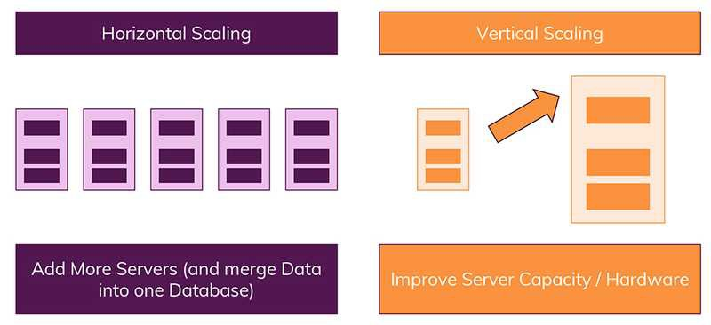

# SQL VS NOSQL

## SQL(관계형 DB)

- 정의
  - Structured Query Language(구조화된 쿼리 언어)
  - DB자체를 나타내는것이 아니라, 특정 유형의 DB와 상호작용하는데 사용하는 쿼리
- 기능
  - RDBMS에서 데이터 CRUD
- 특징
  - 데이터는 정해진 데이터 스키마에 따라 테이블에 저장
  - 데이터는 관계에 따라 여러 테이블에 분산

### 1. 엄격한 스키마

- 데이터는 테이블에 레코드로 저장되면 각 테이블은 명확하게 정의된 구조가 있다
- 관계형 DB에서는 스키마를 준수하지 않는 레코드는 추가할 수 없다



### 2. 관계

- 데이터들을 여러개의 테이블로 나눠서 데이터들의 중복을 피할수 있다.
- 하나의 테이블에서 중복없이 하나의 데이터만 관리하기 때문에, 다른 테이블에서 부정확한 데이터를 다룰 위험이 없어지는 장점이 있다



## NOSQL(비관계형 데이터베이스)

- 정의
  - 스키마도 없도 관계도 없다
  - 관계형 DB반대
- 특징
  - 레코드를 documents(문서)
  - 테이블을 collection(컬랙션)
  - 다른 구조의 데이터를 같은 컬랙션에 추가할 수 있다
  
  - 문서를 JSON과 비슷한 형태
  - 데이터 구조에대해 신경쓸 필요가 없다.
  
- 장점
  - 여러 컬랙션에 조인할 필요 없이 이미 필요한 모든 데이터를 갖춘 문서를 작성하게 된다
- 단점
  - 데이터가 중복되기 때문에 불안정
  - (하나의 데이터를 중복되는 데이터를 모두 수정)

## Scaling(확장)

데이터베이스 서버의 확장은 두가지로 나뉨

### **Horizontal(수평적) 확장**

- 더 많은 서버가 추가되고, DB가 전체적으로 분산
  - 따라서 하나의 DB에서 작동하지만 여러 호스트에서 작동
  - Sharding(샤딩)의 개념을 알고 있는 NoSQL 데이터베이스는 수평적 확장을 지원할 수 있다
    ```jsx
    Sharding
    - 하나의 거대한 데이터베이스나 네트워크 시스템을
    - 여러 개의 작은 조각으로 나누어 분산 저장하여 관리하는 것을 말한다.
    ```

### **Vertical(수직적) 확장**

- 단순히 데이터베이스 서버의 성능을 향상시키는것
  - 데이터 저장 방식으로 인해 SQL 데이터베이스는 일반적으로 수직적 확장만 지원
    

## SQL VS NOSQL

### SQL 장점

- 명확하게 정의된 스키마, 데이터 무결성 보장
- 관계는 각 데이터의 중복없이 한번만 저장

### SQL 단점

- 덜 유연함, 데이터 스키마를 사전에 계획하고 알려야함(수정하기 어렵다)
- 관계를 맺고 있어서 join시 복잡한 쿼리가 실행될수 있다
- 일반적으로 수직적 확장만 가능

### NOSQL장점

- 스키마가 없어 유연함
- 데이터는 앱이 필요로하는 형식으로 저장됨. 데이터를 읽어오는 속도 빨라짐
- 수직 및 수평적 확장 가능

### NOSQL단점

- 유연성으로 인해 데이터 구조 결정을 미룰수 있다
- 데이터 중복을 계쏙 업데이트 해야한다

### SQL DB 사용이 더 좋을때

- 관계를 맺고 있는 데이터가 자주 변경될때 (NOSQL에서는 모두 변경해야한다)
- 변경될 여지가 없고 명확한 스키마가 사용자와 데이터에 중요한 경우

### NOSQL DB 사용이 더 좋을때

- 정확한 데이터 구조를 알수 없거나 변경 / 확장 될 수 있는 경우
- 읽기를 자주 하지만 데이터 변경은 자주 없는 경우
- 데이터를 수평적으로 확장해야 하는 경우(막대한 양의 데이터를 다뤄야하는 경우)
