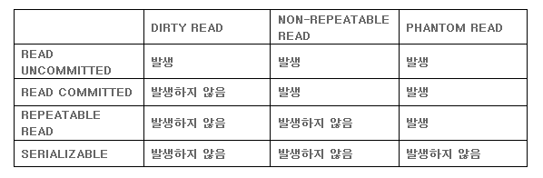
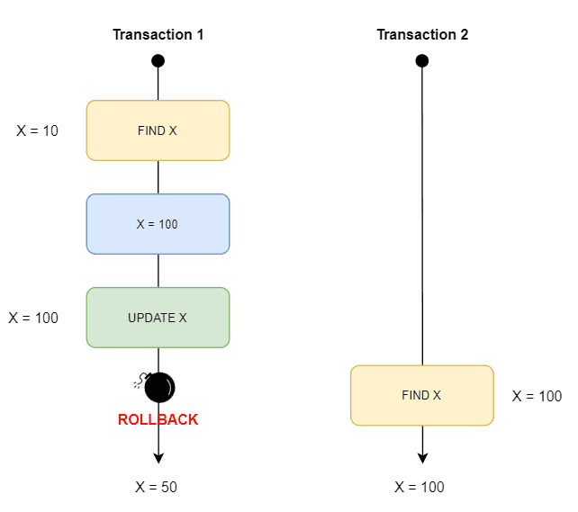
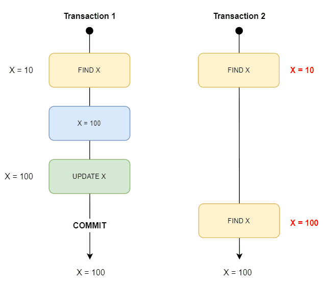
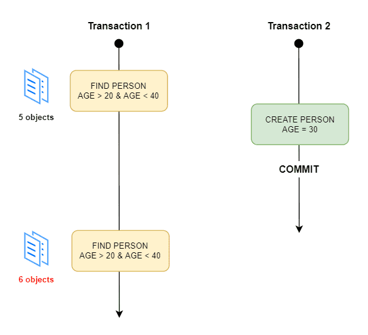

## 트랜잭션(Transaction)
데이터베이스와 어플리케이션의 데이터 거래(transaction)에 있어서 안정성을 확보하기 위한 방법으로 **한 번에 수행되어야 할 연산 모음** or DB를 변경시키는 작업의 단위

## 트랜잭션 격리 수준(Transaction Isolation Level)
### Isolation Level
트랜잭션에서 일관성 없는 데이터를 허용하도록 하는 수준
> 트랜잭션 끼리 얼마나 서로 고립되어 있는지를 나타내는 수준<br> → 한 트랜잭션이 다른 트랜잭션이 변경한 데이터에 대한 접근 강도를 의미

### 왜 필요한가?
트랜잭션은 기본적으로 ACID를 따른다. 따라서 트랜잭션이 DB를 다루는 동안 다른 트랜잭션이 관여하지 못하도록 Locking을 통해 막는 것이 필요하다. 

하지만 무조건적인 Locking으로 트랜잭션들을 순서대로 처리하는 방식으로 구현하게 되면 DB의 성능이 떨어지고, 반대로 성능을 높이기 위해 Locking 범위를 줄이면 잘못된 값이 처리될 위험성이 증가한다.

따라서 최대한 적절한 수준의 효율적인 Locking 방식이 필요하다.

### 종류
레벨이 높아질수록 트랜잭션 사이의 고립정도가 높아지며, DB 성능저하 야기



일반적인 온라인 서비스에서는 ```READ COMMITTED``` 나 ```REPEATABLE READ``` 중 하나를 사용

**1. Read Uncommitted (Level 0)**


**트랜잭션 처리 중이거나 아직 commit 되지 않은 데이터를 다른 트랜잭션이 읽는 것을 허용**
    
- 어떤 트랜잭션의 내용이 **커밋(Commit)이나 롤백(Rollback)과 상관없이** 다른 트랜잭션에서 조회가 가능한 것
- 사실상 정합성의 문제가 많은 격리 수준으로 RDBMS 표준에서는 **격리 수준으로 인정하지 않는다.**
- SELECT 문이 수행되는 동안 해당 데이터에 Shared Lock이 걸리지 않는다.
- 데이터 **일관성** 유지 불가능 → ***Dirty Read*** 발생
    > 💡 **Dirty Read**?<br>아직 커밋(Commit)되지 않은 다른 트랜잭션의 데이터를 읽는 것<br>Read Uncommitted에서 발생

<br>

**2. Read Committed (Level 1)**


**commit이 이루어진 트랜잭션만 조회 가능하며 트랜잭션이 수행되는 동안은 접근 불가능**

- 한 트랜잭션의 변경내용이 **커밋(Commit)되어야만** 다른 트랜잭션에서 조회가 가능한 것
- 대부분의 RDBMS가 **기본적**으로 사용하는 **격리수준**
- SELECT 문이 수행되는 동안 해당 데이터에 Shared Lock이 걸린다. 조회 시에는 실제 테이블 값이 아닌 **Undo 영역에 백업된 레코드 값을 가져옴**
- 하나의 트랜잭션에서 똑같은 SELECT 쿼리 실행 시 항상 같은 결과를 가져와야하는 **REPEATABLE READ 정합성**이 어긋나게 된다. → ***Non-repeatable Read*** 발생
    > 💡 **Non-repeatable Read**?<br>다른 트랜잭션이 커밋(Commit)한 데이터를 읽을 수 있는 것.<br>즉, 한 트랜잭션에서 같은 쿼리로 2번이상 조회했을 때 그 결과가 다른 것<br>값의 수정이나 삭제에 의해 발생<br>Read Uncommitted, Read Committed에서 발생

<br>

**3. Repeatable Read (Level 2)**
    

**트랜잭션이 시작되기 전 커밋된 내용에 대해서만 조회가 가능**

- 트랜잭션이 완료될 때까지 SELECT 문장이 사용하는 모든 데이터에 Shared Lock이 걸린다.
- 트랜잭션 범위 내에서 조회한 데이터의 내용은 항상 동일함을 보장한다. → **Non-repeatable read가 발생하지 않는다.** 즉, 데이터의 **일관성 보장**
- 다른 사용자는 트랜잭션 영역에 해당되는 데이터에 대한 **수정 불가능**
- 트랜잭션의 실행시간이 길어질수록 멀티버전을 관리해야하는 단점
- **Mysql**에서 기본적으로 사용하는 격리수준
- ***Phantom Read***가 발생할 수 있다.
    > 💡 **Phantom Read**?<br>한 트랜잭션에서 같은 쿼리를 2번이상 조회했을 때 없던 결과가 조회되는 것<br>값의 삽입에 의해 발생<br>Read Uncommitted, Read Committed, Repeatable Read에서 발생

<br>

**4. Serializable (Level 3)**

**가장 단순하면서 엄격한 격리 수준으로 성능 측면에서는 동시 처리 성능이 가장 낮다.**
- 완벽한 읽기 일관성 모드를 제공한다.
- 다른 사용자는 트랜잭션 영역에 해당되는 데이터에 대한 **수정 및 입력 불가능**
- Phantom read가 발생하지 않는다.
- 트랜잭션들이 동시에 일어나지 않고, 순차적으로 실행되는 것처럼 동작한다.
- 거의 사용하지 않는다.

<br>

### 결론
동시성과 데이터 무결성과 관련하여 격리수준의 조정이 필요하다.
- 동시성 증가 → 데이터 무결성 문제 발생 가능성 증가
- 데이터 무결성 유지 → 동시성 감소

또한, 레벨을 높게 조정할수록 발생하는 비용이 증가한다.

<br>


### 요약


<br>


출처: https://akasai.space/db/about_isolation/