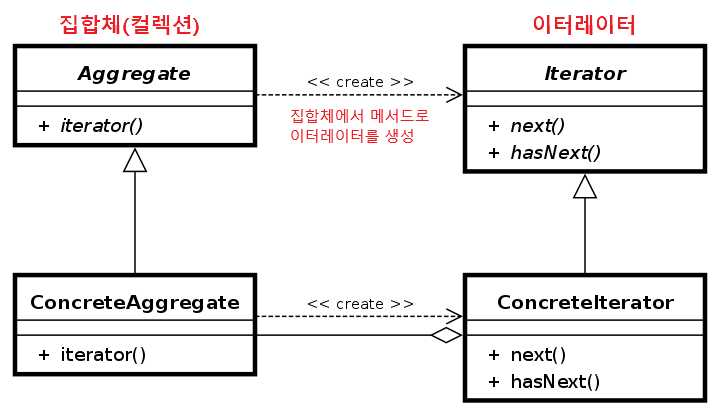

# Iterator Pattern (반복자 패턴)

반복자(Iterator) 패턴은 일련의 데이터 집합에 대하여 순차적인 접근(순회)을 지원하는 패턴이다.

(**데이터 집합**이란 객체들을 그룹으로 묶어 자료의 구조를 취하는 컬렉션을 말한다. 대표적인 컬렉션으로 한번쯤은 들어본 리스트나 트리, 그래프, 테이블 등이 있다.)

### 사용 이유 ❓

보통 배열이나 리스트 같은 경우 순서가 연속적인 데이터 집합이기 때문에 간단한 for문을 통해 순회할수 있다. 그러나 해시, 트리와 같은 컬렉션은 데이터 저장 순서가 정해지지 않고 적재되기 때문에, 각 요소들을 어떤 기준으로 접근해야 할지 애매해진다.

이처럼 복잡하게 얽혀있는 자료 컬렉션들을 순회하는 알고리즘 전략을 정의하는 것을 이터레이터 패턴이라고 한다.
컬렉션 객체 안에 들어있는 모든 원소들에 대한 접근 방식이 공통화 되어 있다면 어떤 종류의 컬렉션에서도 이터레이터만 뽑아내면 여러 전략으로 순회가 가능해 보다 다형(多形) 적인 코드를 설계할 수 있게 된다.

💡자바의 컬렉션 프레임워크(JCF)에서 각종 컬렉션을 무리없이 순회할수 있는 것도 내부에 미리 이터레이터 패턴이 적용되어 있기 때문이다.

- 컬렉션에 상관없이 객체 접근 순회 방식을 통일하고자 할 때
- 컬렉션을 순회하는 다양한 방법을 지원하고 싶을 때
- 컬렉션의 복잡한 내부 구조를 클라이언트로 부터 숨기고 싶은 경우 (편의 + 보안)
- 데이터 저장 컬렉션 종류가 변경 가능성이 있을 때

## 이터레이터 패턴 구조



- Aggregate (인터페이스) : ConcreateIterator 객체를 반환하는 인터페이스를 제공한다.  
  iterator() : ConcreateIterator 객체를 만드는 팩토리 메서드

- ConcreateAggregate (클래스) : 여러 요소들이 이루어져 있는 데이터 집합체

- Iterator (인터페이스) : 집합체 내의 요소들을 순서대로 검색하기 위한 인터페이스를 제공한다.
  hasNext() : 순회할 다음 요소가 있는지 확인 (true / false)
  next() : 요소를 반환하고 다음 요소를 반환할 준비를 하기 위해 커서를 이동시킴

- ConcreateIterator (클래스) : 반복자 객체
  ConcreateAggregate가 구현한 메서드로부터 생성되며, ConcreateAggregate 의 컬렉션을 참조하여 순회한다.
  어떤 전략으로 순회할지에 대한 로직을 구체화 한다.

## 이터레이터 패턴 코드

```
// 집합체 객체 (컬렉션)
interface Aggregate {
    Iterator iterator();
}

class ConcreteAggregate implements Aggregate {
    Object[] arr; // 데이터 집합 (컬렉션)
    int index = 0;

    public ConcreteAggregate(int size) {
        this.arr = new Object[size];
    }

    public void add(Object o) {
        if(index < arr.length) {
            arr[index] = o;
            index++;
        }
    }

    // 내부 컬렉션을 인자로 넣어 이터레이터 구현체를 클라이언트에 반환
    @Override
    public Iterator iterator() {
        return new ConcreteIterator(arr);
    }
}
```

```
// 반복체 객체
interface Iterator {
    boolean hasNext();
    Object next();
}

class ConcreteIterator implements Iterator {
    Object[] arr;
    private int nextIndex = 0; // 커서 (for문의 i 변수 역할)

    // 생성자로 순회할 컬렉션을 받아 필드에 참조 시킴
    public ConcreteIterator(Object[] arr) {
        this.arr = arr;
    }

    // 순회할 다음 요소가 있는지 true / false
    @Override
    public boolean hasNext() {
        return nextIndex < arr.length;
    }

    // 다음 요소를 반환하고 커서를 증가시켜 다음 요소를 바라보도록 한다.
    @Override
    public Object next() {
        return arr[nextIndex++];
    }
}
```

```
public static void main(String[] args) {
    // 1. 집합체 생성
    ConcreteAggregate aggregate = new ConcreteAggregate(5);
    aggregate.add(1);
    aggregate.add(2);
    aggregate.add(3);
    aggregate.add(4);
    aggregate.add(5);

    // 2. 집합체에서 이터레이터 객체 반환
    Iterator iter = aggregate.iterator();

    // 3. 이터레이터 내부 커서를 통해 순회
    while(iter.hasNext()) {
        System.out.printf("%s → ", iter.next());
    }
}
```

<출력>  
1 → 2 → 3 → 4 → 5 →

## 패턴 장점

- 일관된 이터레이터 인터페이스를 사용해 여러 형태의 컬렉션에 대해 동일한 순회 방법을 제공한다.
- 컬렉션의 내부 구조 및 순회 방식을 알지 않아도 된다.
- 집합체의 구현과 접근하는 처리 부분을 반복자 객체로 분리해 결합도를 줄 일 수 있다.
  - Client에서 iterator로 접근하기 때문에 ConcreteAggregate 내에 수정 사항이 생겨도 iterator에 문제가 없다면 문제가 발생하지 않는다.
- 순회 알고리즘을 별도의 반복자 객체에 추출하여 각 클래스의 책임을 분리하여 단일 책임 원칙(SRP)를 준수한다.
- 데이터 저장 컬렉션 종류가 변경되어도 클라이언트 구현 코드는 손상되지 않아 수정에는 닫혀 있어 개방 폐쇄 원칙(OCP)를 준수한다.

## 패턴 단점

- 클래스가 늘어나고 코드 복잡도가 증가한다.
- 구현 방법에 따라 캡슐화를 위배할 수 있다.

💡 java.util.Iterator, Spring Framework의 CompositeIterator등이 이터레이터 패턴이다.

<br>

# 면접 질문 ! 📜

### 1. 반복자 패턴 (이터레이터 패턴) 에 대해 설명해주세요.

이터레이터 패턴은 행동 디자인 패턴 중 하나로서, 컬렉션 내의 요소들을 순차적으로 접근하는 표준 방법을 제공합니다. 이 패턴의 주요 목적은 컬렉션의 구현과 그 요소들을 순회하는 방법을 분리함으로써, 컬렉션의 복잡한 내부 구조에 대한 의존성을 줄이고 클라이언트 코드가 다양한 컬렉션 타입에 투명하게 작동할 수 있게 하는 것입니다.

장점으로는 다양한 컬렉션 타입에 대해 일관된 인터페이스를 제공하여, 클라이언트 코드가 컬렉션의 종류에 무관하게 동작할 수 있습니다. 또한 컬렉션의 내부 구조를 숨기며, 이터레이터를 통해서만 요소에 접근하게 함으로써 데이터 구조와 비즈니스 로직 사이의 결합도를 낮춥니다.
그리고 순회 알고리즘을 별도의 반복자 객체에 추출하여 각 클래스의 책임을 분리하여 단일 책임 원칙(SRP)를 준수하며
데이터 저장 컬렉션 종류가 변경되어도 클라이언트 구현 코드는 손상되지 않아 수정에는 닫혀 있어 개방 폐쇄 원칙(OCP)를 준수한다.

단점으로는 이터레이터 패턴을 사용하면 관련 클래스와 인터페이스가 늘어나서 시스템의 복잡도가 증가할 수 있습니다.
그리고 간단한 컬렉션에서 이터레이터를 사용하는 것이 오버헤드를 일으킬 수 있으며, 성능 저하 요인이 될 수 있습니다.
