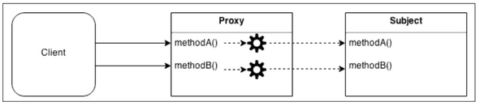
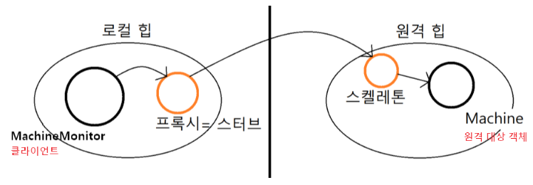

# Proxy Pattern

대상으로 하는 원 본 객체를 대리하여 **대신 처리**하게 함으로써 로직의 흐름을 제어하는 행동 패턴



- 클라이언트가 대상 객체에 접근하기전 프록시 객체의 메서드를 접근 후 추가적인 로직을 처리한 뒤 접근

## 왜 사용할까❓

- 접근을 제어하거나 기능을 추가하고 싶지만, 기존의 특정 객체를 수정할 수 없는 상황일 때
- 초기화 지연, 접근 제어, 로깅, 캐싱 등 기존 객체 동작에 수정 없이 추가하고 싶을 때

## 프록시 패턴 종류

### 기본 패턴

```
interface ISubject {
    void action();
}

class RealSubject implements ISubject {
    public void action() {
        System.out.println("원본 객체 액션 !!");
    }
}
```

```
class Proxy implements ISubject {
    private RealSubject subject; // 대상 객체를 composition

    Proxy(RealSubject subject) {
        this.subject = subject;
    }

    public void action() {
        subject.action(); // 위임
        /* do something */
        System.out.println("프록시 객체 액션 !!");
    }
}

class Client {
    public static void main(String[] args) {
        ISubject sub = new Proxy(new RealSubject());
        sub.action();
    }
}
```

<출력 화면>  
원본 객체 액션 !!  
프록시 객체 액션 !!

---

### 가상 프록시

- 지연 초기화 방식
- 가끔 쓰이지만 항상 메모리에 적재되어 있는 무거운 서비스 객체가 있는 경우
- 실제 객체의 생성에 많은 자원이 소모되지만 사용 빈도는 낮을 때 사용한다.
- 서비스가 시작될 때 객체를 생성하는 대신 객체 초기화가 실제로 필요할 때 초기화 될 수 있도록 지연한다.

예시) 사용자에게 고해상도의 이미지를 불러와 보여주는 이미지 뷰어 프로그램을 만드는 경우

#### 가상 프록시 패턴 적용 전

```
class HighResolutionImage {
    String img;

    HighResolutionImage(String path) {
        loadImage(path);
    }

    private void loadImage(String path) {
        // 이미지를 디스크에서 불러와 메모리에 적재 (작업 자체가 무겁고 많은 자원을 필요로함)
        try {
            Thread.sleep(1000);
            img = path;
        } catch (InterruptedException e) {
            e.printStackTrace();
        }
        System.out.printf("%s에 있는 이미지 로딩 완료\n", path);
    }

    @Override
    public void showImage() {
        // 이미지를 화면에 렌더링
        System.out.printf("%s 이미지 출력\n", img);
    }
}
```

```
class ImageViewer {
    public static void main(String[] args) {
        HighResolutionImage highResolutionImage1 = new HighResolutionImage("./img/고해상도이미지_1");
        HighResolutionImage highResolutionImage2 = new HighResolutionImage("./img/고해상도이미지_2");
        HighResolutionImage highResolutionImage3 = new HighResolutionImage("./img/고해상도이미지_3");

        highResolutionImage2.showImage();
    }
}
```

<출력>  
./img/고해상도이미지\_1에 있는 이미지 로딩 완료  
./img/고해상도이미지\_2에 있는 이미지 로딩 완료  
./img/고해상도이미지\_3에 있는 이미지 로딩 완료

./img/고해상도이미지\_2 이미지 출력

-> 모든 이미지를 로딩 후 이미지를 출력하게 되므로 시간이 오래 걸린다. 사용자가 이미지를 출력하고 싶을 때 이미지를 메모리에 적재하는 방식으로 가상 프록시 패턴을 구현하면?

```
// 대상 객체와 프록시 객체를 묶는 인터페이스 (다형성)
interface IImage {
    void showImage(); // 이미지를 렌더링하기 위해 구현체가 구현해야 하는 추상메소드
}
```

```
// 대상 객체 (RealSubject)
class HighResolutionImage implements IImage {
    String img;

    HighResolutionImage(String path) {
        loadImage(path);
    }

    private void loadImage(String path) {
        // 이미지를 디스크에서 불러와 메모리에 적재 (작업 자체가 무겁고 많은 자원을 필요로함)
        try {
            Thread.sleep(1000);
            img = path;
        } catch (InterruptedException e) {
            e.printStackTrace();
        }
        System.out.printf("%s에 있는 이미지 로딩 완료\n", path);
    }

    @Override
    public void showImage() {
        // 이미지를 화면에 렌더링
        System.out.printf("%s 이미지 출력\n", img);
    }
}
```

```
// 프록시 객체 (Proxy)
class ImageProxy implements IImage {
    private IImage proxyImage;
    private String path;

    ImageProxy(String path) {
        this.path = path;
    }

    @Override
    public void showImage() {
        // 고해상도 이미지 로딩하기
        proxyImage = new HighResolutionImage(path);
        proxyImage.showImage();
    }
}
```

```
class ImageViewer {
    public static void main(String[] args) {
        IImage highResolutionImage1 = new ImageProxy("./img/고해상도이미지_1");
        IImage highResolutionImage2 = new ImageProxy("./img/고해상도이미지_2");
        IImage highResolutionImage3 = new ImageProxy("./img/고해상도이미지_3");

        highResolutionImage2.showImage();
    }
}
```

<출력>  
./img/고해상도이미지\_2에 있는 이미지 로딩 완료

./img/고해상도이미지\_2 이미지 출력

-> 프록시 객체 내에서 경로 데이터를 지니고 있다가 사용자가 showImage를 호출하면 그때서야 대상 객체를 로드(lazyload)하여, 이미지를 메모리에 적재하고 대상 객체의 showIMage() 메서드를 위임 호출함으로써, 실제 메소드를 호출하는 시점에 메모리 적재가 이루어지기 때문에 불필요한 자원낭비가 발생하지 않게 되었다.

### 보호 프록시

- 프록시가 대상 객체에 대한 자원으로의 액세스 제어 ( 접근 권한 )
- 프록시 객체를 통해 클라이언트의 자격 증명이 기준과 일치하는 경우에만 서비스 객체에 요청을 전달할 수 있게 한다.

```
class Proxy implements ISubject {
    private RealSubject subject; // 대상 객체를 composition
    boolean access; // 접근 권한

    Proxy(RealSubject subject, boolean access) {
        this.subject = subject;
        this.access = access;
    }

    public void action() {
        if(access) {
            subject.action(); // 위임
            /* do something */
            System.out.println("프록시 객체 액션 !!");
        }
    }
}

class Client {
    public static void main(String[] args) {
        ISubject sub = new Proxy(new RealSubject(), false);
        sub.action();
    }
}
```

### 로깅 프록시

- 대상 객체에 대한 로깅을 추가하려는 경우
- 프록시는 서비스 메서드를 실행하기 전달하기 전에 로깅을 하는 기능을 추가하여 재정의한다.

### 원격 프록시

- 원격 객체에 대한 로컬 대변자 역할
- 프록시 객체는 네트워크를 통해 클라이언트의 요청을 전달하여 네트워크와 관련된 불필요한 작업들을 처리하고 결과값만 반환



### 캐싱 프록시

- 데이터가 큰 경우 캐싱하여 재사용을 유도
- 클라이언트 요청의 결과를 캐시하고 이 캐시의 수명 주기를 관리

예시 ) HTTP Proxy
HTTP 프록시의 경우 웹 브라우저가 페이지를 표시할 때 서버에서 바로 가져오는 것이 아닌, HTTP Proxy에서 캐시를 확인하고 캐시에 없으면 서버에서 가져오고, 있다면 프록시내에서 페이지를 가져온다.

## 패턴의 장점

- 개방 폐쇄 원칙(OCP) 준수  
  기존 대상 객체의 코드를 변경하지 않고 새로운 기능을 추가할 수 있다.

- 단일 책임 원칙(SPR) 준수
  대상 객체는 자신의 기능에만 집중하고, 그 이외 부가 기능을 제공하는 역할을 프록시 객체에 위임하여 다중 책임을 회피 할 수 있다.

## 패턴의 단점

- 많은 프록시 클래스를 도입해야 하므로 코드의 복잡도가 증가한다.  
  -> 자바에서는 동적 프록시 기법으로 해결이 가능 - 동적 프록시란 ? 컴파일 시점이 아닌, 런타임 시점에 프록시 클래스를 만들어주는 방식
- 프록시 클래스 자체에 들어가는 자원이 많다면 서비스로부터의 응답이 늦어질 수 있다.

### 추가

- 스프링 프레임워크에서는 내부적으로 프록시 기술을 많이 사용하고 있다. ( AOP, JPA 등 )
- 스프링에서는 Bean을 등록할 때 Singleton을 유지하기 위해 Dynamic Proxy 기법을 이용해 프록시 객체를 Bean으로 등록한다.
- 동적 프록시란 ?

# 면접 질문 !

1. 프록시 패턴에 대해 설명해보세요.

프록시 패턴은 실제 객체를 대신하여 해당 객체에 대한 접근을 제어하거나 추가 기능을 수행하는 대리 객체(프록시)를 사용합니다. 이 패턴은 클라이언트가 실제 객체 대신 프록시 객체에 접근함으로써, 프록시 객체가 실제 객체의 메서드를 호출하고 그 전후에 추가적인 로직을 실행할 수 있도록 합니다.

프록시 패턴의 종류에는 가상 프록시, 보호 프록시, 로깅 프록시, 원격 프록시, 캐싱 프록시 등이 있습니다.

장점으로는 기존 코드를 변경하지 않고도 새로운 기능을 프록시 객체를 통해 추가할 수 있으므로 개방 폐쇄 원칙을 준수합니다.
또한 실제 객체는 기능 수행에만 집중하고 보안,로깅,지연로딩 등의 부가적인 기능은 프록시 객체가 담당함으로써 단일 책임 원칙도 준수합니다.

단점으로는 시스템 복잡도 증가와 프록시 객체 내에 많은 로직이 있을 경우 응답지연이 있을 수 있습니다.

( 프록시 패턴은 스프링 프레임워크에서도 널리 사용되며, 특히 AOP(Aspect-Oriented Programming)와 같은 기능을 구현할 때 중요한 역할을 합니다. 또한, 스프링은 객체의 라이프사이클을 관리하기 위해 동적 프록시를 활용하여 런타임에 객체를 프록시화하고 이를 통해 다양한 추가 기능을 제공합니다. )

1-1. 프록시 패턴 종류에 대해서 설명해보세요.

- 가상 프록시은 객체의 생성 비용이 높거나 크기가 큰 리소스의 지연 초기화를 관리합니다.

- 보호 프록시는 객체에 대한 접근을 제어합니다. 클라이언트의 권한에 따라 실제 객체의 메소드를 실행할 수 있게 하거나 실행할 수 없게 합니다.

- 로깅 프록시는 객체의 메서드 호출에 로깅 기능을 추가하여, 언제 어떤 메서드가 호출되었는지 추적할 수 있습니다.

- 원격 프록시는 네트워크를 통해 원격 위치에 있는 객체를 로컬에서 대변하도록 설계됩니다. 이는 분산 시스템에서 클라이언트와 서버 간의 통신을 단순화하는 데 사용됩니다.

- 캐싱 프록시는 데이터를 캐시하여 성능을 개선하고, 반복된 데이터 요청에 대해 빠르게 응답할 수 있도록 합니다. 예를 들어, 웹 페이지 콘텐츠를 캐싱하여 빠르게 제공하는 HTTP 프록시가 이에 해당합니다.

<br>
<br>  
<br>    
<br>
<br>
출처: https://inpa.tistory.com/entry/GOF-💠-프록시Proxy-패턴-제대로-배워보자 [Inpa Dev 👨‍💻:티스토리]
