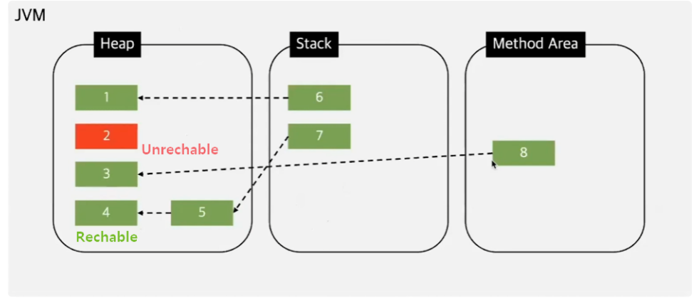
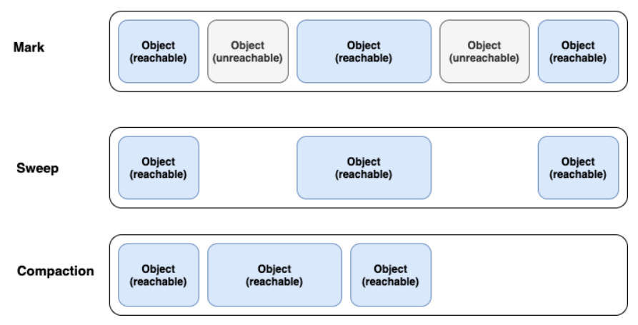
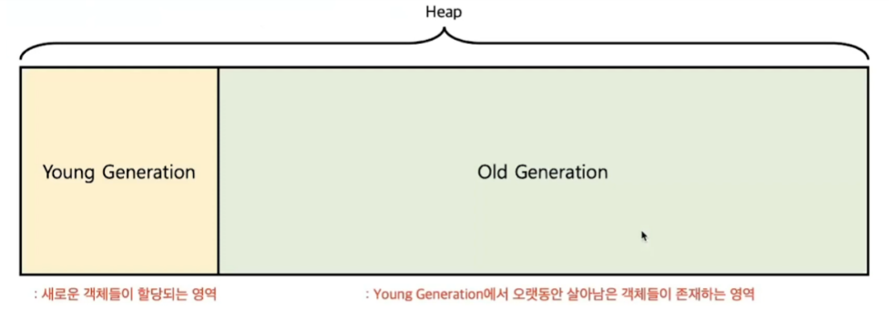
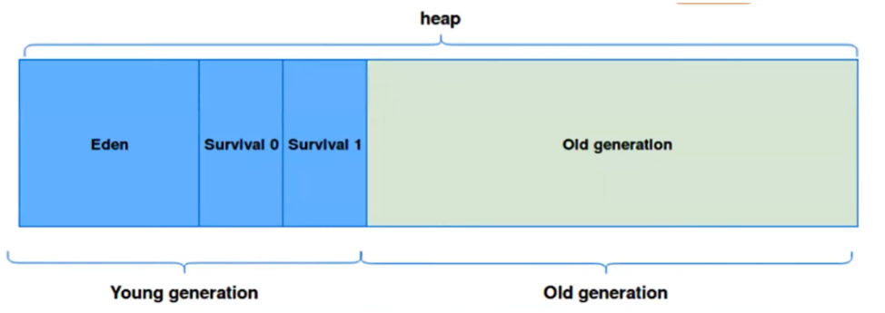
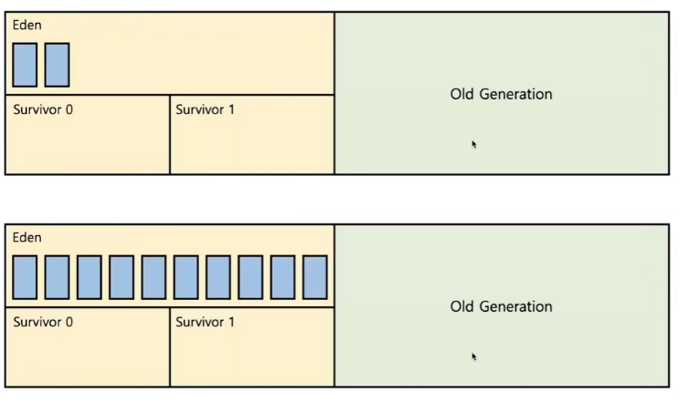
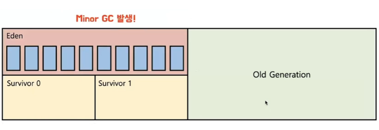
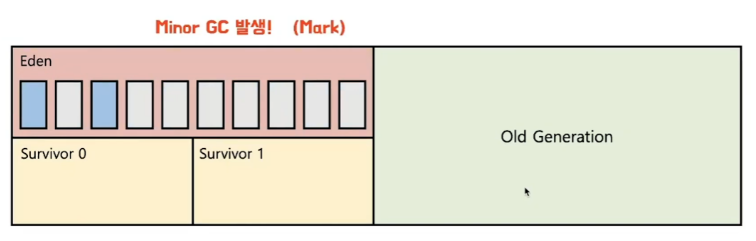
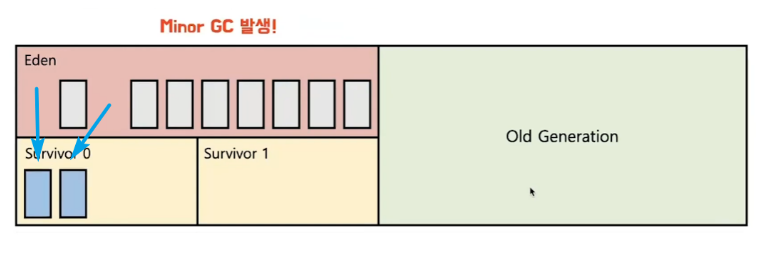
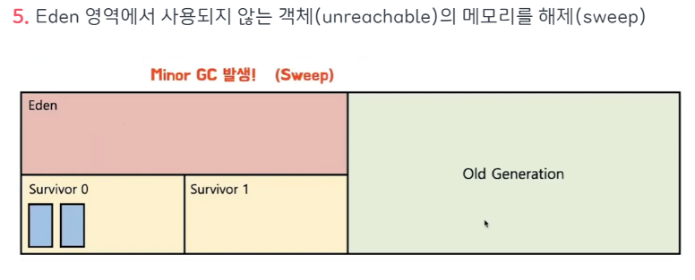
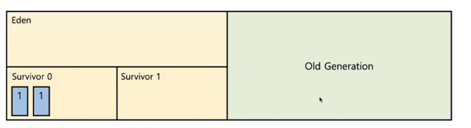

## **Garbage Collection**

- 자바의 메모리 관리 방법 중의 하나

- JVM의Heap 영역에서 동적으로 할당했던 메모리 중 필요 없게 된 메모리 객체(garbage)를 모아 주기적으로 제거하는 프로세스

### 단점

- 자동으로 처리해준다 해도 메모리가 언제 해제되는지 정확하게 알 수 없어 제어하기 힘들며, 가비지 컬렉션(GC)이 동작하는 동안에는 다른 동작을 멈추기 때문에오버헤드가 발생되는 문제점이 있다.
- SWT(Stop The World)
    - GC를 수행하기 위해 JVM이 프로그램 실행을 멈추는 현상을 의미.
    GC가 작동하는 동안 GC 관련 Thread를 제외한 모든 Thread는 멈추게 되어 서비스 이용에 차질이 생길 수 있다.
    - GC가 너무 자주 실행되면 소프트웨어 성능 하락의 문제
    - 실시간성이 강한 서비스에는 적합하지 않을수도 있다

## **가비지 컬렉션 대상**

- 가비지 컬렉션은 특정 객체가 garbage인지 아닌지 판단하기 위해서 도달성, 도달능력(Reachability) 이라는 개념을 적용
- 객체에 레퍼런스가 있다면 Reachable로 구분되고, 객체에 유효한 레퍼런스가 없다면 Unreachable로 구분해버리고 수거
- Reachable : 객체가 참조되고 있는 상태
- Unreachable  : 객체가 참조되고 있지 않은 상태

### **가비지 컬렉션 청소 방식**

- Mark And Sweep
    - Mark-Sweep 이란 다양한 GC에서 사용되는 객체를 솎아내는 내부 알고리즘
    - 가비지 컬렉션이 동작하는 아주 기초적인 청소 과정
    
    
    
    가비지 컬렉션이 될 대상 객체를 **식별(Mark)**하고 **제거(Sweep)**하며 객체가 제거되어 파편화된 메모리 영역을 앞에서부터 채워나가는 **작업(Compaction)**을 수행하게 된다. 
    
    - **Mark 과정** : 먼저 Root Space로부터 그래프 순회를 통해 연결된 객체들을 찾아내어 각각 어떤 객체를 참조하고 있는지 찾아서 마킹
    - **Sweep 과정** : 참조하고 있지 않은 객체 즉 Unreachable 객체들을 Heap에서 제거한다.
    - **Compact 과정** : Sweep 후에 분산된 객체들을 Heap의 시작 주소로 모아 메모리가 할당된 부분과 그렇지 않은 부분으로 압축

## **heap 메모리의 구조**

- Heap영역은 처음 설계될 때 다음의 2가지를 전제 (Weak Generational Hypothesis)로 설계
    - 대부분의 객체는 금방 접근 불가능한 상태(Unreachable)가 된다.
    - 오래된 객체에서 새로운 객체로의 참조는 아주 적게 존재한다.
    
    → 즉, 객체는 대부분 일회성되며, 메모리에 오랫동안 남아있는 경우는 드물다. 이러한 특성을 이용해 JVM 개발자들은 보다 효율적인 메모리 관리를 위해, 객체의 생존 기간에 따라 물리적인 Heap 영역을 나누게 되었고 Young 과 Old 총 2가지 영역으로 설계하였다.
    
    
    
    1. **Young 영역**
        - 새롭게 생성된 객체가 할당(Allocation)되는 영역
        - 대부분의 객체가 금방 Unreachable 상태가 되기 때문에, 많은 객체가 Young 영역에 생성되었다가 사라진다.
        - Young 영역에 대한 가비지 컬렉션(Garbage Collection)을 Minor GC라고 부른다.
    2. **Old 영역(Old Generation 영역)**
        - Young영역에서 Reachable 상태를 유지하여 살아남은 객체가 복사되는 영역
        - Young 영역보다 크게 할당되며, 영역의 크기가 큰 만큼 가비지는 적게 발생한다.
        - Old 영역에 대한 가비지 컬렉션(Garbage Collection)을 Major GC 또는 Full GC라고 부른다.
    
    →또 다시 힙 영역은 더욱 효율적인 GC를 위해 Young 영역을3가지 영역(Eden, survivor 0, survivor 1) 으로 나눈다.
    

- Eden new를 통해 새로 생성된 객체가 위치.
    - 정기적인 쓰레기 수집 후 살아남은 객체들은 Survivor 영역으로 보냄
- Survivor 0 / Survivor 1
    - 최소 1번의 GC 이상 살아남은 객체가 존재하는 영역
    - Survivor 0 또는 Survivor 1 둘 중 하나에는 꼭 비어 있어야 하는 규칙
    

## Minor GC과정 

1. 처음생성된 객체는 Young Generation 영역의 일부인 Eden에 위치

2. 객체가 계속 생성되어 Eden 영역이 꽉 차게 되고 Minor GC가 실행

3. Mark동작을 통해 reachable 객체 탐색

4. Eden 영역에서 살아남은 객체는 1개의 Survivor로 이동

5. Eden 영역에서 사용되지 않는 객체(unreachable)의 메모리를 해제(sweep)

6. 살아남은 모든 객체들은 age값이 1씩 증가
