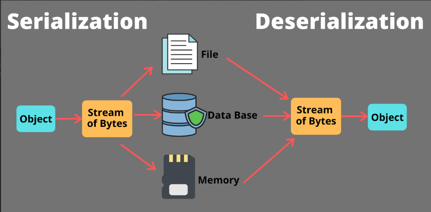

# 직렬화

<aside>
💡 자바 언어에서 사용되는 Object 또는 Data를 다른 컴퓨터의 자바 시스템에서도 사용할 수 있도록 `바이트 스트림 형태`로 `연속적인(Serial) 데이터`로 변화하는 포맷 변환 기술

</aside>

각 PC 의 OS 마다 서로 다른 가상 메모리 주소 공간을 갖기 때문에, Reference Type의 데이터들은 인스턴스를 전달할 수 없다. → 주소 값이 아닌 Byte 형태로 직렬화된 객체 데이터를 전달해야한다.

직렬화된 데이터들은 모두 Primitive Type이 되고, 이는 파일 저장이나 네트워크 전송 시 파싱이 가능한 유의미한 데이터가 된다. 전송 및 저장이 가능한 데이터로 만들어주는 것이 **직렬화**이다.

**역직렬화** : 직렬화된 데이터를 받는 쪽에서 다시 객체 데이터로 변환하는 작업



### 직렬화를 사용하는 곳

- JVM에 상주하는 데이터를 영속화
- Servlet Session
  - 세션 데이터를 저장&공유 해야할 때 직렬화를 이용
- Cache
  - 데이터베이스로부터 조회한 객체를 다른 모듈에서도 필요할 때 재차 DB를 조회하는 것이 아닌, 객체를 직렬화하여 메모리나 외부 파일에 저장해 두었다가 역직렬화하여 사용
  - 자바 직렬화로만 가능한 것은 아니나 자바 시스템에서는 구현이 간편해서 많이 사용된다.
  - But 요즘은 Redis, Memcached 와 같은 캐시 DB를 많이 사용
- Java RMI (Remote Method Invocation)
  - 자바 RMI 는 원격 시스템 간의 메시지 교환을 위해서 사용하는 자바에서 지원하는 기술
  - 최근에는 소켓을 이용해서 안쓰임

### 직렬화 구현

```java
@Entity
@AllArgsConstructor
@toString
public class Post implements Serializable {
private static final long serialVersionUID = 1L;

private String title;
private String content;
```

`serialVersionUID`를 만든다. (Serializable 인터페이스를 구현중)

```java
Post post = new Post("제목", "내용");
byte[] serializedPost;
try (ByteArrayOutputStream baos = new ByteArrayOutputStream()) {
//ByteArrayOutputStream : 직렬화된 데이터를 메모리 내에서 캡처하는데 사용
    try (ObjectOutputStream oos = new ObjectOutputStream(baos)) {
    //ObjectOutputStream : 객체를 직렬화하여 바이트 스트림으로 변환
        oos.writeObject(post);
				//post 객체를 직렬화
        serializedPost = baos.toByteArray();
    }
}
```

`ObjectOutputStream`으로 직렬화를 진행한다. Byte로 변환된 값을 저장하면 된다.

### 역직렬화

```java
try (ByteArrayInputStream bais = new ByteArrayInputStream(serializedPost)) {
    try (ObjectInputStream ois = new ObjectInputStream(bais)) {

        Object objectPost = ois.readObject();
        Post post = (Post) objectPost;
    }
}
```

### **직렬화 serialVersionUID :**

**직렬화 된 객체가 역직렬화 될 때, 클래스 버전이 호환되는 지 검사하는데 사용되는 유니크한 버전 번호**

• 자바 시스템은 **`serialVersionUID`**를 명시적으로 선언하지 않은 경우, 클래스의 세부 사항(멤버 변수, 메소드 등)을 기반으로 해시값 같은 값을 자동 생성하여 할당합니다. 하지만 클래스가 수정되면 이 해시값도 변경될 수 있습니다.
• 클래스를 수정할 때마다 자동 생성된 **`serialVersionUID`**가 변경되면, 이전 버전의 직렬화된 객체와 새로운 클래스 버전 간의 호환성 문제가 발생할 수 있습니다. 즉, 변경된 클래스로 이전 버전의 객체를 역직렬화하려 할 때 **`InvalidClassException`** 오류가 발생할 수 있습니다.

### **serialVersionUID를 명시적으로 선언하는 이유**

• 클래스의 구조가 바뀌어도 기존에 직렬화된 객체와의 호환성을 유지하기 위해서입니다. 명시적으로 **`serialVersionUID`**를 선언하고, 클래스를 수정해도 이 값을 변경하지 않으면, 자바 역직렬화 메커니즘은 여전히 같은 클래스 버전으로 간주합니다.

### 직렬화 예외

### **InvalidClassException**

InvalidClassException 예외는 직렬화를 이용하다보면 흔히 접할 수 있는 오류이다. 이 예외는 아래 3가지 주요 원인으로 인해  Serialized 또는 Deserialized 할 수 없다는 것을 의미한다.

- 클래스의 SerialVersionUID 버전이 다른 경우
- 클래스에 다른 데이터 타입을 포함한 경우
- 기본 생성자가 없는 경우

### NotSerializableException

Serializable을 구현하고 있지만 다른 클래스의 객체를 멤버 변수로 가지고 있을 경우, 그리고 그 참조하고 있는 클래스가 Serializable을 구현하지 않았을 경우이다.

## 직렬화의 장단점

### **직렬화의 장점:**

1. **플랫폼 독립적**: 자바 플랫폼 내에서 객체의 상태를 저장하고 전송할 수 있으며, JVM 간의 데이터 교환을 용이하게 합니다.
2. **객체 전체 저장**: 객체의 현재 상태를 모두 저장하고, 복잡한 데이터 구조를 포함한 모든 세부 정보를 포함할 수 있습니다.
3. **자동 타입 복원**: 역직렬화 과정에서 자바는 자동으로 올바른 데이터 타입으로 객체를 복원하여, 추가적인 데이터 매핑이나 파싱 없이 즉시 사용 가능합니다.
4. **시간 효율성**: 복잡한 객체 구조를 다루는 경우, 별도의 파싱 과정 없이 객체를 전송하고 복원할 수 있어 개발 시간을 단축할 수 있습니다.

### **직렬화의 단점:**

1. **보안 취약점**: 직렬화 데이터는 변경이 쉬워 악의적으로 조작될 수 있으며, 역직렬화 과정에서 보안 취약점이 발생할 수 있습니다.
2. **호환성 문제**: 클래스 구조가 변경되면 기존에 직렬화된 객체와 호환되지 않을 수 있어 역직렬화 실패나 오류를 초래할 수 있습니다.
3. **성능 이슈**: 크고 복잡한 객체를 직렬화하고 역직렬화하는 과정은 메모리와 처리 시간을 많이 소모할 수 있습니다.
4. **범용성 부족**: 자바 직렬화는 자바 플랫폼에 종속적이어서 다른 프로그래밍 언어나 환경에서는 사용할 수 없습니다.

장점보다 단점이 너무 치명적이라서 JSON 포맷이 훨씬 많이 쓰인다.

## 면접 질문

### 1. 자바 직렬화가 무엇인가요?

답변 예시:
자바 직렬화는 객체의 상태를 바이트 스트림으로 변환하는 과정으로, 이 바이트 스트림을 파일, 데이터베이스, 메모리 등에 저장하거나 네트워크를 통해 전송할 수 있습니다. 직렬화된 데이터는 다른 JVM(Java Virtual Machine)에서 역직렬화하여 원래 객체의 상태로 복원할 수 있습니다. 이 과정은 자바 시스템에서 객체의 데이터를 유지하고, JVM 간의 통신을 용이하게 하는 데 중요합니다.

### 2. 직렬화에서 serialVersionUID는 어떤 역할을 하나요?

답변 예시:
serialVersionUID는 직렬화된 객체와 해당 객체의 클래스 버전 간 호환성을 유지하는 데 사용되는 고유 식별자입니다. 클래스의 정의가 변경되었을 때도 이전에 직렬화된 데이터를 성공적으로 역직렬화할 수 있도록 도와줍니다. serialVersionUID가 클래스 버전과 일치하지 않으면 역직렬화 과정에서 InvalidClassException이 발생할 수 있습니다. 따라서, 클래스가 변경될 때마다 호환성을 유지하고자 명시적으로 serialVersionUID를 선언하는 것이 좋습니다.

출처:

[https://inpa.tistory.com/entry/JAVA-☕-직렬화Serializable-완벽-마스터하기](https://inpa.tistory.com/entry/JAVA-%E2%98%95-%EC%A7%81%EB%A0%AC%ED%99%94Serializable-%EC%99%84%EB%B2%BD-%EB%A7%88%EC%8A%A4%ED%84%B0%ED%95%98%EA%B8%B0)

[Inpa Dev 👨‍💻:티스토리]
