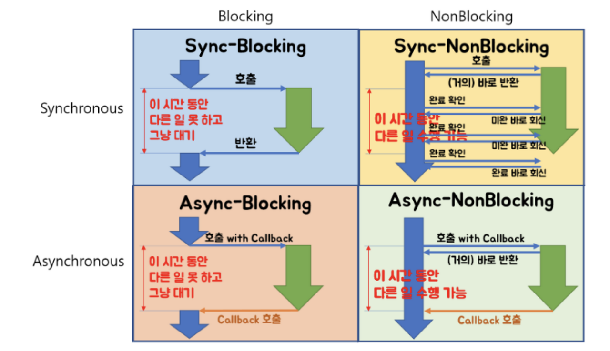

# Blocking/Non-blocking
- 호출된 함수가 바로 리턴해서 호출한 함수에게 제어권을 넘겨주고, 호출한 함수가 다른 일을 할 수 있는 기회를 줄 수 있으면 NonBlocking
- 호출된 함수가 자신의 작업을 모두 마칠 때까지 호출한 함수에게 제어권을 넘겨주지 않고 대기하게 만든다면 Blocking   
=> 제어권을 넘겨주는 시점에 따른 차이

# Synchronous/Asynchronous
- 호출되는 함수에게 callback을 전달해서, 호출되는 함수의 작업이 완료되면 호출되는 함수가 전달받은 callback을 실행하고, 호출하는 함수는 작업 완료 여부를 신경쓰지 않으면 Asynchronous
- 호출하는 함수가 호출되는 함수의 작업 완료 후 리턴을 기다리거나, 또는 호출되는 함수로부터 바로 리턴 받더라도 작업 완료 여부를 호출하는 함수 스스로 계속 확인하며 신경쓰면 Synchronous   
=> 작업의 완료 여부를 누가 신경쓰냐의 차이

### 면접 질문
- **Blocking/Non-Blocking과 sync/async의 차이에 대해 설명하세요**  
Blocking/Non-Blocking은 프로세스의 제어권과 관련된 개념이고, sync/async는 작업 완료 여부의 책임에 대한 개념입니다.
Blocking은 특정 작업이 실행될 때, 제어권을 함께 넘겨주며 작업이 끝나야 제어권을 돌려받기 때문에 그 동안 다른 작업을 하지 못합니다.  
그에 비해 Non-Blocking은 특정 작업에게 실행 명령만 내리고, 제어권은 곧바로 다시 돌려받기 때문에 그 동안 다른 작업도 수행이 가능합니다.   
sync는 호출되는 함수의 결과를 호출하는 함수가 신경을 쓰고 확인합니다.   
반면, async는 호출되는 함수에게 callback을 전달해주고 작업 완료 시에 호출되는 함수에서 callback을 실행시켜 작업 완료를 알립니다.
