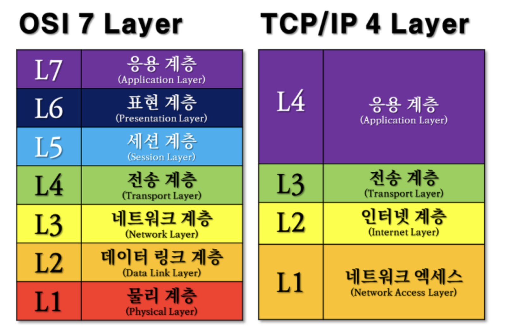

# OSI 7계층

❓ 국제 표준화 기구에서 제안한 통신 규약

네트워크에서 통신이 일어나는 일련의 과정들을 7단계로 나눈 것이다.

### 나눈 이유 ❓

흐름을 직관적으로 살펴볼 수 있고, 이상이 생겼을 때 다른 단계의 장비 및 소프트웨어를 건들이지 않고도 이상이 생긴 단계만 고칠 수 있다.

비슷한 예시의 TCP/IP도 존재

### 그렇다면 차이점은?

OSI는 개념적 모델로 통신에는 실질적으로 구현되어 사용되진 않는다. 하지만 TCP/IP는 연결을 설정하고 네트워크를 통해 통신하는데 사용된다.

### 물리 , 데이터 링크, 네트워크, 전송, 세션, 표현, 응용

## 1계층 : 물리 계층

- 기능 : 통신을 수행하는 두 장치 간의 실제 접속 담당, 전기적 신호가 나가는 **물리적인 장비**를 의미 , 데이터를 전기적인 신호로 변환해서 주고 받는 기능일 뿐 에러 등에 대해서는 신경 쓰지 않는다. ( **데이터 전달** )
- 장비 : 리피터, 허브
- 프로토콜 데이터 단위 : Bit

## 2계층 : 데이터 링크 계층

- 기능 : 데이터 링크 계층은 링크의 설정과 유지 및 종료를 담당하며 **노드 간의 오류제어, 흐름제어, 회선제어 기능을 수행**하는 계층이다. 네트워크 계층에 데이터를 전달하고, 물리 계층에서 발생할 수 있는 오류를 탐지하고 수정하는 기능을 제공한다. **맥 주소를 가지고 통신**하게 된다.
- 장비 : 랜카드, 브리지, 스위치
- 프로토콜 데이터 단위 : 프레임

## 3계층 : 네트워크 계층

- 기능 : **경로(Route)와 주소(IP)를 정하고** 데이터를 패킷 단위로 쪼개어 전송한다. 데이터가 수 중 가장 효율적인 **라우팅(데이터를 목적지까지 가장 안전하고 빠르게 전달하는 기능)** 방법을 찾는다.
- 장비 : 라우터
- 프로토콜 데이터 단위 : 패킷

## 4계층 : 전송 계층

- 기능 : 사용자들 간 신뢰성 있는 데이터를 주고 받게 해주는 역할을 한다. **오류 검출 및 복구, 흐름 제어와 중복 검사 등**을 수행한다. 데이터 전송을 위해 Port 번호가 사용이 된다.
- 대표적인 프로토콜로는 TCP와 UDP
- 장비 : 게이트웨이
- 프로토콜 데이터 단위 : 세그먼트

## 5계층 : 세션 계층

- 기능 : 실제 네트워크 연결이 이루어진다. 프로세스가 통신하기 위한 방법을 정의한다. TCP/IP 세션을 생성 및 제거 한다.
- 프로토콜 데이터 단위 : 메시지

## 6계층 : 표현 계층

- 기능 : 응용프로그램 혹은 네트워크를 위해 데이터를 표현하는 계층 ( 압축, 암호화, 복호화, 데이터 변환 등)

## 7계층 : 응용 계층

- 기능 : 응용 서비스나 프로세스가 응용 계층에서 동작한다. HTTP, FTP, SMTP

## 프로토콜 정리

물리 계층(Physical Layer): 프로토콜x, 랜선, 허브, 리피터들의 디바이스들

데이터 링크 계층(Data Link Layer): Ethernet, Token Ring, FDDI

네트워크 계층(Network Layer): IP, ICMP, ARP, RARP

전송 계층(Transport Layer): TCP, UDP

세션 계층(Session Layer): NetBIOS, SAP, SDP, NWLink

표현 계층(Presentation Layer): ASCII, MPEG, JPEG, MIDI

응용 계층(Application Layer): HTTP, SMTP, FTP

## 면접 질문

### TCP/IP와 OSI 모델을 비교해 설명해주세요.

"TCP/IP는 OSI 모델의 개념을 실제 적용 가능한 형태로 단순화한 4계층 모델입니다. OSI 모델이 이론적인 틀을 제공하는 반면, TCP/IP는 인터넷과 같은 실제 네트워크 환경에서 널리 사용됩니다."

### 세션 계층이 왜 중요한가요, 그리고 어떤 문제들을 해결해주나요?

"세션 계층은 네트워크 상에서 다양한 애플리케이션 간의 세션을 관리하고, 데이터 교환 과정에서의 연결 유지와 중단된 연결의 복구를 담당합니다. 이는 안정적인 통신을 가능하게 합니다."

### 표현 계층은 어떤 역할을 하나요, 그리고 실제 개발에서 어떻게 적용될 수 있나요?

"표현 계층은 데이터를 애플리케이션이 이해할 수 있는 형태로 변환하며, 암호화 및 압축도 처리합니다. 이 계층은 다양한 데이터 형식이 서로 다른 시스템 간에 호환될 수 있게 해줍니다."

### 응용 계층에서 주로 다루는 프로토콜은 무엇이 있나요?

"응용 계층은 사용자에 가장 가까운 계층으로 HTTP, FTP, SMTP와 같은 프로토콜을 통해 데이터 송수신을 관리합니다. 이 계층은 사용자의 요청을 네트워크 서비스로 변환하고, 네트워크에서 받은 데이터를 사용자에게 전달하는 역할을 합니다."
