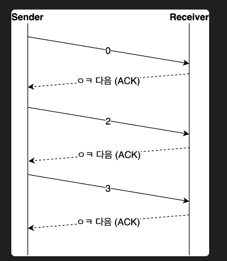
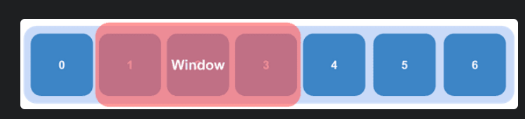
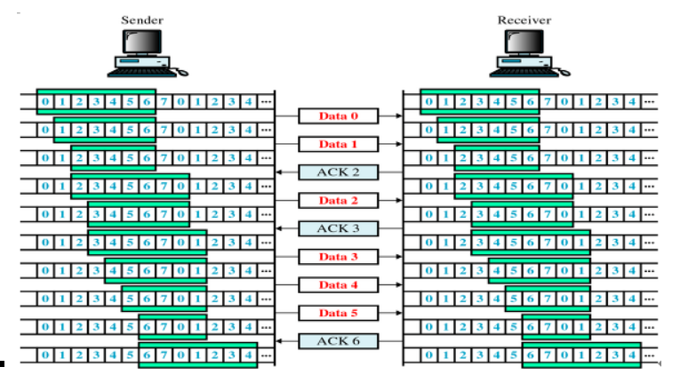
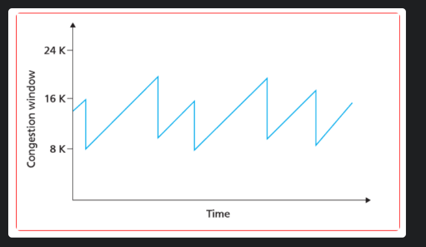
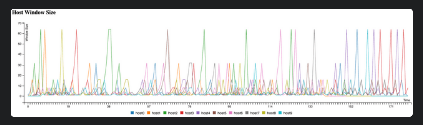
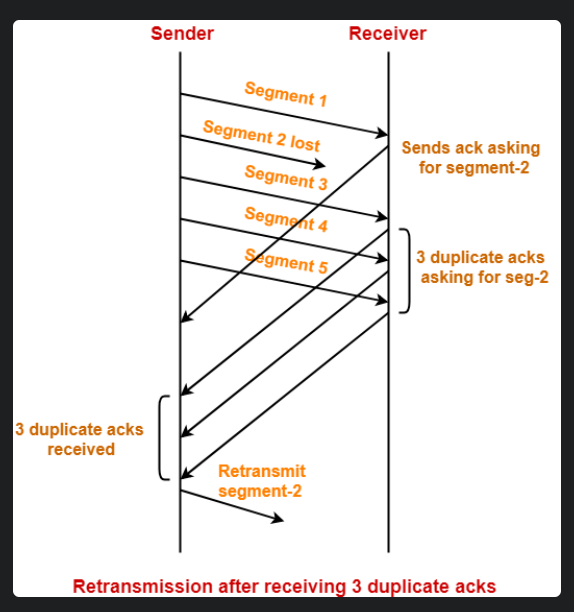

# **TCP/IP (흐름제어/ 혼잡제어)**

## TCP/IP

- TCP
    - 네트워크 통신에서 신뢰적인 연결방식을 의미
        - TCP통신은 Handshake라는 과정으로 서로가 통신을 할 수 있는 상태를 먼저 인증을 하고 나서 통신을 하는 연결지향적인 **양방향 통신**입니다.
    - TCP는 reliable network를 보장할 수 있도록 하는 프로토콜
        - Unreliable : 전송한 데이터그램이 유실될 수 있고, 순서가 바뀌어 도착할 수 있다.
        - Reliable : 세그먼트가 유실될 경우 재전송을 통해 복구해주며, 순서가 바뀌어 도착하더라도 순서 번호를 이용하여 제대로 맞추어 전달한다.
    - TCP는 network congestion avoidance algorithm을 사용

- reliable network 문제점
    - 손실 : 패킷이 손실될 수 있는 문제
    - 순서 바뀜 : 패킷의 순서가 바뀌는 문제
    - Congestion : 네트워크가 혼잡해지는 문제
    - Overload : recevier가 overload되는 문제(recevier가 처리할 수 있는 데이터 양 초과)

---

## **흐름제어와 혼잡제어**

- **흐름제어**
    - 송신측과 수신측의 데이터 처리 속도 차이를 해결하기 위한 기법
    - Flow Control은 receiver가 packet을 지나치게 많이 받지 않도록 조절하는 것
    - 기본 개념은 receiver가 sender에게 현재 자신의 상태를 feedback 한다는 점
- **혼잡제어**
    - 송신측의 데이터 전달과 네트워크의 데이터 처리 속도 차이를 해결하기 위한 기법

## 흐름제어

- 송신측과 수신 측의 TCP 버퍼 크기 차이로 인해 생기는 데이터 처리 속도 차이를 해결하기 위한 기법
    - TCP 버퍼 : 송신 측은 버퍼에 TCP 세그먼트를 보관한 후 순차적으로 전송하고, 수신 측은 도착한 TCP 세그먼트를 애플리케이션이 읽을 때까지 버퍼에 보관

### Stop and Wait

- 매번 전송한 패킷에 대해 응답을 받아야만 그 다음 패킷을 전송

- 단점
    - 패킷을 하나씩 보내기 때문에 비효율적인 방법
    - 따라서 Stop and Wait 방식을 사용하여 흐름 제어를 할 경우에는, 이러한 비효율성을 커버하기 위해 이런 단순한 구현이 아닌 여러가지 오류 제어 방식을 함께 도입해서 사용

### Sliding Window

- Stop and Wait를 사용하여 흐름 제어를 하게되면 비효율적인 부분이 있기 때문에, 오늘날의 TCP는 특별한 경우가 아닌 이상 대부분 슬라이딩 윈도우(Sliding Window) 방식을 사용
- **수신 측이 한 번에 처리할 수 있는 데이터를 정해놓고 그때 그때 수신 측의 데이터 처리 상황을 송신 측에 알려줘서 데이터의 흐름을 제어하는 방식**
- 수신 측에서 설정한 윈도우 크기 만큼 송신 측에서 확인 응답(ACK) 없이 패킷을 전송할 수 있게하여 데이터 흐름을 동적으로 조절
- Stop and Wait과 가장 큰 차이점은 송신 측이 **수신 측이 처리할 수 있는 데이터의 양을 알고 있다**는 점
- **window**
    - 송신 측과 수신 측은 각각 데이터를 담을 수 있는 버퍼를 가지고 있고, 별도로 **윈도우**라는 일종의 마스킹 도구를 가지고 있다
    - 이때 송신 측은 이 윈도우에 들어있는 데이터를 수신 측의 응답이 없어도 연속적으로 보낼 수 있다
    
    
    

### Sliding Window 동작방식

1. 최초로 수신자는 윈도우 사이즈를 7로 정한다.
2. 송신자는 수신자의 확인 응답(ACK)을 받기 전까지 데이터를 보낸다.
3. 수신자는 확인 응답(ACK)을 송신자에게 보내면, 슬라이딩 윈도우 사이즈을 충족할 수 있게끔 윈도우를 옆으로 옮긴다
4. 이후 데이터를 다 받을 때까지 위 과정을 반복한다.

---

## 혼잡제어

- 데이터의 양이 라우터가 처리할 수 있는 양을 초과 → 라우터가 처리하지 못함
- 이때 송신 측에서는 라우터가 처리하지 못한 데이터를 손실 데이터로 간주하고 계속 재전송하여 네트워크를 혼잡하게 한다.
- 이와 같은 **네트워크의 혼잡을 피하기 위하여 송신 측에서 보내는 데이터의 전송 속도를 강제로 줄이게 되는데**, 이러한 작업을 혼잡 제어(Congestion Control)이라고 한다.
- 패킷 수를 제어하는 기능이라 할 수 있으며, 혼잡 제어는 네트워크 내의 패킷 수를 조절하여 네트워크의 오버플로우를 방지

### **AIMD (Additive Increase/Multiplicative Decrease)**

- 직역 -  합 증가/곱 감소 방식
- 처음에 패킷을 하나씩 보내고, 문제 없이 도착하면 윈도우의 크기를 1씩 증가시켜가며 전송한다. 만약 전송에 실패하거나 일정 시간을 넘기면 윈도우의 크기를 반으로 줄인다.
- 특징
    - 여러 호스트가 한 네트워크를 공유하고 있으면 나중에 진입하는 쪽이 처음에는 불리하지만, 시간이 흐르면 평형상태로 수렴
    - 윈도우의 크기를 굉장히 조금씩 늘리기 때문에 네트워크의 모든 대역을 활용하여 제대로 된 속도로 통신하기까지 시간이 오래 걸림

### Slow Start(느린 시작)

- AIMD은 윈도우 크기를 선형적으로 증가 → 제대로 된 속도가 나오기까지 시간이 오래 걸림
- Slow Start는 윈도우의 크기를 1, 2, 4, 8, ...과 같이 지수적으로 증가 → 혼잡이 감지되면 윈도우의 크기를 1로 줄임
- 데이터의 ACK가 도착할 때마다 윈도우의 크기를 증가시키기 때문에 처음에는 윈도우 크기가 조금 느리게 증가할지라도, 시간이 가면 갈수록 윈도우의 크기가 점점 빠르게 증가

### **Fast Retransmit(빠른 재전송)**

- 세그먼트로 분할된 내용들이 **순서대로 도착하지 않는 경우**발생 가능.
- 이 상황 → **수신 측에서는 순서대로 도착한 마지막 패킷의 다음 순번을 ACK 패킷에 실어 전송**
- 그리고 이런 **중복 ACK를 3개 받으면 재전송**
- 송신 측은 자신이 설정한 타임 아웃 시간이 지나지 않았어도 바로 해당 패킷을 재전송할 수 있기 때문에 보다 빠른 재전송률 유지 가능

### **Fast Recovery(빠른 회복)**

- 혼잡한 상태가 되면 윈도우 크기를 1로 줄이지 않고, 반으로 줄이고 선형 증가시키는 방법
- 혼잡 상황을 한 번 겪고나서부터는 AIMD 방식으로 동작한다.

---

## Q

- TCP/IP 통신에서 흐름 제어 기법이 왜 사용되는가?
    - 수신측에서 제한된 저장 용량을 초과한 이후에 도착하는 데이터는 손실 될 수 있다
    - 이러 위험을 줄이기 위해 송신 측의 데이터 전송량을 수신측에 따라 조절

---
