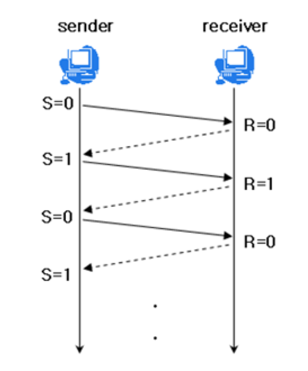
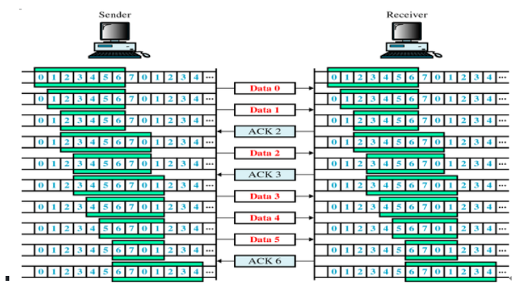

TCP ?

- 네트워크 통신에서 신뢰적인 연결방식
- TCP는 기본적으로 unreliable network에서, reliable network를 보장할 수 있도록 하는 프로토콜

### **reliable network를 보장한다는 것은 4가지 문제점 존재**

1. **손실** : packet이 손실될 수 있는 문제
2. **순서 바뀜** : packet의 순서가 바뀌는 문제
3. **Congestion** : 네트워크가 혼잡한 문제
4. **Overload** : receiver가 overload 되는 문제

# 흐름제어

- 송신측과 수신측의 데이터 처리 속도 차이를 해결하기 위한 기법
- 흐름제어는 데이터를 보내는 속도를 조절하여 수신자의 버퍼가 넘치지 않도록 하는 기술입니다. TCP에서는 수신자의 버퍼 용량을 고려하여 이를 조절합니다.
- 수신측에서 제한된 저장 용량을 초과한 이후에 도착하는 데이터는 손실 될 수 있으며, 만약 손실 된다면 불필요하게 응답과 데이터 전송이 송/수신 측 간에 빈번이 발생한다.
- 이러한 위험을 줄이기 위해 송신 측의 데이터 전송량을 수신측에 따라 조절해야한다.

### 해결 방법

## **1. Stop and Wait**

매번 전송한 패킷에 대해 확인 응답을 받아야만 그 다음 패킷을 전송하는 방법

## **Sliding Window** (Go Back N ARQ)

### 작동 방식

송신자가 수신자의 명시적 승인 없이도 일정량의 데이터를 연속적으로 전송할 수 있게 합니다. 이 기법은 윈도우 크기를 조절하여 네트워크 상황과 수신자의 처리 능력에 맞추어 데이터를 전송하며, 수신자로부터 ACK을 받으면 윈도우를 '슬라이드' 시켜 다음 데이터를 전송합니다.
• Window : TCP/IP를 사용하는 모든 호스트들은 송신하기 위한 것과 수신하기 위한 2개의 Window를 가지고 있다. 호스트들은 실제 데이터를 보내기 전에 '3 way handshaking'을 통해 수신 호스트의 receive window size에 자신의 send window size를 맞추게 된다.

### **작동 방식**

1. **윈도우 크기 설정**: 송신자와 수신자는 각각의 윈도우 크기를 설정합니다. 이 윈도우 크기는 한 번에 보낼 수 있는 데이터의 양을 제한합니다. 송신자의 윈도우 크기는 수신자가 처리할 수 있는 데이터 양을 반영하여 조정됩니다.
2. **데이터 전송**: 송신자는 자신의 윈도우 크기에 맞춰 여러 개의 패킷을 연속적으로 보낼 수 있습니다. 이 때 송신자는 이미 전송한 패킷에 대한 수신자의 확인 응답(ACK)을 기다리지 않고, 윈도우 크기 내에서 계속해서 패킷을 전송할 수 있습니다.
3. **슬라이딩**: 수신자가 패킷을 받고 그것을 확인하면, ACK를 송신자에게 보냅니다. 송신자는 ACK를 받은 후, 윈도우를 '슬라이드' 시키면서 새로운 데이터 패킷을 전송합니다. 이 과정에서 윈도우는 계속 전진하며, 전송한 패킷 중에서 아직 확인되지 않은 첫 번째 패킷을 기준으로 새로운 데이터를 보낼 수 있는 범위가 결정됩니다.
4. **윈도우 조절**: 네트워크 상황이나 수신자의 상태에 따라 윈도우 크기가 조정될 수 있습니다. 예를 들어, 네트워크의 혼잡이나 수신자의 처리 능력 저하가 감지되면 윈도우 크기를 줄여서 데이터 전송량을 감소시킬 수 있습니다.

예시)

- 최초로 수신자는 윈도우 사이즈를 7로 정한다.
- 송신자는 수신자의 확인 응답(ACK)을 받기 전까지 데이터를 보낸다.
- 수신자는 확인 응답(ACK)을 송신자에게 보내면, 슬라이딩 윈도우 사이즈을 충족할 수 있게끔 윈도우를 옆으로 옮긴다
- 이후 데이터를 다 받을 때까지 위 과정을 반복한다.

**_재전송_**

1. **타임아웃 기반 재전송**: 각각의 패킷은 특정 타임아웃을 가집니다. 만약 ACK가 이 타임아웃 기간 내에 도착하지 않으면, 해당 패킷은 손실된 것으로 간주되고 자동으로 재전송됩니다. 타임아웃 기간은 네트워크의 지연 시간과 혼잡 상태에 따라 동적으로 조정될 수 있습니다.
2. **빠른 재전송(Fast Retransmit)**: 이는 세 개 이상의 중복된 ACK가 수신된 경우 발동합니다. 중복 ACK는 특정 패킷 이후의 패킷이 수신되었으나 해당 패킷이 아직 도착하지 않았음을 나타냅니다. 예를 들어, 패킷 1, 2, 3, 5가 전송되었고 패킷 4가 손실된 경우, 수신자는 패킷 5를 받고 패킷 4에 대한 ACK을 여러 번 보낼 수 있습니다. 이때 송신자는 중복된 ACK을 감지하고 즉시 패킷 4를 재전송합니다.
3. **부분적인 ACK 처리**: TCP가 선택적 재전송을 사용하는 경우, 부분적인 ACK을 통해 어떤 패킷들이 성공적으로 수신되었는지 확인할 수 있습니다. 이 정보를 바탕으로 송신자는 아직 수신되지 않은 패킷만을 재전송할 수 있습니다.

# 혼잡제어

• 송신측의 데이터는 지역망이나 인터넷으로 연결된 대형 네트워크를 통해 전달된다. 만약 한 라우터에 데이터가 몰릴 경우, 자신에게 온 데이터를 모두 처리할 수 없게 된다. 이런 경우 호스트들은 또 다시 재전송을 하게되고 결국 혼잡만 가중시켜 오버플로우나 데이터 손실을 발생시키게 된다. 따라서 이러한 네트워크의 혼잡을 피하기 위해 송신측에서 보내는 데이터의 전송 속도를 강제로 줄이게 되는데, 이러한 작업을 혼잡제어라고 한다.

- **AIMD(Additive Increase / Multiplicative Decrease)**
  - 처음에 패킷을 하나씩 보내고 이것이 문제없이 도착하면 window 크기(단위 시간 내에 보내는 패킷의 수)를 1씩 증가시켜가며 전송하는 방법
  - 패킷 전송에 실패하거나 일정 시간을 넘으면 패킷의 보내는 속도를 절반으로 줄인다.
  - 공평한 방식으로, 여러 호스트가 한 네트워크를 공유하고 있으면 나중에 진입하는 쪽이 처음에는 불리하지만, 시간이 흐르면 평형상태로 수렴하게 되는 특징이 있다.
  - 문제점은 초기에 네트워크의 높은 대역폭을 사용하지 못하여 오랜 시간이 걸리게 되고, 네트워크가 혼잡해지는 상황을 미리 감지하지 못한다. 즉, 네트워크가 혼잡해지고 나서야 대역폭을 줄이는 방식이다.
- **Slow Start (느린 시작)**
  - AIMD 방식이 네트워크의 수용량 주변에서는 효율적으로 작동하지만, 처음에 전송 속도를 올리는데 시간이 오래 걸리는 단점이 존재했다.
  - Slow Start 방식은 AIMD와 마찬가지로 패킷을 하나씩 보내면서 시작하고, 패킷이 문제없이 도착하면 각각의 ACK 패킷마다 window size를 1씩 늘려준다. 즉, 한 주기가 지나면 window size가 2배로 된다.
  - 전송속도는 AIMD에 반해 지수 함수 꼴로 증가한다. 대신에 혼잡 현상이 발생하면 window size를 1로 떨어뜨리게 된다.
  - 처음에는 네트워크의 수용량을 예상할 수 있는 정보가 없지만, 한번 혼잡 현상이 발생하고 나면 네트워크의 수용량을 어느 정도 예상할 수 있다.
  - 그러므로 혼잡 현상이 발생하였던 window size의 절반까지는 이전처럼 지수 함수 꼴로 창 크기를 증가시키고 그 이후부터는 완만하게 1씩 증가시킨다.
- **Fast Retransmit (빠른 재전송)**
  - 빠른 재전송은 TCP의 혼잡 조절에 추가된 정책이다.
  - 패킷을 받는 쪽에서 먼저 도착해야할 패킷이 도착하지 않고 다음 패킷이 도착한 경우에도 ACK 패킷을 보내게 된다.
  - 단, 순서대로 잘 도착한 마지막 패킷의 다음 패킷의 순번을 ACK 패킷에 실어서 보내게 되므로, 중간에 하나가 손실되게 되면 송신 측에서는 순번이 중복된 ACK 패킷을 받게 된다. 이것을 감지하는 순간 문제가 되는 순번의 패킷을 재전송 해줄 수 있다.
  - 중복된 순번의 패킷을 3개 받으면 재전송을 하게 된다. 약간 혼잡한 상황이 일어난 것이므로 혼잡을 감지하고 window size를 줄이게 된다.
- **Fast Recovery (빠른 회복)**
  - 혼잡한 상태가 되면 window size를 1로 줄이지 않고 반으로 줄이고 선형증가시키는 방법이다. 이 정책까지 적용하면 혼잡 상황을 한번 겪고 나서부터는 순수한 AIMD 방식으로 동작하게 된다.

### 면접 질문

1. **TCP는 어떻게 신뢰성 있는 통신을 보장하나요?**

- TCP는 데이터의 손실, 순서 바뀜, 혼잡 및 수신 측 과부하 같은 문제들을 해결합니다. 패킷 손실이 감지되면 재전송을 합니다. 또한, 흐름제어와 혼잡제어 메커니즘을 통해 네트워크의 상태와 수신자의 처리 능력에 맞추어 데이터 전송 속도를 조절합니다.

2. **TCP의 흐름제어와 혼잡제어는 어떻게 다른가요?**

- 흐름제어는 "수신자의 수용 능력"에 초점을 맞추어 데이터의 손실을 방지하는 반면, 혼잡제어는 "네트워크의 전체 상태"를 고려하여 네트워크 혼잡을 방지하고 효율을 유지합니다.
- 흐름제어는 송신자와 수신자 사이의 상호작용에 기반하여 수신자의 버퍼 용량에 맞춰 데이터 전송 속도를 조절하는 반면, 혼잡제어는 네트워크 전체의 데이터 흐름과 혼잡 상태에 기반하여 송신 속도를 조절합니다.

3. **AIMD 기법의 장단점은 무엇인가요?**

- AIMD 기법의 장점은 네트워크 상태가 안정적일 때 점진적으로 데이터 전송 속도를 증가시키고, 패킷 손실이 발생하면 전송 속도를 감소시켜 네트워크 혼잡을 효과적으로 관리합니다. 단점은 초기에 네트워크의 전체 대역폭을 활용하지 못하고, 혼잡이 심화된 후에야 대응한다는 점입니다.
