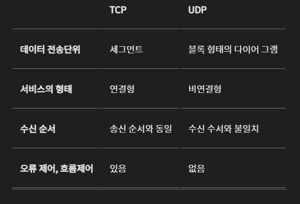
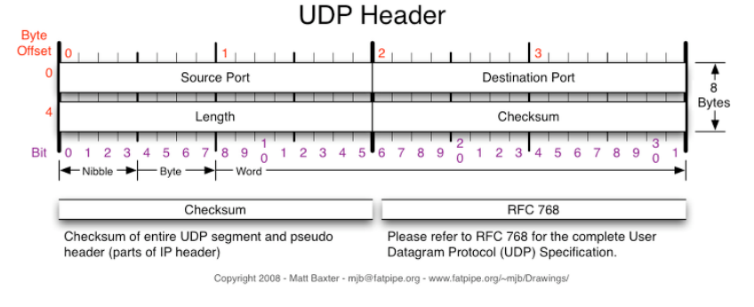

# UDP

## UDP

- User Datagram Protocol의 약자로 데이터를 데이터그램 단위로 처리하는 프로토콜이
- 비연결형, 신뢰성 없는 전송 프로토콜이다.
- 데이터그램 단위로 쪼개면서 전송을 해야하기 때문에 전송 계층
- Transport layer에서 사용하는 프로토콜

### 특징

- TCP와는 다르게 데이터를 패킷으로 나누고 반대편에서 재조립하는 과정을 거치지 않음
    
    **→ 데이터 신속성, 데이터처리가 TCP보다 빠르다**
    
- **수신지에서 제대로 받든 받지 않든 상관하지 않고 데이터를 보내기만 한다.** 즉, 비연결형, 신뢰성 없는 전송 프로토콜로, 데이터그램 단위로 쪼개면서 전송을 해야하기 때문에 전송 계층
    
    → **확인 응답을 못하므로, TCP보다 신뢰도가 떨어짐.**
    
- TCP 처럼 ACK 메세지를 통해 확인을 받거나 하는 작업이 없기 때문에 TCP보다 빠르며, 이러한 속도의 장점으로 UDP는 실시간 방송 등에 사용

---

## **TCP vs UDP**

### 오류해결 방법

- **TCP**
    - 데이터의 분실, 중복, 순서가 뒤바뀜을 자동으로 보정해줘서 송수신 데이터의 정확한 전달 -> 신뢰성
- **UDP**
    - TCP와는 다르게 에러가 날 수도 있고, 재전송이나 순서가 뒤바뀔 가능성이 있다.
        
        즉, 애플리케이션에서 처리해야 하는 번거로움 → 비신뢰성
        
    

---

## **TCP와 UDP는 왜 나오게 되었는가?**

1. IP의 역할은 Host to Host 지원 → 장치에서 장치로의 이동은 IP로 해결되지만, 하나의 장비 내에서 수많은 프로그램들이 통신을 할 경우에는 IP만으로는 한계가 있다.
2. IP에서 오류가 발생하는 경우 ICMP에서 알려준다. 그러나 ICMP는 알려주기만 할 뿐, 대처를 하지 못하기 때문에 IP보다 위에서 처리를 해줘야한다.

→ 1번의 문제를 해결하기 위하여 포트 번호

→ 2번을 해결하기 위해 상위 프로토콜인 TCP와 UDP등장

- **ICMP** : 인터넷 제어 메시지 프로토콜로 네트워크 컴퓨터 위에서 돌아가는 운영체제에서 오류 메시지를 전송받는데 주로 쓰인다.

---

## UDP Header

- Source port : 시작 포트
- Destination port : 도착지 포트
- Length : 길이
- *Checksum* : 오류 검출

---

## Q

- TCP와 UDP의 차이에 대해서 설명해 주세요.
    - TCP는 정확성을, UDP는 속도를 중요시 하는것에서 차이가 있습니다.
    
    TCP는 데이터의 손실이 발생하면 안되는 메시지, 메일등에서 사용이 되고
    
    UDP는 어느정도의 데이터손실이 발생해도 되는 스트리밍 서비스 같은곳에서 사용이 됩니다.
    
    저는 모션 인식을 통한 레이싱 게임을 구현과정에서 UDP 기반인 WebRtc를 사용하였습니다.
    
    게임 특성상 빠른 데이터 동기화가 필요하였고 어느정도 손실이 발생해도 괜찮다는(영상) 점을 고려하여 UDP를 지원하는 WebRtc기술을 사용하였습니다.
    

---