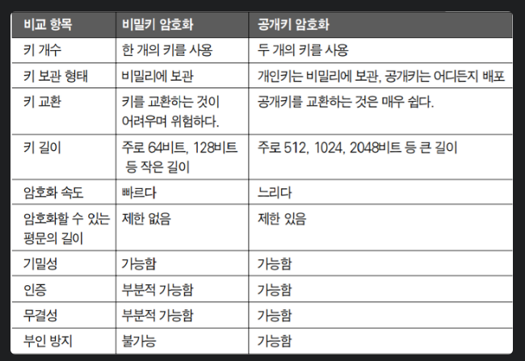
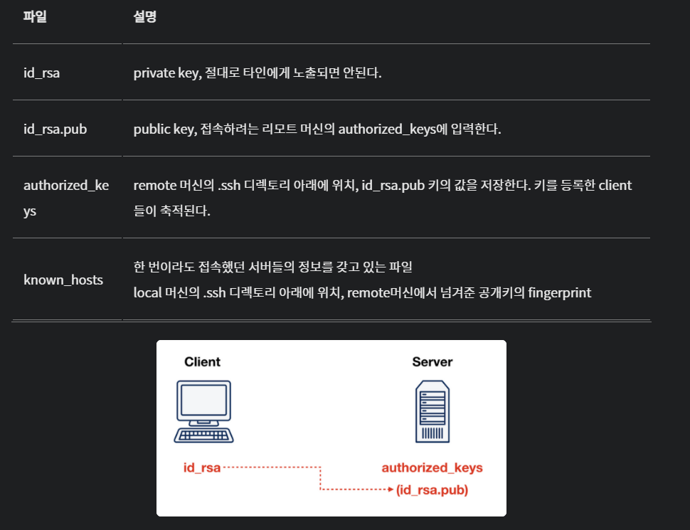

# 대칭키 & 개인키

## 대칭키

- 암호화와 복호화에 동일한 대칭키(암호키)를 사용하는 알고리즘이다.
- 송신자가 키를 통해 평문을 암호화(Encryption)하여 암호문을 보내면, 수신자는 동일한 키를 이용하여 암호문을 복호화(Decryption)하여 평문을 만드는 원리
- DES, 3DES, AES, SEED, ARIA, MASK 등

### **장점**

- 공개키 암호화 방식에 비해 **암호화 및 복호화 속도가 빠름**
- 암호 알고리즘 내부구조가 간단하여 시스템 개발 환경에 용이하다.
- 대용량 Data 암호화에 적합하다.

### **단점**

- 암호화 통신을 하는 사용자끼리는 같은 대칭키 공유
- 키 관리가 어려워 전자 상거래 등 디지털 서명 기법에 적용하기 곤란하다.

---

## **공개키(Public Key)**

- 대칭키의 키 분배 문제를 해결하기 위해 고안된 것으로, 공개키 암호는 **암호화와 복호화에 사용하는 암호키를 분리한 알고리즘(공개키+비밀키)**이다. 비대칭키 암호라고도 불린다.
- **공개키 공개, 암호화된 데이터는 고유한 비밀키로 복호화**
- RSA(가장 대표적), Diffie Hellman, DSA, ECC, Elagamal

### **장점**

- **수신자의 개인키(Private Key)로만 해독할 수 있으므로 안전**하다.
- 키를 분배할 필요가 없다.

### **단점**

- 대칭키 알고리즘에 비해 **속도가 느리다.**
    - 속도가 느리기 때문에 긴 문의 암호화보다는, 대칭키 알고리즘의 키 값에 대한 암호에 사용된다.

---

## **비밀키 암호화와 공개키 암호화의 비교**

---

## **SSH 키 기반 인증 방식**

- ssh는 secure shell
- 원격 접속 프로토콜이며 TCP/22번 포트를 사용한다.
- RSA 공개키 암호화 기법을 사용하며, **공개키 암호화 방식과 대칭키 암호화 방식을 동시에 사용**

### **SSH 키 기반 인증 시스템의 장점**

1. SSH 키 자체가 매우 길고 복잡하여 알아내기 쉽지 않다.
2. 원격으로 직접 키가 전송되지 않아 키 로깅 어택 등에 강하다.
3. Brute-Force (무차별대입) 공격에 강함

### **SSH Key가 동작하는 과정**

- 키를 생성하면 공개키와 비공개키가 생성
- 이 중 비공개키는 로컬 머신(Client)에 위치, 공개키는 리모트 머신(Server)에 위치
- SSH 접속을 시도하면 SSH Client가 로컬 머신의 비공개키와 원격 머신의 비공개키를 비교

