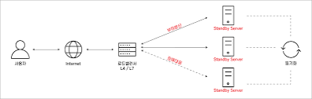

# 대용량 트래픽 처리
- 하드웨어의 성능을 올리거나(Scale-up) 여러대의 서버가 나눠서 일하도록 만든다.(Scale-out)
- 하드웨어 향상 비용 > 서버 확장 비용 => Scale-out이 효과적 (무중단 서비스 제공에도 용이)
- 여러 서버에게 균등하게 트래픽을 분산시켜주는 것이 바로 로드 밸런싱

# 로드 밸런싱

- 서버 또는 네트워크 부하를 여러 대의 서버나 네트워크 장치에 분산시켜 안정적으로 운영하는 기술
- 로드 밸런서는 네트워크 트래픽을 처리하고, 요청을 다른 서버로 전달하여 전체 시스템의 성능을 향상시키는 역할을 함

### 로드 밸런싱 방식
1. 라운드 로빈(Round Robin):
- 모든 서버에 요청을 순서대로 분배하는 방식
- 서버의 성능이나 상태를 고려하지 않고 간단하게 구현 가능
- 서버 간 성능 차이가 크지 않은 경우에 적합함.
2. 최소 연결(Least Connection):
- 현재 연결된 클라이언트 수가 가장 적은 서버에 요청을 전달하는 방식
- 서버의 현재 연결 상태를 고려하여 효율적으로 연결을 분산합니다.
- 실시간 애플리케이션 또는 세션 기반 요청에 유용.
3. 가장 적은 부하(Least Load):
- 각 서버의 실제 부하(예: CPU 사용률, 메모리 사용량 등)를 측정하고, 가장 적은 부하를 가진 서버에 요청을 전달하는 방식
- 서버의 성능과 가용성을 고려하여 최적의 서버에 요청을 배분합니다.
- 서버의 자원 사용량을 모니터링하여 동적으로 부하를 조절할 수 있습니다.
- 서버 간 성능 차이가 크고 부하 패턴이 불규칙한 경우에 유용합니다.

### 면접 질문
- **로드 밸런싱(Load Balancing) 에 대해 말해보세요.**  
로드 밸런싱은 주로 서버 구축 및 활용 시에 고려하는 서버에 가해지는 부하를 적절하게 분산시켜주는 장치 또는 기술을 뜻합니다.  
처음에 구축했던 서버가 수용할 수 있는 범위보다 더 큰 트래픽 발생으로 인해 사용할 수 없게 되는 경우에 서버 트래픽을 분산시키기 위해 사용합니다.

- **서버 확장의 두 가지 방법(Scale-Up, Scale-Out) 에 대해 설명해보세요.**  
Scale-Up 방식은 서버 자체의 성능을 향상시키는 것으로, 서버 CPU, RAM 등을 교체하여 서버의 성능을 향상시킵니다.  
반면, Scale-Out 방식은 기존 서버와 동일하거나 낮은 서버를 여러 대 증설하여 운영하는 것을 뜻합니다.  
보통 Scale-Out 방식을 사용하는데, 그 이유는 서버 성능을 향상시키는 것보다 여러 대의 서버를 증설하는 것이 비용적 측면에서 효과적이기 때문입니다.
