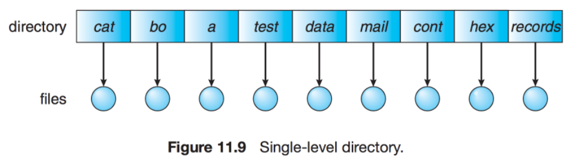

# 파일 시스템

컴퓨터에서 파일이나 자료를 쉽게 발견할 수 있도록, 유지 및 관리하는 방법

하드디스크와 메모리 속도차이를 줄이기위함, 하드디스크 용량을 효율적으로 관리하기위해 개발

- 특징

  - 커널영역에서 동작
  - 파일 CRUD 기능을 원할히 수행하기 위한 목적
  - 계층적 디렉터리 구조를 가짐
  - 파일시스템에 대한 실제 저장소는 디스크로서, 디스크 파티션 별로 파일시스템을 둘 수 있다

- 구조
  - 메타 영역: 데이터 영역에 기록된 파일의 이름, 위치, 크기, 시간정보, 삭제유무 등 파일 정보
  - 데이터 영역: 파일의 데이터

## 접근 방법

### 순차 접근

- 가장 간단한 방법으로 파일의 정보가 레코드 순서대로 차례차례 처리됨
- 읽기, 쓰기에 대한 시스템 콜이 발생하면서 현제 위치를 가르키는 포인터에서 포인터를 앞으로 보내면서 read, write 진행
- 뒤로 돌아갈땐 offset만큼 되감기를 해야한다(테이프 모델 기반)

### 직접 접근

- 특별한 순서 없이, 빠르게 레코드를 read, write 가능
- 현재 위치를 가르키는 cp 변수만 유지하면 직접 접근 파일을 가지고 순차 파일 기능을 쉽게 구현 가능
- 무작위 파일 블록에 대한 임의 접근을 허용한다. 따라서 순서의 제약이 없다.
- 대규모 정보를 접근할때 유용하기 때문에 데이터베이스에 활용한다.

### 기타 접근

- 직접 접근 파일에 기반하여 색인 구축
- 크기가 큰 파일을 입출력 탐색할 수 있게 도와주는 방법

## 디렉터리와 디스크 구조

### 디스크 구조

- 파티션은 연속된 저장 공간을 하나 이상의 연속되고 독립적인 영역으로 나누어서 사용할 수 있도록 정의한 규약

### 디렉터리

**1단계 디렉터리**

- 가장 간단한 구조, 파일들은 서로 유일한 이름을 가짐, 서로 다른 사용자라도 같은 이름 사용 불가

**2단계 디렉터리**

- 사용자에게 개별적인 디렉토리를 만들어줌
- UFD(User File Directory) : 자신만의 사용자 파일 디렉토리
- MFD(Master File Directory) : 사용자의 이름과 계정번호로 색인되어 있는 디렉토리

**트리 구조 디렉토리**

- 2단계 구조 확장된 다단계 트리 구조
- 한 비트를 활용하여, 일반 파일(0)인지 디렉토리파일(1) 구분

**그래프 구조 디렉토리**

- 순환이 발생하지 않도록 하위 디렉토리가 아닌 파일에 대한 링크만 허용하거나, 가비지 컬랙션을 이용해 전체 파일 시스템을 순회하고 접근 가능한 모든 것을 표시
- 링크가 있으면 우회하여 순환을 피할 수 있음
