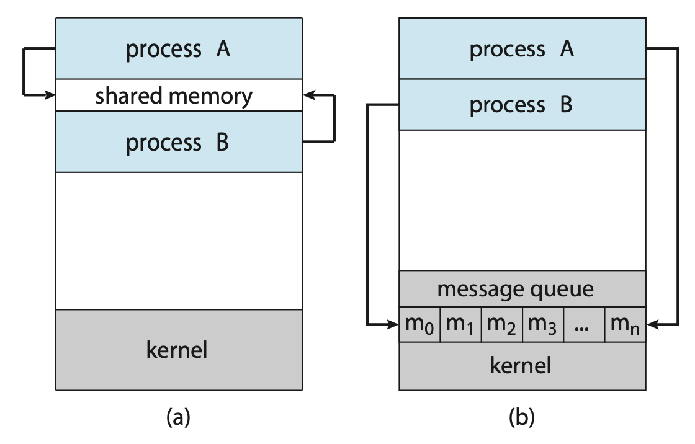
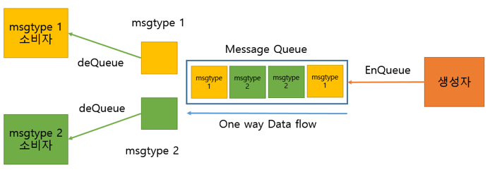

## IPC (Inter Process Communication)
프로세스는 독립적으로 실행된다. 즉, 독립 되어있다는 것은 다른 프로세스에게 영향을 받지 않는다고 말할 수 있다. (스레드는 프로세스 안에서 자원을 공유하므로 영향을 받는다)

이런 독립적 구조를 가진 프로세스 간의 통신을 해야 하는 상황이 있을 것이다. 이를 가능하도록 해주는 것이 바로 IPC 통신이다.

프로세스는 커널이 제공하는 IPC 설비를 이용해 프로세스간 통신을 할 수 있게 된다.


### IPC 전통적 모델

> (a) Shared Memory  <br>(b) Message Passing
- Shared Memory: **데이터를 공유**, 즉 함께 사용하는 것 (ex. Shared Memory, ...)

- Message Passing: **통신**을 이용해서 데이터를 주고 받는 방법 (ex. PIPE, Named PIPE, Message Queue, ...)


## IPC의 종류

파이프는 두 개의 프로세스를 연결하는 단방향 통신 채널로 하나의 프로세스는 데이터를 쓰기만 하고, 다른 하나는 데이터를 읽기만 할 수 있다. 

### 익명 PIPE 
통신할 프로세스를 명확히 알 수 있는 경우에 사용한다.(부모-자식 프로세스)

- 장점:  
매우 간단하게 사용할 수 있다.  
단순한 데이터 흐름을 가질 때 효율적이다. 
- 단점:  
전이중 통신(양쪽 모두 송/수신을 하는 것)을 위해서는 2개를 만들어야 하는데, 이때 구현이 복잡해진다.
대신 read()와 write()가 기본적으로 block 모드로 작동한다.

### Named PIPE(IFFO) 
익명 파이프의 확장된 상태로 부모 프로세스와 무관한 다른 프로세스도 통신이 가능하다. 서로다른 프로세스들이 파이프의 이름만 알면 통신이 가능하다.
- 장점: 부모-자식 프로세스가 아니어도 통신이 가능하다.
- 단점: Named 파이프 역시 읽기/쓰기 동시에 불가능하다. 따라서 전이중 통신을 위해서는 익명 파이프처럼 2개를 만들어야 가능하다.

### Message Queue
입출력 방식은 Named 파이프와 동일하다.
다른점은 메시지 큐는 파이프처럼 데이터의 흐름이 아니라 메모리 공간이다.




메모리를 사용한 파이프로, 구조체를 기반으로 통신한다. 메세지 타입에 따라 구조체 종류를 다르게 받을 수 있다.

사용할 데이터에 번호를 붙이면서 여러 프로세스가 동시에 데이터를 쉽게 다룰 수 있다.

커널에서 제공하기 때문에 메모리 제한이 있을 수 있다.

### Shared Memory
프로세스들이 주소 공간의 일부를 공유하는 방식  
- 프로세스가 공유 메모리 할당을 커널에 요청하면, 커널은 해당 프로세스에 메모리 공간을 할당해주고 이후 모든 프로세스는 해당 메모리 영역에 접근할 수 있게 된다.
- 중개자 없이 곧바로 메모리에 접근할 수 있어서 IPC 중에 가장 빠르게 작동함

<br>

### +
### 메모리 맵
공유 메모리처럼 메모리를 공유하지만, 메모리 맵은 열린 파일을 메모리에 맵핑시켜서 공유하는 방식이다. (즉 공유 매개체가 파일+메모리)

파일은 시스템 전역의 자원이므로 다른 프로세스들끼리 데이터를 공유하는데 문제가 없다는 점을 이용한 것이다.

주로 파일로 대용량 데이터를 공유해야 할 때 사용한다.


### 소켓
네트워크 소켓 통신을 통해 데이터를 공유한다.(pipe 개념을 네트워크로 확장시킨 것)

클라이언트와 서버가 소켓을 통해서 통신하는 구조로, 원격에서 프로세스 간 데이터를 공유할 때 사용한다.

네트워크 소켓통신을 사용한 데이터 공유이며, IPC 기법 중에 유일하게 다른 외부 시스템의 프로세스와도 공유가 가능하다.


## ❓ 면접질문
**Q. IPC란 무엇인가요?**
```
A. IPC는 프로세스들 사이에 서로 데이터를 주고 받는 방식, 즉 프로세스 간의 통신을 의미합니다. 각 프로세스는 독립적인 실행 객체이기 때문에 프로세스 간 통신을 하려면 커널이 제공하는 IPC 모델 방식을 사용해서 통신을 해야 합니다. 여기에는 크게 두가지로 메세지 전달 방식과 공유 메모리 방식이 있습니다.
```

<br>

**Q. IPC 모델에 대해 설명해주세요**
```
A. 크게 두가지로 메세지 전달 방식과 공유 메모리 방식이 있습니다. 공유 메모리 같은 경우에는 프로세스 간에 공유가 되도록 설정해놓은 메모리이며, 모든 프로세스들이 접근이 가능합니다. 속도가 가장 빠르다는 장점이 있습니다.
메세지 전달 방식은 공유자원을 그때그때 프로세스 사이에서 전달하는 방식이에요. 이러한 방법의 장점은 동기화를 전혀 고민할 필요가 없어서 구현하기가 편하다는 것입니다. 그치만 공유메모리에 비해 속도가 느립니다. 종류는 익명 파이프와 Named 파이프, 메세지큐 방식이 있습니다.
```
<br>

출처: https://velog.io/@coastby/%EC%9A%B4%EC%98%81%EC%B2%B4%EC%A0%9C-IPC-Inter-Process-Communication-%ED%94%84%EB%A1%9C%EC%84%B8%EC%8A%A4-%EA%B0%84-%ED%86%B5%EC%8B%A0, https://jeonjoonho.github.io/2020/04/25/IPC%28Inter%20Process%20Communication%29/, https://velog.io/@syleemk/%EB%A9%B4%EC%A0%91-%EB%8C%80%EB%B9%84-%EC%9A%B4%EC%98%81%EC%B2%B4%EC%A0%9C#ipc-%EC%A2%85%EB%A5%98