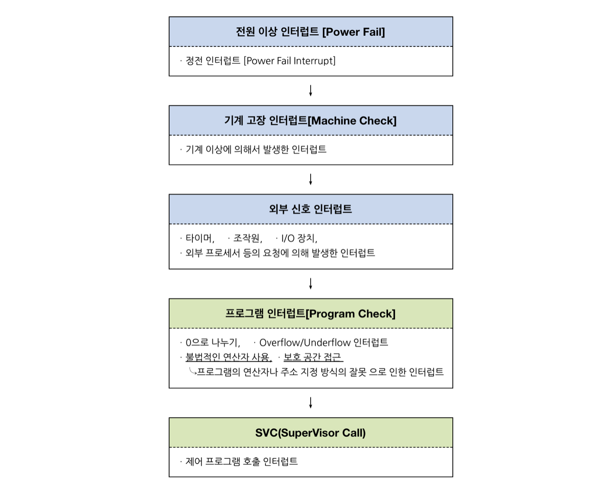
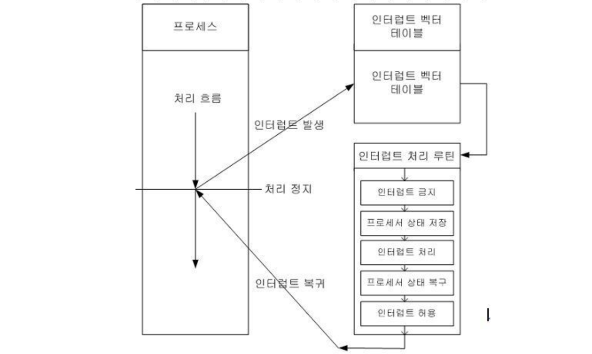
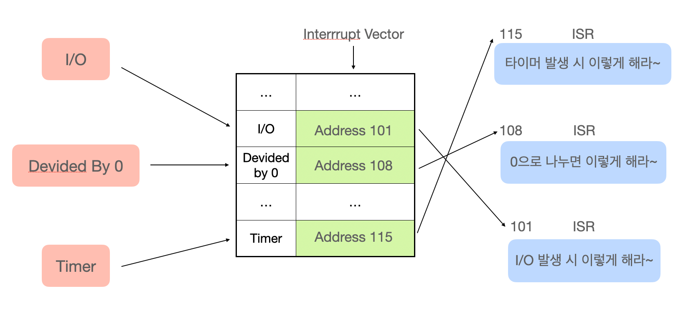

## Interrupt (인터럽트)
CPU는 컴퓨터의 핵심으로 컴퓨터에 연결된 모든 주변기기와 신호를 주고받으며 모든 일을 관장하는데, 보조 역할을 하는 주변기기가 많은 일 하는 대신 CPU는 자신만의 주된 업무(관리와 계산 등)을 한다. 그래서 어떤 일이 발생하면 주변기기가 CPU에 이 사실을 알려주어야한다. 이 사실을 알리는 것이 Intterupt

### Interrupt?
어떤 신호가 들어왔을 때, CPU를 잠깐 정지시키는 것
> 인터럽트란 프로세스 실행 도중 예기치 않은 상황이 발생할 경우, 현재 실행 중인 작업을 즉시 중단하고, 발생된 상황에 대한 우선 처리가 필요함을 CPU에게 알리는 것

<br>

## 종류
우선순위에 따라서 두가지로 나뉜다.



### 하드웨어/외부 인터럽트
**주변 기기나 하드웨어**에서 발생한 이벤트에 의해 발생하는 인터럽트. 일반적인 인터럽트를 이르는 말

    이때 인터럽트 라인이 설계된 이후 순차적인 인터럽트 실행을 중지하고, 운영체제에 시스템콜을 요청해서 원하는 디바이스로 향해 디바이스에 있는 작은 로컬 버퍼에 접근하여 일을 수행한다.

- I/O 디바이스의 입출력, 전원 이상, 기계 착오, 외부 신호
- Interrupt Mask(인터럽트가 발생하였을 때 요구를 받아들일지 말지 지정하는 것) 가능 여부에 따라 Maskable interrupt와 Non-maskable interrupt(매우 중요하여 거부,무시가 안됨. 전원 이상, 하드웨어 고장 등 어쩔 수 없는 오류)가 있다.

<br>

### 소프트웨어/내부 인터럽트
**트랩(trap)** 또는 **exception** 이라고도 하며, 프로세스 오류 등으로 프로세스가 **시스템콜을 호출할 때 발생**
- 파일 입출력, 메모리 할당, 네트워크 통신, 시스템 정보 조회

종류
- Exception: 0으로 나누기, 오버플로우, 페이지 부재, 명령어를 잘못 사용한 경우
- SVC: System Call 을 실행시키기 위한 CPU 명령어

## 인터럽트 과정


인터럽트가 발생되면 인터럽트 핸들러가 모여있는 인터럽트 벡터(일종의 함수를 가리키는 포인터)로 가서 인터럽트 핸들러 함수가 실행된다.

### 순서
1. 인터럽트 발생
2. PCB에 현재 수행 중이던 프로세스의 상태를 저장
3. 인터럽트 처리 후 실행할 명령어의 주소를 PC(ProgramCounter)에 저장
4. CPU에 위치한 인터럽트 벡터를 읽어 해당 인터럽트 처리 루틴(ISR)으로 넘어가 루틴을 실행 = 인터럽트 처리
5. ISR 끝에 IRET 명령어에 의해 인터럽트 해제
6. 루틴 이후 다시 저장해둔 PC 레지스터 값을 읽어 다시 프로세스 수행



- PCB(Process Control Block): 운영체제가 프로세스를 제어하기 위해 정보를 저장해 놓는 곳
- 인터럽트 핸들러: ISR(Interrtup Service Routine)이라고도 함. 인터럽트 발생 시 이를 핸들링하기 위한 함수. 커널 내부의 IRQ를 통해 호출되며 request_irq()를 통해 인터럽트 핸들러 함수를 등록할 수 있다.
- IRQ: 인터럽트 요청 라인(interrupt request lines). 0-15번까지 구성되어 있고, 미리 할당되어있는 것과 사용을 위해 예비된 것이 있다. (ex. 0: 시스템 타이머, 1: 키보드 ...)
- IRET: Interrupt Return. 이전 태스크로 다시 돌아가는 어셈블리 명령어. ISR의 마지막 명령어.


## ❓ 면접질문
**Q. 인터럽트의 종류에 대해 설명해주세요**
```
A. 우선순위에따라 하드웨어 인터럽트, 소프트웨어 인터럽트로 나뉩니다. 하드웨어 인터럽트는 일반적인 인터럽트를 일컫는 말로, 주로 I/O 장치, 전원 공급, 기계 착오 등에 의해 발생합니다. 소프트웨어 인터럽트는 내부에서 프로세스가 시스템 콜을 호출할 때 발생하는 인터럽트로 트랩이라고 합니다. 소프트웨어 인터럽트로는 예외와 SVC가 있습니다.
```
<br>

**Q. 인터럽트 발생 시 일어나는 일에 대해 설명해주세요.**
```
A. 인터럽트가 발생하면, PCB에 현재 수행 중이던 프로세스의 상태를 저장합니다. 인터럽트 처리 후 실행할 명령어의 주소를 PC(ProgramCounter)에 저장하고, CPU에 위치한 인터럽트 벡터를 읽어 해당 인터럽트 처리 루틴(ISR)으로 넘어가 루틴을 실행합니다. ISR 끝에 IRET 명령어에 의해 인터럽트 해제가 되면, 다시 저장해둔 PC 레지스터 값을 읽어 다시 프로세스 수행
```
<br>


출처: https://doh-an.tistory.com/31, https://velog.io/@nnnyeong/OS-%EC%9D%B8%ED%84%B0%EB%9F%BD%ED%8A%B8-Interrupt, https://velog.io/@ohjinhokor/interrupt-vs-trap-%EA%B7%B8%EB%A6%AC%EA%B3%A0-software-interrupt-vs-hardware-interrupt