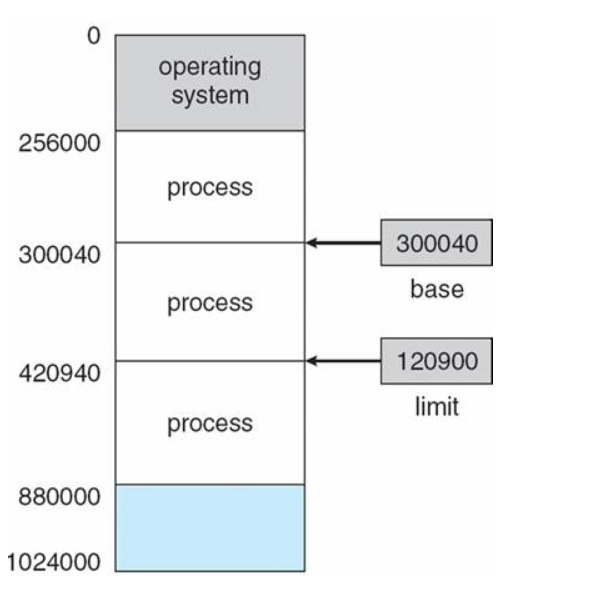

# 메모리

컴퓨터가 프로그램을 실행하는데 필요한 데이터와 명령어를 저장하는 공간(빠른 처리와 성능에 영향)

## 메모리 종류

1. 물리 메모리(Physical Memory)
   - 컴퓨터 하드웨어에서 RAM과 같이 직접 접근가능한 메모리
2. 가상 메모리(Virtual Memory) = 논리 메모리(Logical Memory)
   - 더 많은 메모리를 제공하기위해 사용
   - 실제 데이터가 담겨있는 곳에 접근하기 위해 빠른 주소변환 필요 → MMU

## Memory Management Unit(MMU, 메모리 관리 장치)

- 논리주소를 물리주소로 변환해 준다
- 메모리 보호나 캐시관리등 CPU가 메모리에 접근하는 것을 총 관리해주는 하드웨어

**MMU의 메모리 보호**

- 프로세스는 독립적인 메모리 공간을 가져야한다.
- 그래서 한 프로세스에 합법적인 주소 영역을 설정하고, 잘못된 접근이 오면 trap을 발생시켜 보호한다
  
  - base 레지스터: 프로세스 시작주소를 물리주소로 저장
  - limit 레지스터: 프로세스의 사이즈를 저장
  ```jsx
  base <= x < base + limit;
  ```
  이로써 프로세스의 접근 가능한 합법적인 메모리 영역 → 이 영역 밖에서 접근을 요구하면 trap발생

**메모리 과할당**

- 실제 메모리 사이즈보다 더 큰 사이즈의 메모리를 프로세스에 할당한 상황
  → 프로세스를 swap out하고 이 공간을 빈 프레임으로 활용
- 페이지 Swap in / Swap out
  - Swap in: 하드 디스크에서 메모리 페이지를 로드하거나 스왑영역에서 대기
  - Swap out: 메모리에서 하드디스크의 스왑역역에 저장

**페이지 교체**

- 메모리 과할당이 발생했을때, 프로세스 하나를 swap out해서 빈 프레임을 확보하는 것
- 과정
  1. 프로세스 실행 도중 페이지 부재 발생
  2. 페이지 폴트 발생시킨 페이지 위치를 디스크에서 찾음
  3. 메모리에 빈 프레임이 있는지 확인
  4. 빈 프레임에 페이지 폴트가 발생한 페이지를 올리고, 페이지 테이블 업데이트
- 페이지 교체시 프로세스를 계속 수행시키며 사용자가 알지 못하도록 해야함 → **오버헤드를 줄여야 함**
  - 빈 프레임이 없는 경우 victim 프레임을 비우고 새로운 프레임을 올리는 과정에서 두 번의 디스크접근이 이뤄진다. 이처럼 입출력 연산이 많아지면 오버헤드 문제 발생
    → 현재 상황에서 페이지 폴트를 발생할 확률을 최대한 줄여주는 교체알고리즘 사용

**캐시 메모리**

주기억장치에 저장된 내용의 일부를 임시로 저장해두는 기억장치

- CPU와 주기억장치의 속도 차이로 성능 저하를 방지하기 위한 방법
- **CPU와 기억장치의 상호작용**
  - CPU에서 주소를 전달 → 캐시 기억장치에 명령이 있는지 확인
    - 존재 (Hit): 해당명령어를 CPU로 전송
    - 비존재(Miss): 명령어를 가지고 주기억장치로 접근 → 명령어를 가진 데이터 인출 → 데이터를 캐시에 저장 → 명령어를 CPU로 전송

→ 캐시에 참조할때 순차적으로 참조하는것은 비효율적이다. 한 번에 원하는 정보를 짚어낼 수 있도록 적중률을 극대화하는 방법이 **“지역성의 원리”**

**지역성의 원리**

- 시간 지역성: 최근에 참조된 주소의 내용은 곧 다음에도 참조되는 특성
- 공간 지역성: 실제 프로그램이 참조된 주소와 인접한 주소의 내용이 다시 참조되는 특성

**캐싱 라인**

목적 데이터를 바로 접근하여 출력해야 캐시가 의미가 있어진다

캐시에 저장하는 데이터에는 데이터의 메모리 주소등을 기록해 둔 태그를 달아놓음

→ 이런 태그들을 자료구조를 사용하여 묶음으로 저장
