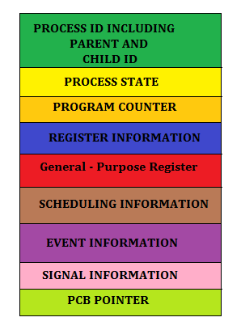
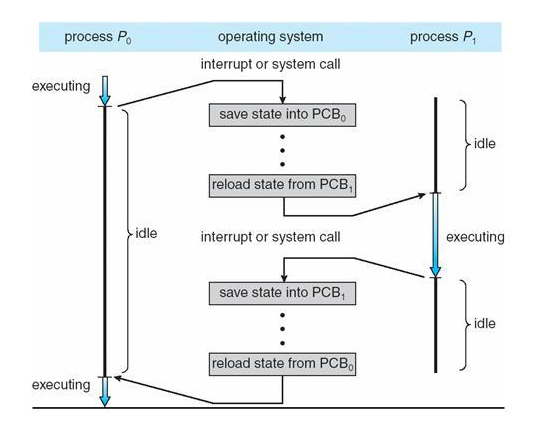

**Process Management**
: CPU가 프로세스가 여러개일 때, 
CPU 스케줄링을 통해 관리하는 것을 말함

이때, CPU는 각 프로세스들이 누군지 알아야 관리가 가능함

프로세스들의 특징을 갖고있는 것이 바로 **Process Metadata**

이러한 메타데이터는 프로세스가 생성되면 **PCB(Process Control Block)** 라는 곳에 저장됨

<br>

## PCB(Process Control Block)
프로세스 메타데이터들을 저장해 놓는 곳

- 프로세스 상태 관리와 문맥교환(Context Switching)을 위해 필요하다.
    >앞으로 다시 수행할 대기 중인 프로세스에 관한 저장 값을 PCB에 저장해두는 것
- 한 PCB 안에는 한 프로세스의 정보가 담긴다.
- 프로세스 생성 시 만들어지며 주기억장치에 유지된다.

### PCB의 구조

- Process ID : 프로세스를 구분하는 ID
- Process state : 각 State 들의 상태를 저장한다.
- Program Counter : 다음 Instruction의 주소를 저장한다. CPU는 이 값을 참조해서 Process의 Instruction을 수행한다.
- Register : Accumulator, CPU Register, General Register 등을 포함한다.
- CPU Scheduling Information : 우선순위, 최종 실행시간, CPU 점유시간 등이 포함된다.
- Memory Information : 해당 프로세스 주소공간(lower bound ~ upper bound) 정보를 저장
- Process Information : 페이지 테이블, 스케줄링 큐 포인터, 소유자, 부모 등
- Device I/O Status : 프로세스에 할당된 입출력 장치 목록, 열린 목록등
- Pointer : 부모/자식 프로세스에 대한 포인터, 자원에 대한 포인터 등
- Open File List : 프로세스를 위해 열려있는 파일의 리스트

### PCB 생성 & 제거
PCB는 Linked List 방식으로 관리한다.
> PCB List Head에 PCB들이 생성될 때마다 붙게 된다.<br> 주소값으로 연결이 이루어져 있는 연결리스트이기 때문에 삽입 삭제가 용이하다.

즉, 프로세스가 생성되면 해당 PCB가 생성되고 프로세스 완료시 제거된다.

<br>

## Context Switching
CPU는 한번에 하나의 프로세스만 처리할 수 있다. CPU 자원을 공유해서 여러 프로세스가 쓰기 위해서는 context swtiching 과정이 필요하다.  
수행 중인 프로세스를 변경할 때, CPU의 레지스터 정보가 변경되는 것을 Context Switching이라고 한다.  
**CPU가 이전의 프로세스 상태를 PCB에 보관하고, 또 다른 프로세스의 정보를 PCB에 읽어 레지스터에 적재하는 과정**

<br>

### Context Switching이 발생하는 경우
---
**1. 멀티태스킹(Multi-Tasking)**  

여러 프로세스들이 운영체제의 스케줄러의 방식에 따라 번갈아 수행된다.  
이때 번갈아 프로세스가 CPU를 할당 받는데, 이를 Context Switching이라고 한다.  
하지만 이 속도가 무척 빠르기 때문에 사용자는 여러 프로세스가 동시에 처리되는것처럼 느껴진다.

<br> 

**2. 인터럽트 핸들링(interrupt handling)**  

인터럽트는 시스템에 예외 상황이 발생했을때 CPU에게 알려 처리할 수 있도록 하는 것을 말한다. 이 인터럽트가 발생하면 Context Switching이 일어난다.

인터럽트(interrupt) 종류
- I/O request : 입출력 요청
- Time Slice Expired : CPU 사용시간이 만료
- fork a child : 자식 프로세스 생성
- Wait for an interrupt : 인터럽트 처리 대기

<br>

**3. 사용자와 커널 모드 전환(User and Kernal mode switching)**  

user mode : 사용자가 응용프로그램들을 사용하기 위해 접근하는 영역이다. 또한 사용자가 프로그램 내부에 자원들에 접근할 수 없도록 하는 모드이다.  
kernal mode : system memory롸 모든 명령어들에 접근이 가능한 실행모드이다. CPU 스케줄링, 메모리 관리, I/O 관리, 파일 시스템 관리 등의 일을 맡고 있다.

user mode와 kernal mode간의 전환에서 context swtiching은 필수가 아니지만 운영체제에 따라 발생할 수 있다.

<br>

## Context Switching 동작과정


<br>

## Context Switching Cost
Context Switching이 발생하게 되면 다음 프로세스를 위해 초기화 하는 등 여러 작업 때문에 큰 cost가 발생한다.

- cache 초기화, Memory Mapping 초기화, Kernel은 메모리 접근을 위해서 항상 실행되어야 함

Context switching 때, 해당 CPU는 아무 작업을 하지 못하기 때문에  
**Context switching 이 자주 일어나면 오버헤드가 많이 발생해서 오히려 효율과 성능이 떨어질 수 있다.**


## ❓ 면접질문
**Q. PCB에 대해 설명해주세요.**
```
A. 프로세스 메타데이터들을 저장해 놓는 곳으로 프로세스 상태 관리와 Context Switching을 위해 필요합니다. 즉, 대기 중인 프로세스에 관한 메타데이터를 PCB에 저장해두는 것입니다. 한 PCB 안에는 한 프로세스의 정보가 담기며, 프로세스 생성 시 만들어지고 프로세스가 종료되면 삭제됩니다. 또한 PCB는 주기억장치에 유지됩니다.
```
<br>

출처: https://jettstream.tistory.com/149, https://jackcokebb.tistory.com/14