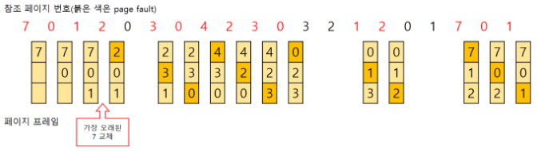
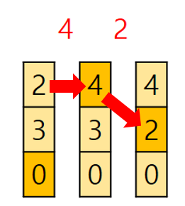
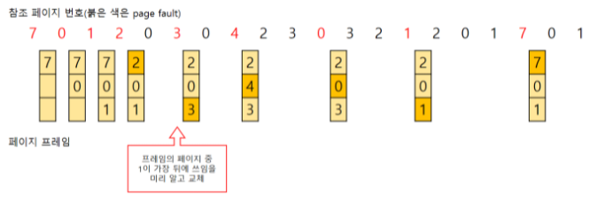
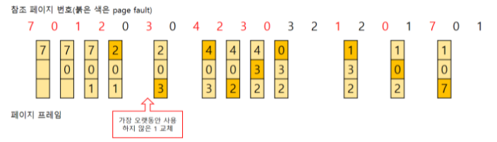
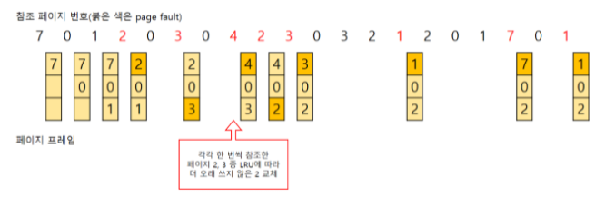
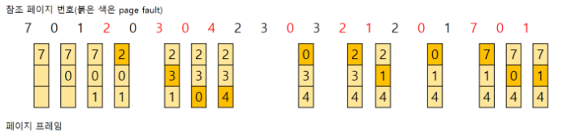

# 페이지 교체 알고리즘

- OS에서 주기억장치보다 더 큰 용량의 프로그램을 실행하기 위해서 가상메모리 기법을 사용해서 처리
- 이때 페이징 기법으로 메모리를 관리하는 OS는 필요한 페이지를 요구할 때 해당 페이지를 메모리에서 로딩
- 페이지를 찾아 빈 프레임에 로딩하는데 빈프레임이 없을 경우가 있다
- 새로 올릴 페이지와 교체할 프레임을 찾는 알고리즘을 페이지 교체 알고리즘

## FIFO(FIRST IN FIRST OUT)

- 메모리에 올라온 지 가장 오래된 페이지를 교체
- 페이지가 올라온 시간을 기록하거나, 페이지가 올라온 순서를 큐에 저장하는 방식

- 성능이 항상 좋다고 할 수 없다. 위와 같이 페이지4와 2가 교체되고 또 다시 페이지 2를 사용하려고 한다. 이런식으로 사용중인 페이지를 계속해서 교체하면 실행속도 저하

## Optimal

- 앞으로 가장 오랫동안 사용되지 않을 페이지 교체
- 프로세스가 앞으로 사용할 페이지를 알아야한다는 것이 실제 활용에서 알 방법이 없기 때문에 최적 알고리즘은 구현이 불가능한 알고리즘임, 그래서 실제 구현 보다 다른 알고리즘과 비교 연구 목적을 위해 사용함
- 가장 페이지 교체 수가 적음

## LRU(Least Recently Used)

- 가장 오래 사용되지 않은 페이지를 교체하는 알고리즘
- 최적 알고리즘보다 교체 횟수가 높지만 FIFO보다 효율적임

## LFU(Least **Frequently** Used)

- 참조횟수가 가장 작은 페이지를 교체
- 만약 교체대상이 페이지가 여러 개일 경우, LRU에 따라 가장 오래 사용하지 않은 페이지를 교체

## MFU(Most Frequently Used)

- LFU와 반대로 참조 횟수가 가장 많은 페이지 교체
- 참조 횟수가 적은 페이지가 최근에 사용된 것이기 때문에 앞으로도 사용될 가능성이 높다는 것

## 교체방식

- Global 교체
  - 메모리 상의 모든 프로세스 페이지에 대해 교체하는 방식
- Local교체
  - 메모리 상의 자기 프로세스 페이지에서만 교체하는 방식

→ 다중 프로그래밍의 경우, 메인 메모리에 다양한 프로세스가 동시에 존재할 수 있다

페이지 교체시 다양한 페이지 교체 알고리즘을 활용해 victim page를 선정하는데, 선정 기준을 Global인지 Local인지?

실제로는 전체를 기준으로 페이지를 교체하는것이 더 효율적이다. Local로 진행하면 교체를 할때 각각 모두 교체를 진행해야하기 때문이다.
