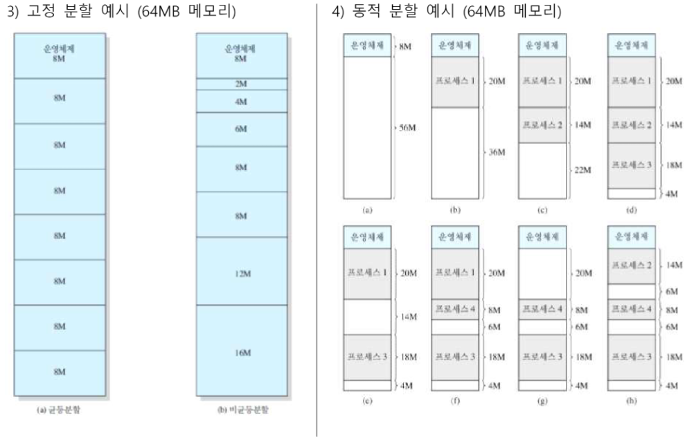
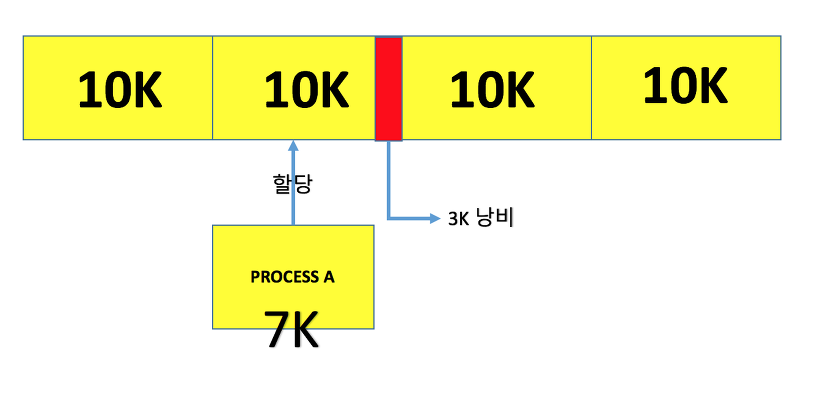
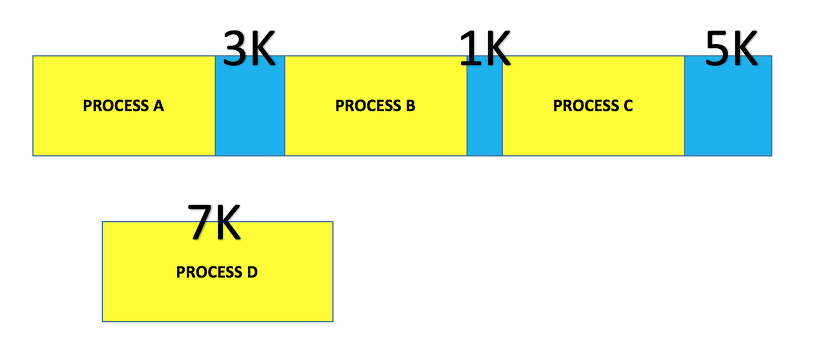
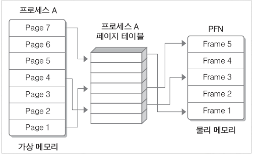
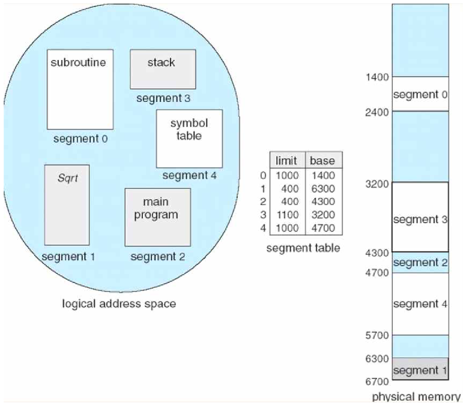

# **페이징과 세그먼테이션**

- 이 기법을 쓰는 이유는 다중 프로그래밍 시스템에서 다수의 프로세스를 수용하기위해 주기억 장치를 동적으로 분할하는 메모리 관리작업이 필요함

## 가상메모리

- 실제메모리 크기보다 큰 프로그램을 실행하기위해 사용
- 핵심 아이디어
  - 모든 데이터를 주 기억장치에 올리지 않고 필요한 것들만 올려서 사용한다.
  - 남은것들은 보조기억장치에 존재
  - 필요할때 보조 기억장치에서 주 기억장치로 옮겨서 사용
- 가상메모리의 주소와 실제 메모리의 주소는 일치하지 않는다
  - 가상 메모리주소와 실제 메모리 주소를 1:1대응시켜야한다
    - 이를 해결해 주는 것이 MMU(Memory Managment Unit)
    - MMU는 가상 메모리 주소를 실제 메모리 주소로 변환시켜 주는것
    - 하지만, 모든 메모리주소를 MMU를 거쳐 변환하는것은 오버헤드가 크다.
    - 따라서 MMU는 메모리를 일정단위로 쪼개서 관리한다.

## 메모리관리

### 1. 연속메모리 관리

- 프로그램 전체가 하나의 공간에 연속적으로 할당되어야하는 기법
- 고정 분할 기법: 주 기억장치가 고정된 파티션으로 분할 → 내부단편화 발생
- 동적 분할 기법: 파티션들이 동적 생성되면서 자신가 크기가 같은 파티션에 적재 → 외부 단편화 발생

→ 이렇게 연속 메모리 관리 기법을 사용하면 단편화 현상이 발생한다.

→ 기억장치의 빈 공간 또는 자료가 여러 조각으로 나뉘는 현상. 프로세스들이 메모리에 적재되고 제거되는 일이 반복되면, 프로세스들이 차지하는 메모리 틈 사이로 사용하지 못할 만큼의 자유공간이 늘어나게 된다. 이런 단편화는 2가지로 나뉜다.

**내부단편화**

- 프로세스가 사용하는 메모리공간에 남는 부분
- 프로세스가 요청한 양보다 더 많은 메모리를 할당할때 발생
- 메모리분할 자유 공간과 프로세스가 사용하는 공간차이를 의미

**외부단편화**

- 메모리 공간 중 사용하지 못하게 되는 부분
- 메모리 할당 및 해제 작업의 반복으로 작은 메모리가 중간 중간 존재할 수 있다.(총 메모리 공간은 충분하지만 사용하지 못함)
- 외부 단편화를 위해 압축을 이용하여 프로세스가 사용하는 공간을 한쪽으로 몰 수 있지만 효율이 좋지못하다.

### 2. 불연속 메모리 관리

- 프로그램의 일부가 서로 다른 주소 공간에 할당될 수 있는 기법.
- 외부 단편화 해소를 위한 페이징과 내부 단편화 해소를 위한 세그멘테이션으로 나뉜다

**페이징(Paging)**

프로세스를 일정한 크기의 페이지로 분할해서 메모리에 적재하는 방식

- 페이지: 고정 사이즈의 가상 메모리 내 프로세스 조각
- 프레임: 페이지 크기와 같은 주 기억장치 메모리 조각
- 하나의 프로세스가 사용하는 메모리 공간이 연속적이어야 한다는 제약을 없애는 메모리 관리기법

- 물리메모리는 고정 크기의 프레임으로, 가상 메모리는 고정크기의 페이지로 분리되어 있음
- 개별 페이지는 순서에 상관없이 물리 메모리에 있는 프레임에 매핑되어 저장
- 모든 프로세스는 하나의 페이징테이블을 가지고 있으며, 여기에는 메인메모리에 적재되어있는 페이지 번호와 해당 페이지가 위치한 메인메모리의 시작 주소가 있다

- 논리 주소와 페이지 테이블
  - MMU(메모리 관리 장치)가 논리주소를 이용하여 실제 데이터가 담겨있는 주소로 변환
- 페이징의 장, 단점
  - 장점 : 논리 메모리는 물리 메모리에 연속되어 저장될 필요가 없고, 물리 메모리에 남는 프레임에 적절히 배치되기 때문에 외부 단편화가 발생하지 않는다.
  - 단점: 내부 단편화가 발생할 수 있다. 페이지 단위를 작게하면 해결 할 수 있지만, 페이지 매핑과정이 복잡해져 오히려 비효율적

**세그먼테이션(Segmentation)**

- 가상 메모리를 물리적단위인 페이지가 아니라 서로 크기가 다른 논리적 단위로 분할한 것을 의미함
- 예를 들어 돼지를 도축할때 같은 크기로 잘라서 보관하는 것이 아니라 부위별로 잘라서 보관

- 세그먼트 테이블
  - 분할 방식을 제외하고 페이징과 세그먼테이션이 동일하기 때문에 매핑 테이블 동작방식도 동일
  - 단, 논리 주소의 앞 비트들은 페이징 번호가 아닌 세그먼트 번호가 된다.
- 세그먼테이션의 장단점
  - 장점 : 내부 단편화 문제가 해소된다, 보호와 공유기능을 수행할 수 있다, 프로그램의 중요한 부분과 중요하지 않은 부분을 분리하여 저장할 수 있고, 같은 코드영역은 한 번에 저장할 수 있다.
  - 단점 : 외부 단편화 문제가 발생 할 수 있다.

**단순 페이징**

- 각 프로세스는 프레임과 같은 길이를 가진 균등 페이지로 나뉜다
- 외부 단편화가 생기지 않는다
- 내부 단편화가 존재할 수 있다

**단순 세그먼테이션**

- 각 프로세스는 여러 세그먼트로 나뉜다.
- 내부단편화가 발생하지 않는다.
- 외부단편화가 존재할 수 있다.
- 메모리 효율 개선
- 동적 분할을 통한 오버헤드 감소

**가상 메모리 페이징**

- 단순 페이징과 비교해 프로세스 페이지 전부를 로드할 필요가 없다
- 필요한 페이지가 있으면 나중에 자동으로 불러 들인다.
- 외부단편화가 발생하지 않는다
- 복잡한 메모리 관리로 오버헤드가 발생할 수 있다

**가상 메모리 세그먼테이션**

- 필요하지 않는 세그먼트들은 로드되지 않는다
- 필요한 세그먼트가 있을 때 나중에 자동으로 불러 들인다.
- 내부 단편화가 발생하지 않는다.
- 복잡한 메모리 관리로 오버헤드가 발생할 수 있다

## 예상질문

**페이징 또는 세그먼테이션을 사용하는 이유는?**

프로그램을 실행할때 코드를 디스크에서 메인 메모리로 적재할때 단편화가 발생한다. 단편화가 많이 발생할 경우 사용하지 못하는 메모리가 많아진다. 이를 해결하기 위해 압축등을 사용할 수 있지만, 메모리 계산 비용이 적은 페이징 또는 세그먼테이션을 사용한다
