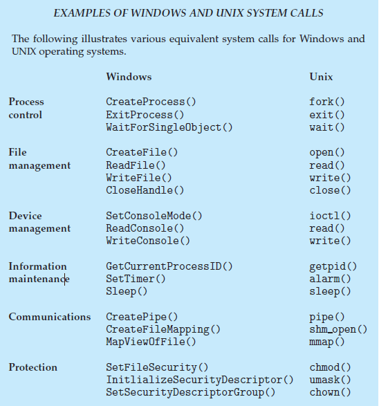

## System Call (시스템콜)
운영체제는 커널 모드와 사용자 모드로 나뉘어 구동된다.

**시스템콜**: 운영체제가 커널에 접근하기 위한 인터페이스
- 커널: 운영체제의 핵심 부분으로 보안, 메모리, 프로세스, 파일 시스템, I/O 디바이스, I/O 요청관리 등 운영체제의 중추 역할을 한다.

<br>

**유저 프로그램**이 운영체제의 서비스를 받기 위해 **커널 함수를 호출할 때** 사용<br>
- 커널 영역의 기능을 사용자 모드가 사용가능하게, 즉 **프로세스가 하드웨어에 직접 접근하여 필요한 기능을 사용할 수 있게 해줌**

### 장점
- 컴퓨터 자원에 대한 직접 접근을 차단하여 프로그램을 다른 프로그램으로부터 보호할 수 있다.
- 시스템콜은 하나의 추상화 계층이다. 그래서 이를 통해 네트워크 통신이나 DB와 같은 낮은 영역 처리에 대한 부분을 많이 신경쓰지 않고 프로그래밍해도 된다는 장점이 있다.

<br>

## System Call의 동작


- 유저 프로그램이 I/O 요청으로 트랩(trap)을 발동하면 올바른 요청인지 확인 후 유저모드가 시스템콜을 통해 커널 모드로 변환되어 실행된다.
    - 유저모드: 유저가 접근할 수 있는 영역을 제한하여 자원에 함부로 침범하지 못하는 모드
    - 커널모드: 모든 컴퓨터 자원에 접근 가능한 모드
- **mode bit**: 유저모드와 커널모드를 구분할 때 사용하는 플래그 변수
    - 0: kernel mode / 1: user mode

### 동작순서

1. User mode의 어플리케이션이 System Call(open() 함수)를 호출 
2. Trap이 발생하며 System Call Interface를 통해 Kernel mode로 진입 (이때 현재 상태를 저장, mode bit를 0으로 설정)
3. 요청 받은 System Call을 수행한다. 
4. User mode로 return (mode bit를 1로 변경한다.)

<br>

### 시스템 콜 발생 시 매개변수 전달방법

시스템콜을 발생시킬 때 더 많은 정보가 필요할 수 있는데 그 정보가 담긴 매개변수를 운영체제에 전달하기 위한 3가지 방법이 있다.
1. 매개변수를 CPU 레지스터 내에 전달한다. 이 경우에 매개변수의 갯수가 CPU 내의 총 레지스터 개수보다 많을 수 있다.
2. 위와 같은 경우에 매개변수를 메모리에 저장하고 메모리의 주소가 레지스터에 전달된다.
3. 매개변수는 프로그램에 의해 스택(stack)으로 전달(push) 될 수도 있다.

<br>

### 종류

1. 프로세스 제어(Process Control)
2. 파일 조작 (File Manipulation)
3. 장치 관리 (Device Manipulation)
4. 정보 유지 (Information Maintenance)
5. 통신 (Communication)
6. 보호 (Protection)


## ❓ 면접질문
**Q. System call에 대해 설명해주세요.**
```
A. 운영체제가 커널에 접근하기 위한 인터페이스로 유저 프로그램이 운영체제의 서비스를 받기 위해 커널 함수를 호출할 때 사용합니다. 컴퓨터 자원에 대한 직접 접근을 차단하여 프로그램을 다른 프로그램으로부터 보호할 수 있다는 장점이 있습니다.
```
<br>

**Q. 시스템콜의 동작순서에 대해 말해주세요.**
```
A. 먼저, 유저 모드의 어플리케이션이 시스템콜 함수를 호출하면, trap이 발생하며 System Call Interface를 통해 커널 모드로 진입합니다. 이때 진행중이던 프로세스 상태를 PCB에 저장, mode bit를 0으로 변경합니다. 이후 요청 받은 시스템콜을 수행하고, 유저 모드로 return하며 mode bit를 1로 변경합니다.
```
<br>


출처: https://yummy0102.tistory.com/485, https://didu-story.tistory.com/311, https://luckyyowu.tistory.com/133, https://nice-engineer.tistory.com/entry/%EC%9A%B4%EC%98%81%EC%B2%B4%EC%A0%9C-System-Call