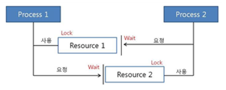

# 데드락

- 두 개 이상의 프로세스나 스레드가 서로 자원을 얻지 못해서 다음 처리를 하지 못하는 상태
- 무한히 다음 자원을 기다리게 되는 상태

자원1과 2를 모두 필요로 하는 프로세스1과2

서로 하나씩 얻고 다음걸 기다리게 되면 데드락 상태에 걸린다.

**_데드락(DeadLock) 발생 조건_**

4가지 모두 성립해야 데드락 발생

1. **상호 배제(Mutual exclusion)**

   > 자원은 한번에 한 프로세스만 사용할 수 있음

2. **점유 대기(Hold and wait)**

   > 최소한 하나의 자원을 점유하고 있으면서 다른 프로세스에 할당되어 사용하고 있는 자원을 추가로 점유하기 위해 대기하는 프로세스가 존재해야 함

3. **비선점(No preemption)**

   > 다른 프로세스에 할당된 자원은 사용이 끝날 때까지 강제로 빼앗을 수 없음

4. **순환 대기(Circular wait)**

   > 프로세스의 집합에서 순환 형태로 자원을 대기하고 있어야 함

**_데드락(DeadLock) 처리_**

**예방(prevention)**

교착 상태 발생 조건 중 하나를 제거하면서 해결한다 (자원 낭비 엄청 심함)

- 상호배제 부정 : 여러 프로세스가 공유 자원 사용
- 점유대기 부정 : 프로세스 실행전 모든 자원을 할당
- 비선점 부정 : 자원 점유 중인 프로세스가 다른 자원을 요구할 때 가진 자원 반납
- 순환대기 부정 : 자원에 고유번호 할당 후 순서대로 자원 요구

**회피(avoidance)**

교착 상태 발생 시 피해나가는 방법

은행원 알고리즘(Banker's Algorithm)

- 은행에서 모든 고객의 요구가 충족되도록 현금을 할당하는데서 유래함
- 프로세스가 자원을 요구할 때, 시스템은 자원을 할당한 후에도 안정 상태로 남아있게 되는지 사전에 검사하여 교착 상태 회피
- 안정 상태면 자원 할당, 아니면 다른 프로세스들이 자원 해지까지 대기

**교착 상태를 탐지 & 회복**

교착 상태가 되도록 허용한 다음 회복시키는 방법

**탐지(Detection)**

자원 할당 그래프를 통해 교착 상태를 탐지함

자원 요청 시, 탐지 알고리즘을 실행시켜 그에 대한 오버헤드 발생함

**회복(Recovery)**

교착 상태 일으킨 프로세스를 종료하거나, 할당된 자원을 해제시켜 회복시키는 방법

**프로세스 종료 방법**

- 교착 상태의 프로세스를 모두 중지
- 교착 상태가 제거될 때까지 하나씩 프로세스 중지

**자원 선점 방법**

- 교착 상태의 프로세스가 점유하고 있는 자원을 선점해 다른 프로세스에게 할당 (해당 프로세스 일시정지 시킴)
- 우선 순위가 낮은 프로세스나 수행 횟수 적은 프로세스 위주로 프로세스 자원 선점
  ⇒ 낮은 애 한테서 자원 뺏기

## 면접 질문

1. 데드락(교착 상태)가 뭔가요? 발생 조건에 대해 말해보세요.

<aside>
💡 데드락, 또는 교착 상태는 두 개 이상의 프로세스가 서로가 가지고 있는 자원을 기다리면서 무한히 대기하는 상태를 말합니다. 교착 상태가 발생하면 관련된 모든 프로세스가 계속 대기 상태에 머물러, 시스템이 더 이상 진행되지 못하게 됩니다.

교착 상태가 발생하기 위해서는 네 가지 조건이 동시에 만족되어야 합니다:

- **상호 배제 (Mutual Exclusion)**: 자원은 한 번에 한 프로세스만이 사용할 수 있습니다.
- **점유와 대기 (Hold and Wait)**: 자원을 점유한 프로세스가 다른 자원을 기다리며, 그 자원을 점유하지 않은 상태로 대기합니다.
- **비선점 (No Preemption)**: 자원이 강제로 회수되지 않고, 자원을 점유한 프로세스가 자원을 자발적으로 해제할 때까지 기다립니다.
- **순환 대기 (Circular Wait)**: 각 프로세스가 자원을 기다리며, 그 자원을 점유한 다른 프로세스들이 순환적으로 서로를 기다립니다.
</aside>

1. 회피 기법인 은행원 알고리즘이 뭔지 설명해보세요.

<aside>
💡 은행원 알고리즘은 교착 상태를 회피하기 위한 기법 중 하나로, 자원을 할당하기 전에 시스템이 안전 상태인지 확인하는 알고리즘입니다. 이 알고리즘은 다익스트라가 제안했으며, 은행원이 대출을 승인하기 전에 은행의 자원 상태를 고려하는 방식에서 이름이 유래되었습니다.

알고리즘의 주요 원리는 다음과 같습니다:

1. **안전 상태 확인**: 시스템은 자원을 할당하기 전에 해당 할당이 시스템을 안전 상태로 유지할 수 있는지 검사합니다. 안전 상태란 모든 프로세스가 언젠가는 실행을 완료할 수 있는 상태를 말합니다.
2. **최대 필요량**: 각 프로세스가 필요한 최대 자원량을 사전에 알고 있어야 합니다.
3. **현재 할당과 필요 계산**: 현재 자원 할당 상태와 각 프로세스의 추가 자원 요구를 기반으로 자원을 할당할 수 있는지 결정합니다.
4. **안전 순서**: 자원을 할당한 후에도 특정 순서로 모든 프로세스가 실행을 완료할 수 있다면, 그 상태를 안전하다고 합니다.

이 알고리즘은 자원 할당 전에 항상 시스템이 안전한 상태에 있는지 확인함으로써 교착 상태를 회피합니다.

</aside>
