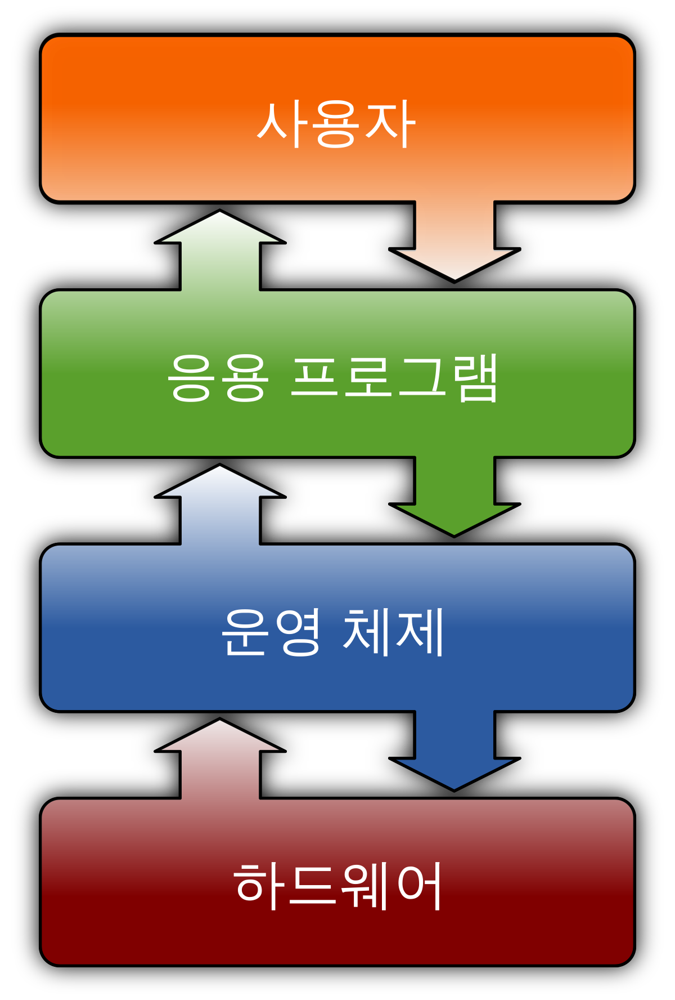

# 운영체제

- 운영체제란 응용프로그램 또는 사용자가 컴퓨터 하드웨어를 편리하고 효율적으로 사용하게 하기 위하여 시스템 자원(메모리, 프로세서 등)을 관리하고    
여러가지 프로그램이 필요로 하는 공통적인 서비스를 제공하는 소프트웨어이다.   
(종류로는 Windows, Linux, UNIX, MS-DOS 등이 있으며, 시스템의 역할 구분에 따라 각각 용이점이 있다.)

### 운영체제의 주요 기능
1. 프로세스 관리:   
프로세스 스케줄링: 여러 프로세스를 효율적으로 실행하기 위해 CPU 시간을 할당   
프로세스 생성 및 종료: 새로운 프로세스를 생성하고 불필요한 프로세스를 종료   
동기화와 통신: 프로세스 간의 통신과 동기화를 관리   
 
2. 메모리 관리:   
메모리 할당: 프로그램이 실행될 때 필요한 메모리를 할당하고, 사용이 끝난 메모리를 해제   
가상 메모리: 실제 메모리보다 큰 메모리 공간을 사용할 수 있게 함   
메모리 보호: 각 프로그램이 다른 프로그램의 메모리 공간을 침범하지 않도록 함  
 
3. 파일 시스템 관리:   
파일 저장 및 접근: 데이터를 파일 형태로 저장하고 접근할 수 있도록 함.   
디렉토리 구조 관리: 파일들을 체계적으로 정리하고 관리할 수 있도록 디렉토리 구조를 제공   
보안 및 권한 관리: 파일에 대한 접근 권한을 설정하고 관리   
 
4. 장치 관리:
입출력 장치 제어: 프린터, 디스크 드라이브, 키보드 등의 입출력 장치를 관리   
드라이버 제공: 하드웨어와 소프트웨어 간의 통신을 위해 장치 드라이버를 제공   
 
5. 사용자 인터페이스:
명령 줄 인터페이스(CLI): 텍스트 명령어를 통해 시스템을 제어   
그래픽 사용자 인터페이스(GUI): 마우스와 그래픽 화면을 이용해 시스템을 제어
 
6. 네트워킹
네트워크 인터페이스 관리: 네트워크 하드웨어(예: NIC, 무선 어댑터)를 제어하고 관리   
프로토콜 스택: TCP/IP와 같은 네트워크 프로토콜을 구현하고 관리   
소켓 프로그래밍: 소켓 API를 제공하여 애플리케이션이 네트워크 통신을 할 수 있도록 함   
네트워크 서비스: DNS, DHCP, FTP 등 다양한 네트워크 서비스를 제공함   
방화벽 및 보안: 네트워크 트래픽을 필터링하고 안전한 통신을 보장   
 
7. 사용자 관리
사용자 계정 관리: 사용자 계정을 생성, 수정, 삭제하며, 사용자 ID(UID)를 할당함   
인증 및 권한 부여: 사용자 인증을 통해 시스템 접근을 제어하고, 파일 및 디렉토리 접근 권한을 설정   
그룹 관리: 사용자 그룹을 생성하고 사용자를 그룹에 할당하여 일괄적으로 권한을 부여   
사용자 환경 설정: 각 사용자에게 개인 환경 설정(예: 홈 디렉토리, 환경 변수)을 제공   
세션 관리: 사용자의 로그인 및 로그아웃 세션을 관리   

### 면접 질문
- ** 운영 체제란 무엇입니까?**  
운영체제란 응용프로그램 또는 사용자가 컴퓨터 하드웨어를 편리하고 효율적으로 사용하게 하기 위하여 시스템 자원을 관리하고   
여러가지 프로그램이 필요로 하는 공통적인 서비스를 제공하는 소프트웨어입니다.

- **운영 체제의 주요 목적은 무엇입니까?**  
운영 체제에는 두 가지 주요 목적이 있다고 생각합니다.
1. 컴퓨터 시스템의 계산 활동을 관리하여 컴퓨터 시스템이 제대로 작동하도록 한다.
2. 프로그램 개발 및 실행을 위한 환경을 제공한다.
