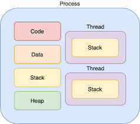

# 프로세스
- 프로세스는 실행 중인 프로그램의 인스턴스 즉, 프로그램이 메모리에서 실행될 때, 그것은 프로세스가 됨
- 프로세스는 각각 별도의 주소공간 할당 (독립적)

### 프로세스의 구성 요소
1. Code : 실행할 프로그램 코드.
2. Data : 전역 변수, 정적 변수, 배열 등
3. Stack : 함수 호출, 지역 변수, 매개 변수, 리턴 값 (임시 메모리 영역)
4. Heap : 동적으로 할당된 메모리(new(), malloc() 등)

### 프로세스의 상태
1. 생성 상태 (New): 프로세스가 생성 중인 상태.
2. 준비 상태 (Ready): 실행될 준비가 된 상태.
3. 실행 상태 (Running): CPU에서 실행 중인 상태.
4. 대기 상태 (Waiting): 입출력 등으로 인해 대기 중인 상태.
5. 종료 상태 (Terminated): 실행이 완료된 상태.

### 프로세스의 관리
- 운영체제는 프로세스를 관리하기 위해 스케줄러와 PCB를 사용
- 스케줄러는 프로세스의 상태 전환과 CPU 할당을 담당

# 스레드
- 스레드는 프로세스 내에서 실행되는 작업의 단위로 프로세스는 하나 이상의 쓰레드를 가질 수 있음.
- 스레드는 독립적으로 실행되지만, 동일한 메모리 공간(코드, 데이터, 힙)을 공유함

### 스레드의 구성 요소
1. thread ID : 고유한 식별자.
2. Program Counter : 현재 실행 중인 명령어의 주소.
3. register : CPU 레지스터 상태.
4. Stack : 함수 호출, 지역 변수. (쓰레드마다 별도의 스택이 있음)

### 스레드의 관리
- 운영체제는 쓰레드를 관리하기 위해 TCB(Thread Control Block)를 사용
- TCB는 쓰레드의 상태, 스택 포인터, 프로그램 카운터 등을 저장

## 프로세스 vs 스레드
|특징|프로세스| 스레드                |
|----------------|-----------------------------------|--------------------|
|기본 단위|실행 중인 프로그램의 인스턴스| 프로세스 내의 실행 단위      |
|메모리 공유|독립적인 메모리 공간| 프로세스 내에서 메모리 공간 공유 |
|자원 할당|자원을 많이 소모| 자원을 적게 소모          |
|상호 간섭|프로세스 간 간섭 없음| 스레드 간 간섭 발생 가능     |
|생성 속도|생성, 종료 속도가 느림| 생성, 종료 속도가 빠름      |
|오버헤드|오버헤드가 큼| 오버헤드가 적음           |

## 멀티프로세스 vs 멀티스레드
### 멀티프로세스
장점
1. 안정성이 높음 : 한 프로세스가 크래시해도 다른 프로세스에 영향을 미치지 않음. 
2. 독립적 실행 : 프로세스 간 간섭이 없으므로, 독립적으로 실행될 수 있음.

단점 
1. 높은 자원 소모 : 각 프로세스가 별도의 메모리 공간을 차지하므로 메모리 사용량이 많음.
2. 느린 통신 : 프로세스 간 통신이 복잡하고 느림.
3. 높은 비용 : 각각 독립된 메모리 영역을 갖고 있으므로 작업량이 많을수록 Context Switching으로 인한 성능 저하

### 멀티스레드
장점   
1. 빠른 속도 : 스레드 간 문맥 전환이 빠르고, 자원 공유가 효율적임.
2. 낮은 자원 소모 : 메모리 공간을 공유하므로 자원 소모가 적음.  

단점
1. 낮은 안정성 : 한 스레드의 오류가 프로세스 전체에 영향을 미칠 수 있음.
2. 동기화 문제 : 메모리 공유로 인한 동기화 문제 발생 가능성.

### 문맥교환 (Context Switch)
하나의 프로세스가 이미 CPU 를 사용중인 상태에서 다른 프로세스가 CPU 를 사용하기 위해 이전 프로세스의 상태를 저장하고    
새로운 프로세스의 상태를 적재하는 것.   
-> CPU 가 동시에 여러개의 프로세스를 실행시키는 것처럼 보이지만, 사실은 CPU 가 재빠르게 여러 프로세스를 번갈아가며 실행하고 관리하고 있는 것.

### 면접 질문
- **프로세스란 무엇을 의미합니까?**  
컴퓨터에서 실행되고 있는 프로그램을 프로세스라고 합니다.   
크게 두 가지 유형의 프로세스가 있는데 운영체제의 업무를 담당하는 운영 체제 프로세스,   
사용자가 이용하는 응용프로그램의 업무를 담당하는 사용자 프로세스가 있습니다.

- **프로세스와 스레드의 차이는 무엇입니까?**  
프로세스는 운영체제로부터 자원을 할당받는 작업의 단위이고, 스레드는 프로세스가 할당받은 자원을 이용하는 실행의 단위 이다. 프로세스는 운영체제로부터 메모리, 주소 공간 등을 할당받고 쓰레드는 할당받은 자원들을 내부 스레드끼리 공유하면서 실행된다. 
