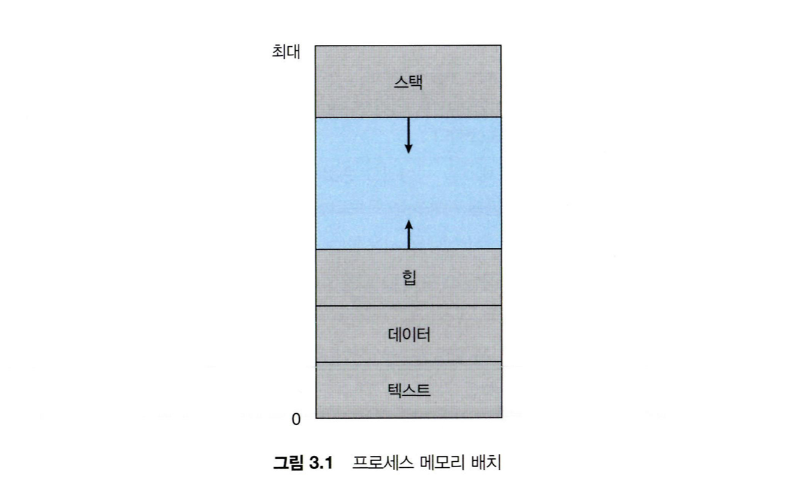

# 프로세스 주소 공간
- 프로세스가 메모리를 할당 받으면, 자신만의 방법으로 메모리를 관리하기 위해 이 공간들을 어떤 구조로 관리하는데, 이를 프로세스 주소 공간이라고 한다.   
-> 프로세스 주소 공간을 나누는 것은 시스템 안정성과 보안성을 높이고, 효율적인 메모리 관리를 가능하게 하며, 디버깅과 유지보수를 용이하게 함.   
이를 통해 운영 체제는 다수의 프로세스를 효과적으로 관리하고, 각 프로세스가 안전하고 안정적으로 실행될 수 있도록 보장함

### 구성 요소
1. Stack 영역 :   
- 함수의 호출과 관계되는 지역 변수와 매개변수가 저장되는 영역
- Stack 영역의 값은 함수의 호출과 함께 할당되며, 함수의 호출이 완료되면 소멸
- 메모리의 높은 주소에서 낮은 주소의 방향으로 할당
- 재귀 함수가 너무 깊게 호출되거나 함수가 지역변수를 너무 많이 가지고 있어 stack 영역을 초과하면 stack overflow 에러가 발생
2. Heap 영역:   
- 런타임에 크기가 결정되는 영역
- 사용자에 의해 공간이 동적으로 할당 및 해제
- 주로 참조형 데이터 (ex. 클래스) 등의 데이터가 할당
- 메모리의 낮은 주소에서 높은 주소의 방향으로 할당
3. Data 영역:
- 전역 변수나 Static 변수 등 프로그램이 사용할 수 있는 데이터를 저장하는 영역
- 어떤 프로그램에 전역/static 변수를 참조하는 코드가 존재한다면, 이 프로그램은 컴파일 된 후에 data 영역을 참조
- 프로그램의 시작과 함께 할당되며, 프로그램이 종료되면 소멸. 단, 초기화 되지 않은 변수가 존재한다면, 이는 (그림에는 표현되지는 않았지만 BSS 영역에 저장된다.)
4. Text (Code) 영역:
- 프로그램이 실행될 수 있도록 CPU가 해석 가능한 기계어 코드가 저장되어 있는 공간으로, 프로그램이 수정되면 안 되므로 ReadOnly 상태로 저장

### 면접 질문
- **힙 영역과 스택영역의 차이점을 설명하시오.**  
스택영역은 함수의 호출과 관계되는 지역변수와 매개변수가 저장되는 영역으로 함수의 호출과 함께 할당되며, 함수의 호출이 종료될때 해제됩니다.   
힙 영역은 사용자가 직접 관리할 수 있는 메모리 영역으로 힙 영역은 사용자에 의해 메모리공간이 동적으로 할당되고 해제됩니다.

