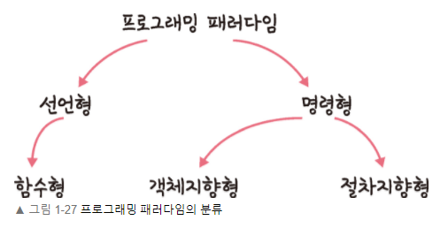

### 프로그래밍 패러다임

프로그래머에게 프로그래밍의 관점을 갖게 해주는 역할을 하는 개발 방법
  

- [선언형과 함수형 프로그래밍](declarative_functional_programming.md)
- [객체지향 프로그래밍](object-oriented_programming.md)
- [절차형 프로그래밍](procedural.md)
- 패러다임의 혼합
