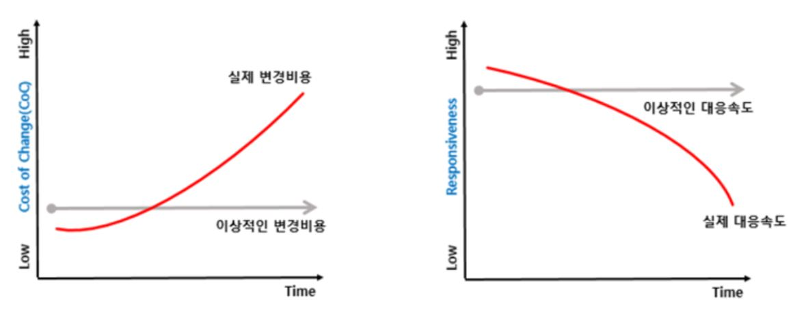
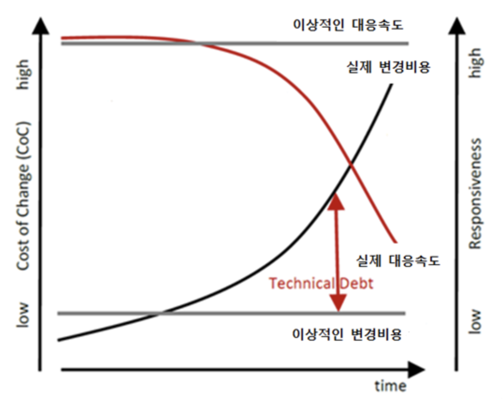

## 클린 코드
> 코드를 작성하는 의도와 목적이 명확하며, 다른 사람이 쉽게 읽을 수 있어야 한다. = **가독성**이 좋은 코드

<br> 

### 가독성이 높은 코드?
- 네이밍이 잘 되어야 함
- 오류가 없어야 함
- 중복이 없어야 함
- 의존성을 최대한 줄여야 함
- 클래스 혹은 메소드가 한 가지 일만 처리해야 함

<br> 

### 필요성



> 이렇게 비용과 개발시간을 감소시키기 위해서 클린코드의 작성이 필요하다.

<br> 

## 클린코드의 주요원칙
### 일반적인 원칙
- Follow Standard Conventions: 코딩 표준, 아키텍처 표준 및 설계 가이드를 준수하라.
- Keep it Simple, Stupid (KISS): 단순한 것이 효율적이며, 복잡함을 최소화하라.
- Boy Scout Rule: 참조되거나 수정되는 코드는 원래 코드보다 클린해야한다. (캠핑장을 떠나기 전에는 원래보다 깨끗해야한다.)
- Root Cause Analysis: 항상 근본적인 원인을 찾자. 그렇지 않으면 반복될 것이다.
- Do not Multiple Languages in One Source File: 하나의 소스 파일은 하나의 언어로 작성하라.

### 클래스 설계 원칙
기본적으로 SOLID를 따른다.
- S: 단일 책임의 원칙 - 하나의 클래스는 하나의 책임만 가진다.
- O: 개방-폐쇄 원칙 - 클래스는 확장에 대해 열려있고, 변경에 대해서는 닫혀있어야 한다.
- L: 리스코프 치환 원칙 - 하위 클래스의 메소드는 상위 클래스의메서드를 대체하여 사용될 수 있어야 한다.
- I: 인터페이스 분리 원칙 - 인터페이스가 사용하지 않는 메소드에 의존하지 않아야 한다.
- D: 의존성 역전 원칙 - 추상화된 것은 구체적인 것에 의존하면 안된다.(자주 변경되는 구체적인 것에 의존하지 말고 추상화된 것을 참조하도록 하자.)

<br>

## 클린코드의 세부 원칙들...
### 네이밍(Naming)
- 변수, 클래스, 메소드에 **의도가 분명한 이름**을 사용하자.
- 여러가지 **네이밍 규칙**들을 클래스, 함수, 변수, DB, 컬럼 등에 맞게 Camel, Pacal, kebab, snake를 따져서 작성하자.
- 함수명은 동사, URL은 복수명사, 변수는 들어가는 인자의 개수에 따라서 단/복수명사를 정확하게 적자.
### 주석(Comment) 활용
- 왠만하면 주석이 필요없이 이해할 수 있도록 작성하고, 정말 **필요할 경우에만** 주석을 추가하자.
- 주석을 **명확하고 간결하게** 작성하자.

### 꾸미기(Aesthetics)
- **규칙적인 들여쓰기와 줄바꿈**으로 가독성을 향상시키자.
- 메소드를 이용해 불규칙한 **중복 코드를 제거**한다.

### 흐름제어 만들기(Making control flow easy to read)
- 왼쪽에는 변수를, 오른쪽에는 상수를 두고 비교하기
    ``` java
    if(length >= 10)

    while(bytes_received < bytest_expected)
    ```
- 부정이 아닌 긍정을 다루자
    ```java
    if ( a == b ) { // a!=b는 부정
	    // same
    } else {
        // different
    }
    ```
- if/else를 사용하며, 삼항 연산자는 매우 간단한 경우만 사용하자.
- do/while 루프는 피하자.

### 함수(Function) 모듈화
- 함수는 가급적 **작게, 한번에 하나의 작업만 수행하도록** 작성하자.
- 복잡한 함수는 별도의 함수로 분리하자.

### 테스트 가능한 코드 작성
- 모듈화, 의존성 주입, 인터페이스 활용 등을 통해 테스트 가능성을 고려한 코드를 작성하자.

<br>

참고: [클린코드는 왜 중요하고 어떻게 실천해야 할까?](https://yozm.wishket.com/magazine/detail/2415/), [Summary of 'Clean code' by Robert C. Martin](https://gist.github.com/wojteklu/73c6914cc446146b8b533c0988cf8d29)

<br>
<br>


## ❓ 면접질문
**Q. 클린코드가 무엇인가요?**
```
A. 가독성이 좋은 코드를 말합니다. 주로 비용과 개발 시간을 효율적으로 사용하기 위해 적용합니다.  
다양한 기법이 있지만 보통 표준화, 단순화를 통해 복잡한 코드를 단순하고 이해하기 좋게 만드는 것을 목적으로 합니다.  
네이밍 규칙을 세우거나 중복이 없는 코드, 또는 SOLID 원칙을 잘 지킨 코드 등이 클린코드에 해당합니다.
```

**Q. 클린코드는 어떻게 작성하나요?**
```
A. 여러 다양한 기법을 통해 가독성이 높은 클린코드를 작성합니다.  
복잡한 함수를 모듈화하고, 네이밍 규칙을 지켜 함수나 변수명을 작성하거나 규칙적인 들여쓰기나 줄바꿈을 사용합니다.  
또한 주석을 필요한 곳에 적절하고 간략하게 사용하므로써 가독성을 높일 수도 있습니다.  
이 밖에도 여러가지 방법이 있지만, 명확하고 간결하게 이해하기 좋은 코드를 작성하는 것을 기본으로 합니다.
```


<br>

출처: [클린 코드(Clean Code) 핵심 요약 및 정리](https://mangkyu.tistory.com/132), [Clean Code Cheat Sheet](https://www.planetgeek.ch/wp-content/uploads/2014/11/Clean-Code-V2.4.pdf), [클린코드란 무엇인가](https://velog.io/@kwontae1313/%ED%81%B4%EB%A6%B0%EC%BD%94%EB%93%9C%EB%9E%80-%EB%AC%B4%EC%97%87%EC%9D%B8%EA%B0%80)