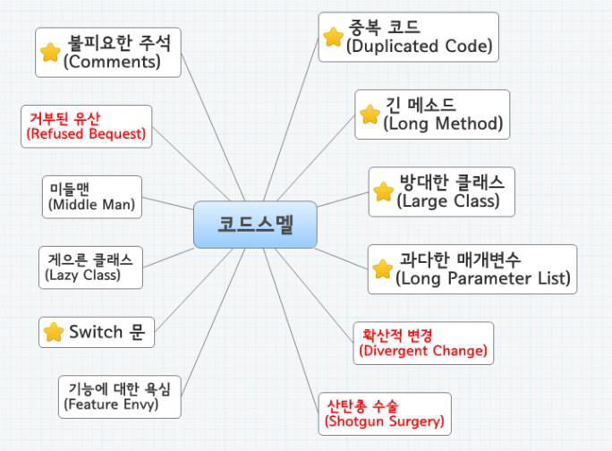
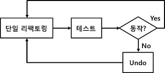
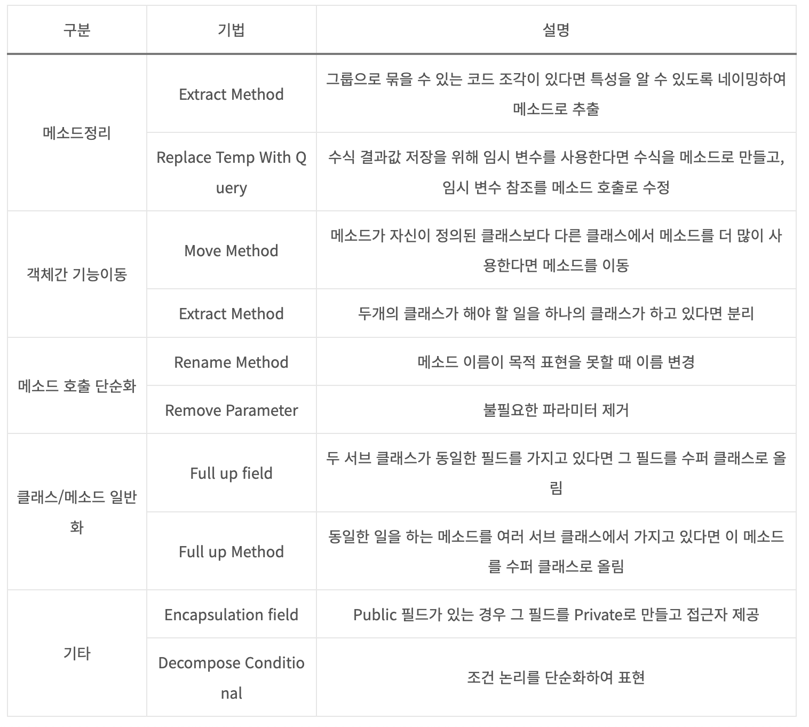
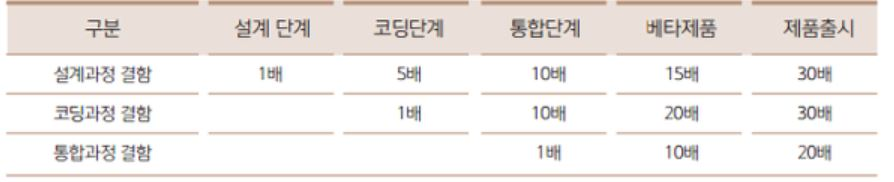

## 리팩토링
프로그램의 **외부 동작은 그대로** 둔 채, 내부의 코드를 정리하면서 개선하는 것  
레거시 코드(테스트가 불가능하거나 이해하기 어려운 코드)를 **클린 코드로 만드는 것**  
리팩토링 작업은 코드의 **가독성을 높이고**, 향후 이루어질 **유지보수**에 큰 **도움**이 된다.

**버그**를 없애거나 **기능을 추가**하는 것이 아닌, 코드의 **내부 논리나 구조를 개선**하는 유지보수 행위  
리팩토링을 통해 SW를 보다 이해하기 쉽고, 수정하기 쉽게 만들어준다. → 자연스레 개발 속도가 빨라진다.

<br>

### 왜 해야하나요?
Design Stamina Hypothesis(디자인-스테미너 가설)에 따르면, 시간이 지날수록 복잡한 코드와 씨름하느라 개발 생산성이 저하된다.  
즉, 소프트웨어 설계에 신경쓰지 않으면 계속해서 개발 속도가 저하되는 것이다. 

반대로 설계에 신경을 쓰면 새로운 기능 개발이 쉬워지는데, 리팩토링은 코드를 항상 깔끔한 상태로 만들어서 좋은 아키텍처로 가도록 유도한다.  
그래서 훨씬 더 많은 기능을 빠르게 구현할 수 있으며 이게 바로 리팩토링이 필요한 이유이다. 

좋은 품질과 클린 코드를 위해서, 나아가 본질적인 이유는 <b>경제성(Economics)</b>이다.  
많은 기능을 빠르게 적용하기 위해 리팩토링이 필요한 것이다.

### 언제하나요?
- 쓰레기 줍기 리팩토링: 좋지 않은 혹은 이상한 코드를 발견하면 이전보다 더 나은 코드로 정리하는 것
- 이해를 위한 리팩토링: 이해가 가지 않는 코드를 발견하면 이해하기 쉬운 코드로 정리하는 것
- 준비를 위한 리팩토링: 새로운 코드를 추가했더니, 기존과 구조가 달라지고 적절하지 않는 경우. 리팩토링을 통해 기존 코드를 수정하고, 리팩토링된 코드 위에 새로운 기능을 추가해야 함.
- 계획된 리팩토링: 프로젝트 계획에 리팩토링 단계를 넣어 매번 코드를 깔끔하게 만드는 것으로 시점이 매우 명확하다.(리팩토링을 하지 않는 팀에게 필요함. 리팩토링을 해야하는 이유 혹은 명분을 찾아야 하며 언제든지 쉽게 포기하고 타협할 수 있으므로 지양해야 한다.)
- 장기적인 리팩토링: 복잡한 의존성을 갖는 커다란 모듈을 수정해야 하는 경우. 최대한 작은 단위로 정해진 목표에 맞게 코드를 수정하는 것이 중요하다.

<br>

### 리팩토링이 필요한 코드는?
    Bad Smell ! 즉, 더러운 코드.

→ 중복된 코드가 있을 때, 메소드가 지나치게 길 때, 클래스 하나가 너무 많은 일을 하려할 때, 클래스가 충분히 역할을 하지 않을때, 필요하지 않는 것을 처리하기 위해 작성된 코드가 있을 때, 클래스들이 지나치게 친밀할 때, 클래스의 상속 구조가 잘못되었을 때, 주석이 잔뜩 붙어있을 때, 한 클래스에 너무 많은 인스턴스 변수를 가질때 등 정말 다양한 문제들이 있다.

<br>



<details><summary>Code Smell</summary>

1. 게으른 클래스(Lazy Class): 자식 클래스와 부모 클래스 차이 없으면 합침  
2. 추측성 일반화(Speculative Generality): 추측만으로 생성한 클래스는 제거
3. 임시필드(Temporary Field): 파라미터를 줄이기 위한 필드, 메서드는 클래스화
4. 메시지 체인(Message Chain): 특정 객체를 얻기위한 다수 객체는 간소화
5. 미들 맨(Middle Man): 다른 클래스로 위임하는 역할만 담당하는 클래스 검토
6. 부적절한 친밀(Inappropriate Intimacy): 불필요 데이터를 가지고 있는 경우
7. 불완전 라이브러리(Incomplete Library): 불완전 시 필요 부분 추가 구성
8. 거부된 유산(Refused Bequest): 부모클래스의 I/F 거부 시 부모 객체 호출
9. 주석(Comment): 코드 내부 주석은 메서드로 추출해서 설명

</details>

<br>

## 리팩토링 절차
1. 리팩토링 대상 식별
2. 테스트를 통한 적용

    

> 소규모 변경 → 동작 여부 테스트(**회귀 테스트**) → 작동할 경우 다음 단계 / 하나라도 작동하지 않을 경우 undo 후 리팩토링

<br>

## 리팩토링 기법


<details><summary>참고: 리팩토링 vs 리엔지니어링</summary>

| 항목 | 리팩토링 | 리엔지니어링 |
| --- | ----- | ----- |
| 관점 | 모듈의 정제 | 시스템 개선 |
| 적용 범위 | 클래스, 메서드 단위 | 시스템 등 대단위 |
| 반복성 | 대다수 반복 | 반복 미발생 |
| 적용 사례 | 메서드 다형성 적용 | 시스템 전반적 모듈화 |

</details>

<br/>
<br/>
<br/>

## 시큐어 코딩
도출 → 설계 → 개발 → 테스트 → 배포
안전한 소프트웨어를 개발하기 위해, 소스코드 등에 존재할 수 있는 잠재적인 **보안취약점**을 제거하는 것.

구현(개발) 단계에서 잠재적인 보안 취약점을 사전에 제기 및 발견하여 외부공격으로부터 안전한 소프트웨어를 개발하는 기법.

<br>

### 왜 해야하나요?

> 제품출시 이후에 생긴 결함을 제거하기 위해선 30배의 비용이 필요하지만, 구현(코딩) 단계에서 시큐어코딩을 적용시킨다면 경제적 측면에서 많은 이점이 있기 때문이다.

<br>

### 보안 약점을 노려 발생하는 사고사례들
1. SQL 인젝션 취약점으로 개인유출 사고 발생
2. URL 파라미터 조작 개인정보 노출
3. 무작위 대입공격 기프트카드 정보 유출


- SQL 인젝션 예시

    안전하지 않은 코드
    ```
    String query "SELECT * FROM users WHERE userid = '" + userid + "'" + "AND password = '" + password + "'";
    
    Statement stmt = connection.createStatement();
    ResultSet rs = stmt.executeQuery(query);
    ```

    <br>

    안전한 코드
    ```
    String query "SELECT * FROM users WHERE userid = ? + "AND password = ?";

    PrepareStatement stmt = connection.prepareStatement(query);
    stmt.setString(1, userid);
    stmt.setString(2, password);
    ResultSet rs = stmt.executeQuery();
    ```


<br>
<br>


## ❓ 면접질문
**Q. 리팩토링에 대해 설명해주세요.**
```
A. 가독성을 높이는 클린코드에 유지보수성 목적을 결합한 것으로, 외부 동작은 그대로 유지한 채 내부의 코드의 구조를 개선하는 것입니다.  
코드를 이해하기 쉽고, 수정하기 쉽게 만들어줍니다.
```
<br/>


**Q. 클린코드와 리팩토링의 차이를 말해보세요.**
```
A. 클린 코드는 단순히 가독성을 높이기 위한 작업으로 이루어져 있다면,  
리팩토링은 클린 코드를 포함한 유지보수를 위한 코드 개선이 이루어집니다.  
클린코드와 같은 부분은 설계부터 잘 이루어져 있는 것이 중요하고,  
리팩토링은 결과물이 나온 이후 수정이나 추가 작업이 진행될 때 개선해나가는 것이 올바른 방향입니다.
```
<br/>

**Q. 시큐어 코딩에 대해 설명해주세요.**
```
A. 구현단계에서 취약점을 제기 및 발견하여 해킹 및 악의적 공격을 미연에 방지하고 보안약점을 제거하는 코딩 방법입니다.
```


출처: [Code-Refactoring(코드 리펙토링)이란?](https://velog.io/@rlrhs11/Code-Refactoring%EC%BD%94%EB%93%9C-%EB%A6%AC%ED%8E%99%ED%86%A0%EB%A7%81-%EC%9D%B4%EB%9E%80), [마틴 파울러의 강연 정리 - 리팩토링 시점과 절차, 리팩토링이 필요한 이유](https://mangkyu.tistory.com/268), [리팩토링](https://itpenote.tistory.com/91), [코드 리팩토링](https://blog.skby.net/%EC%86%8C%ED%94%84%ED%8A%B8%EC%9B%A8%EC%96%B4-%EB%A6%AC%ED%8C%A9%ED%86%A0%EB%A7%81-refactoring/)