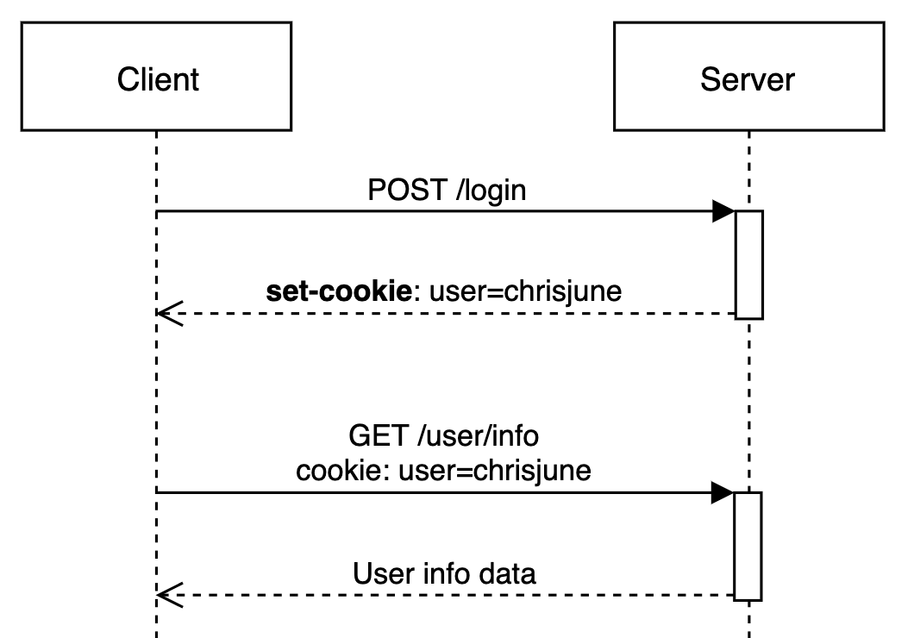
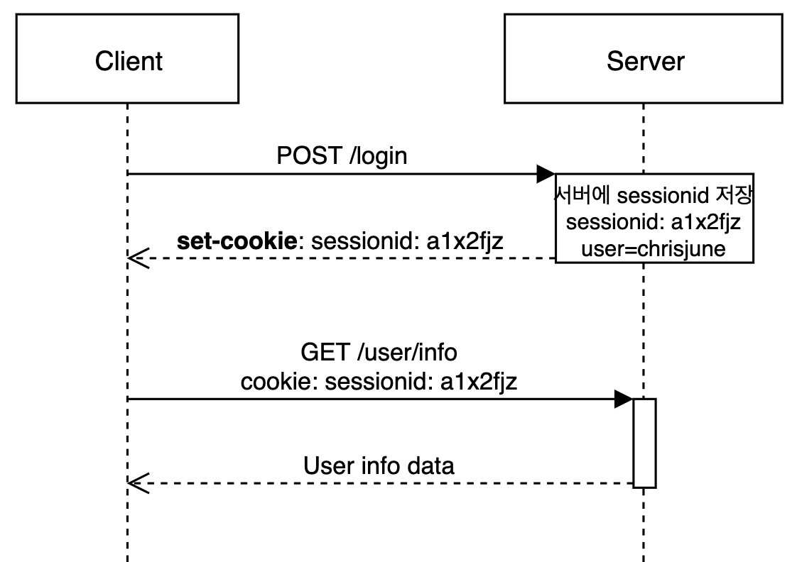
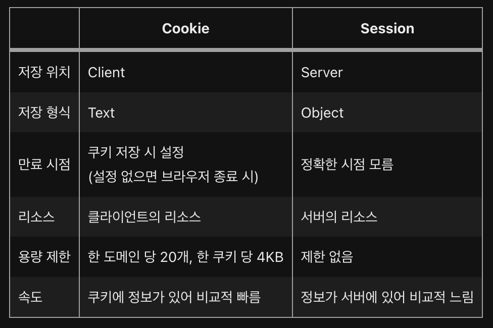

# Cookie & Session

## 쿠키와 세션을 사용하는 이유 - **HTTP 프로토콜의 특징**

- Connectionless(비연결지향)
  - HTTP 프로토콜은 클라이언트에서 서버에 요청을 보내면 응답을 하고 **연결을 끊는 특징**
- Stateless(상태정보 유지 안함)
  - HTTP 통신은 **연결을 끊는 순간 클라이언트와 서버의 통신이 끝나며 상태 정보를 유지하지 않는 특징**,
    → Stateless하다.

→ HTTP 프로토콜은 `비연결지향`과 `상태정보 유지 안함`이라는 특징을 가지고 있다.

따라서 서버와 클라이언트가 통신을 할 때 통신이 연속적으로 이어지지 않고 한 번 통신이 되면 끊어진다.

또한 통신이 끊어지면 상태정보가 유지되지 않기 때문에 매번 페이지를 이동할 때마다 로그인은 다시 하거나, 상품 선택 후 구매 페이지에서 선택한 상품의 정보가 없거나 하는 등의 문제가 발생할 수 있다.

**이러한 문제를 해결하는 방법이 바로 쿠키와 세션**

## 쿠키

HTTP의 일종으로 사용자가 어떤 웹 사이트를 방문할 경우, 해당 사이트가 사용하고 있는 서버에서 **사용자의 컴퓨터에 저장하는 작은 기록 정보 파일**

- 사용목적
  - 세션 관리(Session Management)
    - 로그인, 사용자 닉네임, 접속 시간, 장바구니 등의 서버가 알아야할 정보들을 저장
  - 개인화(Personalization)
    - 사용자마다 다르게 그 사람에 적절한 페이지를 보여줄 수 있다.
  - 트래킹(Tracking)
    - 사용자의 행동과 패턴을 분석하고 기록
- 동작과정

1. 클라이언트가 서버에 로그인 요청
2. 서버는 클라이언트의 로그인 요청의 유효성을 확인하고(아이디와 비밀번호 검사) 응답헤더에 `set-cookie` 를 통해 쿠키를 추가하여 응답
3. 클라이언트는 이후 서버에 요청할 때 전달받은 쿠키를 자동으로 요청헤더에 추가하여 요청한다. 헤더에 쿠키값을 자동으로 추가하여 주는데 이는 브라우저에서 처리해주는 작업이다.

- 단점
  - 쿠키는 클라이언트에서 수정할 수 있기 때문에 위변조의 위험이 항상 존재한다. 따라서 쿠키값(value)를 암호화해야 하며, 민감하거나 중요한 정보를 담지 않도록 해야한다.

### 세션

일정 시간 동안 같은 사용자로부터 들어오는 일련의 요구를 하나의 상태로 보고, 그 상태를 유지시키는 기술

→ 브라우저가 종료되기 전까지 클라이언트의 요청을 유지하게 해주는 기술

- 특징

  - 웹 서버에 **웹 컨테이너의 상태를 유지하기 위한 정보를 저장**
  - 웹 서버에 저장되는 쿠키(세션 쿠키 / session cookie)이다.
  - 브라우저를 닫거나, 서버에서 세션을 삭제했을 때만 삭제가 되기 때문에 **쿠키보다 보안적으로 우수**
  - **저장 데이터에 제한이 없다**
  - 각 클라이언트에 **고유 세션 ID(Session ID)를 부여**

- 동작과정

1. 클라이언트가 서버에 로그인 요청
2. 서버는 로그인 요청의 유효성을 확인하고 고유**한 id를 session ID로 생성하여 저장**
3. 서버가 응답할 때 **응답헤더에 세션 ID를 쿠키에 추가하여 응답**합니다.
4. 클라이언트는 이후 서버에 요청할 때 전달받은 세션 ID를 쿠키에 자동으로 요청 헤더에 추가하여 요청
5. 서버에서는 헤더의 세션 ID 값을 저장된 세션저 장소에서 찾아보고 유효한지 확인 후 요청을 처리하고 응답

→ 사용자나 다른 누군가에게 노출되면 안되는 보안적으로 중요한 정보들을 서버 안에서 다루기 위해 사용

- 단점
  - 세션의 내용은 서버에 저장되기 때문에 계속하여 늘어날 경우 서버에 부하가 발생할 수 있다.
  - 세션에 대한 정보가 서버에 있어 쿠키에 비해 비교적 속도가 느리다.

## 쿠키 VS 세션

## 저장 위치

- 쿠키: **클라이언트의 웹 브라우저가 지정하는 메모리 또는 하드디스크**
- 세션: **서버의 메모리**에 저장

## 만료 시점

- 쿠키: 저장할 때 expires 속성을 정의해 무효화시키면 **삭제될 날짜 지정 가능**
- 세션: 클라이언트가 로그아웃하거나, 설정 시간동안 반응이 없으면 무효화되어 **정확한 시점을 알 수 없음**

## 리소스

- 쿠키: 클라이언트에 저장되고, 클라이언트의 메모리를 사용하기 때문에 **서버 자원을 사용하지 않음**
- 세션: 서버에 저장되고, 서버의 메모리로 로딩되기 때문에 **세션이 생길 때마다 리소스를 차지함**

## 용량 제한

- 쿠키: 클라이언트도 모르게 접속되는 사이트에 의해 설정될 수 있기 때문에 쿠키로 인한 문제가 발생하는 것을 막기 위해 **한 도메인 당 20개, 한개의 쿠키 당 4KB로 제한**
- 세션: 클라이언트가 접속하면 서버에 의해 생성되므로 **개수나 용량 제한 없음**

## 예상질문

# 세션와 쿠키를 모두 사용하는 이유

세션이 쿠키에 비해 보안이 높은 편이나 쿠키를 사용하는 이유는 세션은 서버에 저장되고, 서버의 자원을 사용하기 때문에 서버 자원에 한계가 있고, 속도가 느려질 수 있습니다.

따라서 자원관리 차원에서 쿠키와 세션을 적절한 요소 및 기능에 병행 사용하여 서버 자원의 낭비를 방지하며 웹사이트의 속도를 높일 수 있습니다.
