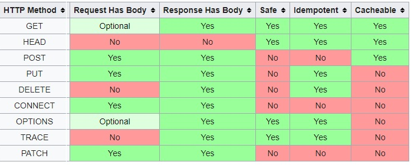

# **HTTP Request Methods**

- **GET**
  리소스(데이터)를 받기 위함
  URL(URI) 형식으로 서버 측에 리소스를 요청
- **HEAD**
  메세지 헤더 정보를 받기 위함
  GET과 유사하지만, HEAD는 실제 문서 요청이 아닌 문서에 대한 정보 요청이다. 즉, Response 메세지를 받았을 때, Body는 비어있고, Header 정보만 들어있다.
- **POST**
  내용 및 파일 전송을 하기 위함
  클라이언트에서 서버로 어떤 정보를 제출하기 위해 사용한다. Request 데이터를 HTTP Body에 담아 웹 서버로 전송한다.
- **PUT**
  리소스(데이터)를 갱신하기 위함
  POST와 유사하나, 기존 데이터를 갱신할 때 사용한다.
- **DELETE**
  리소스(데이터)를 삭제하기 위함
  웹 서버측에 요청한 리소스를 삭제할 때 사용한다.
  → 실제로 클라이언트에서 서버 자원을 삭제하도록 하진 않아 비활성화로 구성한다.
- **CONNECT**
  클라이언트와 서버 사이의 중간 경유를 위함
  보통 Proxy를 통해 SSL 통신을 하고자 할 때 사용한다.
- **OPTIONS**
  서버 측 제공 메소드에 대한 질의를 하기 위함
  웹 서버 측에서 지원하고 있는 메소드가 무엇인지 알기 위해 사용한다.
- **TRACE**
  Request 리소스가 수신되는 경로를 보기 위함
  웹 서버로부터 받은 내용을 확인하기 위해 **loop-back** 테스트를 할 때 사용한다.
  - loop-back : 전송한 메시지가 자기 자신에게 되돌아 오는 것을 의미. RS232 시리얼 통신이나 TCP/IP 통신을 시도할 때 자기 자신에게 메시지를 보내고 받는다는 의미입니다.
- **PATCH**
  리소스(데이터)의 일부분만 갱신하기 위함
  PUT과 유사하나, 모든 데이터를 갱신하는 것이 아닌 리소스의 일부분만 수정할 때 쓰인다.

---

## 예상 질문

PUT 요청과 PATCH요청의 차이점은?

- PUT은 데이터를 갱신하기 위함이지만 PATCH는 모든 데이터를 갱신하는 것이 아니라 데이터의 일부분만 수정하기 위해 사용합니다.
