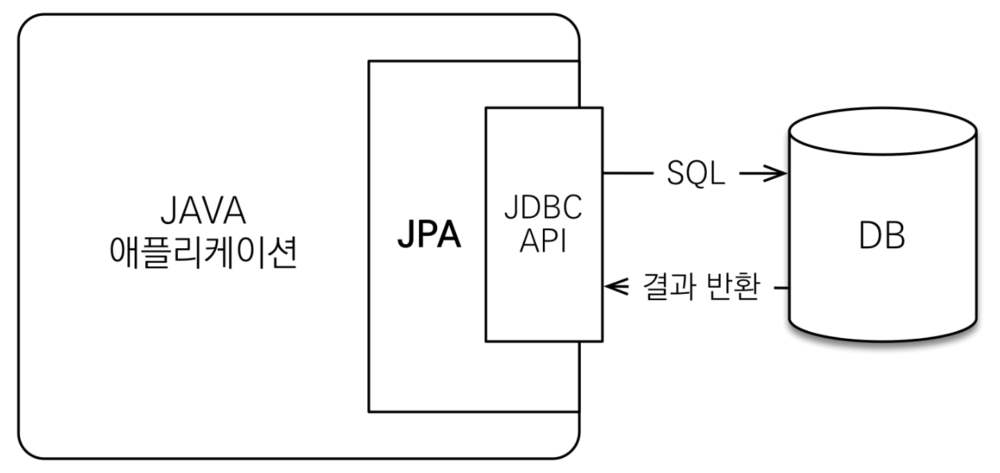
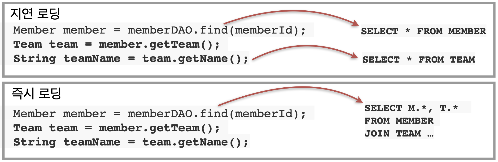

# JPA
**J**ava **P**ersistence **A**PI  
**자바** 진영 **ORM**(Object-Relational Mapping/객체 관계 매핑) **기술 표준**  

- Java application과 JDBC 사이에서 동작
    

- JPA는 표준 명세를 구현한 3가지 구현체: 하이버네이트, EclipseLink, DataNucleus

<br>

## JPA 사용 시 이점
- sql 중심 → **객체 중심으로 개발**
    - *생산성, 유지보수성* 향상

<br>

- **객체와 DB의 패러다임 불일치 해결**
    - 패러다임 불일치? 객체와 DB의 구조가 달라서 지향하는 점이 다르다.
    - *상속, 연관관계, 객체 그래프 탐색, 비교*
    1. 상속
        ```java
        // 저장
        jpa.persist(album);

        // 조회
        Album album = jpa.find(Album.class, albumId);
        ```
    2. 연관관계
        ```java
        // 저장
        member.setTeam(team);
        jpa.persist(member);
        ```
    3. 객체 그래프 탐색
        ```java
        Member member = jpa.find(Member.class, memberId);
        Team team = member.getTeam();  // 자유로운 객체 그래프 탐색
        ```
    4. 비교: 동일한 트랜잭션에서 조회한 엔티티는 같음을 보장
        ```java
        String memberId = "100";
        Member member1 = jpa.find(Member.class, memberId);
        Member member2 = jpa.find(Member.class, memberId);

        member1 == member2;  // 같다
        ```
    <br>
- **성능 최적화** 기능
    1. **1차 캐시**와 **동일성**(identity) 보장

         | 
        --- | --- 
        - 같은 트랜잭션 안에서는 같은 엔티티를 반환 → 약간의 조회 성능 향상
        - DB Isolation Level(트랜잭션 격리수준)이 Read Commit이어도 애플리케이션에서 Repeatable Read 보장
            - Read Commit: 트랜잭션에서 변경한 내용이 commit 되어야 조회가능
            - Repeatable Read: 트랜잭션이 시작되기 전에 커밋된 내용에 대해서만 조회할 수 있는 격리수준
    2. 트랜잭션을 지원하는 **쓰기 지연**(transactional write-behind)
         | 
        --- | ---
        1. INSERT
            - 트랜잭션을 커밋할 때까지 INSERT SQL을 모음
            - JDBC BATCH SQL 기능을 사용해서 한번에 SQL 전송
        2. UPDATE
            - UPDATE, DELETE로 인한 로우 락(Row Lock: 두 개의 동시 트랜잭션이 같은 로우를 변경하는 것을 방지) 시간 최소화
            - 트랜잭션 커밋 시 UPDATE, DELETE SQL 실행하고, 바로 커밋
    3. **지연 로딩**(Lazy Loading): 객체가 실제 사용될 때 로딩
        (↔ 즉시 로딩: JOIN으로 한번에 연관된 객체까지 미리 조회)
        

<br>

- 데이터 접근 추상화와 벤더 독립성
    - JPA는 앱과 데이터베이스(벤더) 사이에 추상화된 데이터 접근 계층을 제공한다.
    - 특정 데이터베이스 기술에 종속되지 않는다. 각 DB마다 특정 명령을 처리하는 방식이 다를 수 있다. 하지만 JPA는 여러 DB에 대해 기능을 구현해놓았기 때문에, DB 종류를 JPA에게 알려주기만 하면, DB를 변경하더라도 정상적으로 동작하게 된다.

- **변경 감지(Dirty Check)**
    - [영속성 컨텍스트 & 변경감지](https://github.com/World-sBestCSStudy/world_best_CS_study/tree/main/Web/Spring/%EC%98%81%EC%86%8D%EC%84%B1%20%EC%BB%A8%ED%85%8D%EC%8A%A4%ED%8A%B8%20%26%20%EB%B3%80%EA%B2%BD%20%EA%B0%90%EC%A7%80)

<br>

### JPA의 단점
1. Mybatis에 비해 학습이 어렵다.
2. 자동으로 만들어지는 SQL로는 복잡한 쿼리를 만들거나 여러 테이블을 Join 해야하는 경우에 적합하지 않다.
3. SQL을 작성할 때 DB의 특성에 맞게 SQL을 튜닝하여 성능 향상을 고려할 수 있는데, JPA의 경우 자동화된 SQL 문으로 인해 오히려 성능이 떨어질 수가 있다.

<br>

## Mybatis와 JPA 비교
### Mybatis 특징
- SQL Mapper 방식
- Java 코드에서 SQL문을 분리하여 XML 파일로 저장하기 때문에 관리가 편하다.
- 분리된 SQL 문을 MyBatis가 찾아서 자동으로 실행한다.
- 불필요한 Boilerplate 코드를 제거할 수 있다.
- 동적 SQL 생성이 가능하다.

### Mybatis 장점
- SQL에 대한 직접 제어를 제공하므로 복잡한 쿼리나 특정 DB에 최적화된 쿼리 작성에 적합
- SQL을 잘 아는 경우, JPA에 비해 학습이 용이하고 쉽게 사용 가능

### Mybatis 단점
- CRUD 단순 작업에 반복적으로 수작업이 필요함
- 특정 DB를 기준으로 SQL을 작성하기 때문에 DB 변경을 하려면 전체를 수정해야 함


<br>

## JPA 구동방식
JPA는 **자바 애플리케이션과 JDBC API 사이에서 동작**이 된다. 즉, 개발자가 JPA에게 명령하면 JPA가 JDBC API를 사용해서 SQL을 호출하고 결과를 받아서 동작한다.


1. Persistence 클래스에서 META-INF/persistence.xml 에서 설정 정보를 읽는다. 
2. EntityManagerFactory를 만든다. 
3. EntityManager를 필요할 때마다 생성해서 JPA를 동작한다.

<br>

#### EntityManager & EntityManagerFactory
<image src="https://github.com/World-sBestCSStudy/world_best_CS_study/assets/80496853/7ac074e1-16ec-4700-8139-3a0362bd112e" width=70%/>

- EntityManager?  
Entity를 관리하는 역할을 하는 클래스. EntityManager 내부에 영속성 컨텍스트로 엔티티들을 관리  
EntityManager는 **쓰레드간에 공유/재사용하지 않는다.**
- EntityManagerFactory?  
멀티 스레드 구현 시 스레드 간의 동시성 이슈가 발생할 수 있기 때문에 하나의 EntityManager를 공유하지 않고 계속해서 생성하여 사용한다.  
여기서 EntityManagerFactory는 EntityManager를 만들어내는 공장 역할을 한다.  
EntityManagerFactory는 DB 당 하나만 생성하고, WAS가 종료되는 시점에 사라진다.

<br>

## JPQL(Java Persistence Query Language)
JPA는 객체중심 개발을 지향한다. 하지만 모든 DB를 객체로 변환해서 **검색**하는 것이 불가능하다. 결국 필요한 데이터만 DB에서 불러오려면 검색 조건이 포함된 SQL이 필요하다.  

### 특징
- SQL과 문법이 유사하며, ```SELECT```, ```FROM```, ```WHERE```, ```GROUP BY```, ```HAVING```, ```JOIN```을 지원한다.
- SQL: DB 테이블 대상 쿼리  
JPQL: 엔티티 객체 대상 쿼리 → 객체를 대상으로 검색하는 객체지향 SQL이라고 생각하면 됨
- SQL을 추상화해서 특정 DB에 의존 X
### 단점
- 기본 문자열로 작성되기 때문에 컴파일 시 에러를 발생하지 않는다.
- 동적으로 쿼리 언어를 작성하는 데 효율적이지 못하다.
### 문법
- 기본 문법
    ```sql
    select _ from _ (where) _ (group by) _ (having) _ (order by) _
    update _ (where) _
    delete _ (where) _
    ```
- 엔티티, 속성은 대소문자를 구분하지만, JPQL 키워드(select, from)는 대소문자 구분을 하지 않는다.
- DB Table 이름이 아닌 Entity 이름을 사용한다.
- 별칭 사용 필수, as 생략 가능
    ```sql
    select m from Member as m where m.age > 25
    ```
- 반환 타입 
    ```java
    // 반환 타입이 명확한 경우
    TypedQuery<Member> query1 = em.createQuery("select m from Member m", Member.class);
    TypedQuery<String> query2 = em.createQuery("select m.username from Member m", String.class);
    
    // 반환 타입이 명확하지 않은 경우
    Query query3 = em.createQuery("select m.username, m.age from Member m");
    ```
- 결과 조회
    ```java
    // 결과가 하나 이상일 때, 리스트 반환
    TypedQuery<Member> query1 = em.createQuery("select m from Member m", Member.class);
    List<Member> resultList = query1.getResultList();
    
    // 결과가 단 하나일 때, 단일 객체 반환
    // 결과가 없을 경우: NoResultException, 결과가 둘 이상: NonUniqueResultException 발생
    TypedQuery<Member> query2 = em.createQuery("select m from Member m where m.id = 1L", Member.class);
    Member singleResult = query2.getSingleResult();
    ```
- 파라미터 바인딩 방식
    ```java
    // 이름 기준
    Member result = em.createQuery("select m from Member m where m.username = :username", Member.class)
                    .setParameter("username", "member1")
                    .getSingleResult();

    // 위치 기준 -> 잘 사용하지 않는다.
    Member result = em.createQuery("select m from Member m where m.username = ?1", Member.class)
                    .setParameter(1, "member1")
                    .getSingleResult();

    ```
    
### 프로젝션 (Projection)
- JPQL의 SELECT 절에 **조회할 대상을 지정**하는 것  
- 대상: Entity, Embedded 타입, 스칼라 타입(숫자, 문자 등 기본 데이터 타입)
    1. Entity 프로젝션: **객체 또는 객체의 속성**을 조회
    2. Embedded 타입 프로젝션: Entity의 속성 중 **값 타입으로 생성된 속성**을 조회
    3. 스칼라 타입 프로젝션: 데이터 타입과 상관없이 여러 데이터를 조회.  
    조회되는 데이터의 **자료형을 규정할 수 없으므로** Query 형식을 사용 → ```createQuery()``` 메서드에 조회하는 데이터의 클래스가 매개변수로 들어가지 않는다.  
    → 조회 결과의 자료형을 규정할 수 없으므로 **Object 배열** 또는 **DTO**를 사용하여 받아야 한다.
- 조회 결과는 영속성 Context에 의해 관리된다.
- Join을 사용할 때에는 반드시 Join을 명시하자. (JPA가 자동으로 join을 사용하여 조회하지만, 개발자의 이해를 돕기 위해 명시)
    

<br>

## 질문 추가
**Q.** JPA에서 **N+1문제**는 언제 발생하고, 해결책이 뭔지 궁금해요!

**A.** N+1 문제는 JPA 사용한 객체 조회할 때 연관관계도 함께 조회하게 되면서 N번의 추가적인 쿼리가 발생하는 문제입니다.  
이를 해결하는 방법으로는 Fetch Join, BatchSize, @EntityGraph 등이 있습니다.  
Fetch Join은 JPQL을 사용하여 DB에서 데이터를 가져올 때 처음부터 연관된 데이터까지 가져와서 영속성 컨텍스트의 1차 캐시에 저장하여 이후 탐색 시에 추가적인 쿼리 수행을 피하는 방법입니다.  
BatchSize는 연관관계에 대해 추가로 N번 발생하던 쿼리문을 1번으로 줄여서 성능 최적화를 수행하는 방법입니다.  
즉, 추가로 N번 발생하는 쿼리문의 `select * from 엔티티 where 연관관계엔티티 = ?`를 `select * from 엔티티 where 연관관계엔티티 = (?,?,?)` 한 번으로 회피하여 수행하도록 하는 방법입니다.  
@EntityGraph 는 spring data jpa에서 어노테이션으로 fetch join을 수행할 수 있도록 한 것으로 Lazy Loading을 일부 Eager Loading으로 전환하는 방법입니다.