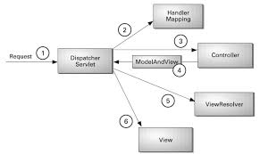

# Spring MVC
- Spring Framework에서 제공하는 MVC 패턴을 구현한 웹 프레임워크
- Spring MVC는 기본적인 MVC 패턴을 따르면서도 다양한 기능과 유연성을 제공하여 웹 애플리케이션 개발을 용이하게 함.

- 

## 요청과 응답 흐름 과정
1. 클라이언트가 url을 요청하면, 웹 브라우저에서 스프링으로 request가 보내진다.
2. Dispatcher Servlet이 request를 받으면, Handler Mapping을 통해 해당 url을 담당하는 Controller를 탐색 후 찾아낸다.
3. 찾아낸 Controller로 request를 보내주고, 보내주기 위해 필요한 Model을 구성한다.
4. 필요한 비즈니스 로직을 처리. 이 과정에서 서비스 계층이나 데이터 액세스 계층과 상호작용하며, 비즈니스 로직이 완료되면, 컨트롤러는 모델 데이터와 함께 뷰 이름을 반환한다.
5. Dispatcher Servlet은 View Resolver를 통해 request에 해당하는 view 파일을 탐색 후 받아낸다.
6. 받아낸 View 페이지 파일에 Model을 보낸 후 클라이언트에게 보낼 페이지를 완성시켜 받아낸다.
7. 완성된 View 파일을 클라이언트에 response하여 화면에 출력한다.

## 구성 요소
1. DispatcherServlet:
- Spring MVC의 중심 컴포넌트로, 모든 요청을 받아서 적절한 컨트롤러에 전달함.
- 요청을 처리하고, 적절한 뷰를 선택하여 응답을 생성함.
2. Handler Mapping
- 요청 URL을 적절한 컨트롤러 메서드와 매핑.
3. Controller
- 실질적인 요청을 처리하는 곳.
- Dispatcher Servlet이 프론트 컨트롤러라면, 이 곳은 백엔드 컨트롤러라고 볼 수 있음.
- 모델의 처리 결과를 담아 Dispatcher Servlet에게 반환.
4. View Resolver
- 컨트롤러의 처리 결과를 만들 view를 결정해주는 역할을 담당. 
- 다양한 종류가 있기 때문에 상황에 맞게 활용하면 됨.
