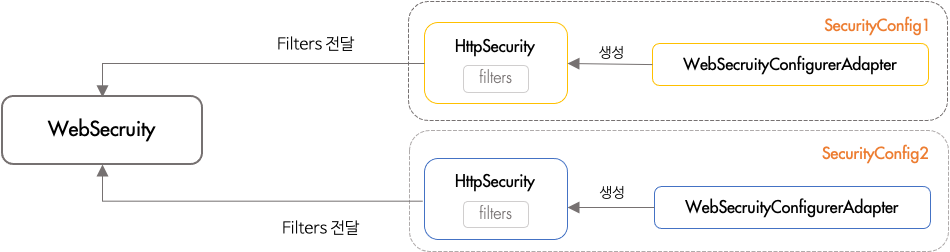

# Spring Security

- 스프링 기반 어플리케이션의 보안(인증과 권한, 인가)을 담당하는 스프링 하위 프레임워크
    - 스프링 앱과의 의존성을 분리시키기 위해 기본적으로 서블릿 필터기반으로 동작하게끔 구현
    - 즉 스프링을 사용하지 않더라도 서블릿을 사용하고 있다면 따로 적용이 가능하다.
- 보안과 관련해서 체계적으로 많은 옵션들을 제공해주기 때문에 개발자의 입장에서는 하나하나 보안 관련 로직을 작성하지 않아도 된다는 장점이 있다.


## 인증, 인가 과정


### 초기화



- Spring Security에서는 인증, 인가에 대한 처리를 여러개의 필터를 연쇄적으로 실행하여 수행한다.
  이 때, 설정에 따라서 필요한 필터가 있고 필요 없는 필터가 있음
- WebSecurityConfigurerAdapter를 구현한 설정 파일의 내용을 기반으로 해당되는 필터들을 생성
    - 이 때, 실제 필터를 생성하는 클래스가 바로 HttpSecurity. HttpSecurity의 코드를 보면 DefaultSecurityFilterChain 객체를 생성하거나 addFilter 메소드와 같이 필터를 다루고 있다.
- 이렇게 설정 파일 별로 필터 목록을 갖게 된 후, 이 필터들은 WebSecurity 클래스에게 전달이 된다.
  WebSecurity는 각각 설정 클래스로 부터 필터 목록들을 전달받고, 다시 FilterChainProxy를 생성자의 인자로 전달한다. 결국 FilterChainProxy는 각각의 설정 클래스 별(SecurityConfig1, SecurityConfig2)로 필터 목록들을 갖고 있는 형태가 된다.

### **사용자 요청**


- 사용자가 처음 요청을 하면 가장 먼저 DelegatingFilterProxy가 가장 먼저 그 요청을 받고, FilterChainProxy에게 요청을 위임한다.
  DelegatingFilterProxy는 서블릿 필터이며 위임을 할 때에는 "springSecurityFilterChain"이라는 이름을 가진 Bean을 찾게 되는데, 그 Bean이 바로 FilterChainProxy
- 위에서 확인했듯이, FilterChainProxy는 초기화될 때 이미 빈으로 등록되며 필터 목록을 가지고 있다.
  이제 위임받은 요청을 가지고 있는 각각의 Filter들에게 순서대로 요청을 맡김.
  이 때 각각의 필터들이 체인으로 연결되어 수행 → 넘김 → 수행 → 넘김으로 진행되는 형태(수행되는 메소드가 doFilter)
- **DelegatingFilterProxy**
    - 사용자의 요청이 서블릿에 전달되어 자원에 접근하기 전에, 스프링 시큐리티는 필터의 생명주기를 이용해서 인증과 권한 작업을 수행한다. 서블릿 필터의 생명주기 시점에서 인증과 권한 작업을 수행해야 하는데, 서블릿 컨테이너에서는 스프링 컨테이너에 등록된 빈을 인식할 수 없다.

  **→ 따라서 스프링 시큐리티에서는 DelegatingFilterProxy라는 서블릿 필터의 구현체를 제공**

  DelegatingFilterProxy는 서블릿 매커니즘을 통해 서블릿의 필터로 등록될 수 있으며 스프링에 등록된 빈을 가져와 의존성을 주입할 수 있다. 이렇게 DelegatingFilterProxy는 서블릿 컨테이너의 생명주기와 스프링의 ApplicationContext 사이를 연결하는 다리 역할을 한다.


- **FilterChainProxy**
    - DelegatingFilterProxy를 통해 받은 요청과 응답을 **스프링 시큐리티 필터 체인에 전달하고 작업을 위임**하는 역할
      중간에 FilterChainProxy를 두는 이유는 서블릿을 지원하는 시작점 역할을 하기 위해서이다.
      만약, 서블릿에서 문제가 발생한다면 FilterChainProxy의 문제라는 것을 바로 알 수 있게된다.

### Filter Chain


[Spring Security, 제대로 이해하기 - FilterChain](https://gngsn.tistory.com/160)

## Spring Security 용어

- 인증(Authentication) : 해당 사용자가 본인이 맞는지를 확인하는 절차
- 인가(Authorization) : 인증된 사용자가 요청한 자원에 접근 가능한지를 결정하는 절차
- 접근 주체(Principal) : 보호받는 Resource에 접근하는 대상
- 비밀번호(Credential) : Resource에 접근하는 대상의 비밀번호
- 권한 : 인증된 주체가 어플리케이션의 동작을 수행할 수 있도록 허락되어 있는 지를 결정
    - 인증 과정을 통해 주체가 증명된 이후 권한을 부여할 수 있다.
    - 권한 부여에도 두 가지 영역이 존재하는데 웹 요청 권한과 메서드 호출 및 도메인 인스턴스에 대한 접근 권한 부여

## **Spring Security Architecture**


**1. Http Request 수신**

- 사용자가 로그인 정보와 함께 인증 요청을 한다.

**2. 유저 자격을 기반으로 인증토큰 생성**

- AuthenticationFilter가 요청을 가로채고, 가로챈 정보를 통해 UsernamePasswordAuthenticationToken의 인증용 객체를 생성한다.

**3. FIlter를 통해 AuthenticationToken을 AuthenticationManager로 위임**

- AuthenticationManager의 구현체인 ProviderManager에게 생성한 UsernamePasswordToken 객체를 전달한다.

**4. AuthenticationProvider의 목록으로 인증을 시도**

- AutenticationManger는 등록된 AuthenticationProvider들을 조회하며 인증을 요구한다.

**5. UserDetailsService의 요구**

- 실제 데이터베이스에서 사용자 인증정보를 가져오는 UserDetailsService에 사용자 정보를 넘겨준다.

**6. UserDetails를 이용해 User객체에 대한 정보 탐색**

- 넘겨받은 사용자 정보를 통해 데이터베이스에서 찾아낸 사용자 정보인 UserDetails 객체를 만든다.

**7. User 객체의 정보들을 UserDetails가 UserDetailsService(LoginService)로 전달**

- AuthenticaitonProvider들은 UserDetails를 넘겨받고 사용자 정보를 비교한다.

**8. 인증 객체 or AuthenticationException**

- 인증이 완료가되면 권한 등의 사용자 정보를 담은 Authentication 객체를 반환한다.

**9. 인증 끝**

- 다시 최초의 AuthenticationFilter에 Authentication 객체가 반환된다.

**10. SecurityContext에 인증 객체를 설정**

- Authentication 객체를 Security Context에 저장한다.

최종적으로는 SecurityContextHolder는 세션 영역에 있는 SecurityContext에 Authentication 객체를 저장한다. 사용자 정보를 저장한다는 것은 스프링 시큐리티가 전통적인 세선-쿠키 기반의 인증 방식을 사용한다는 것을 의미한다.

## **Spring Security의 주요 모듈**


1. **SecurityContextHolder, SecurityContext, Authentication**

유저의 아이디와 패스워드 사용자 정보를 넣고 실제 가입된 사용자인지 체크한 후 인증에 성공하면 우리는 사용자의 principal과 credential정보를 Authentication안에 담는다. 스프링 시큐리티에서 방금 담은 Authentication을 SecurityContext에 보관한다. 이 SecurityContext를 SecurityContextHolder에 담아 보관하게 되는 것이다.


Authentication 클래스는 현재 접근하는 주체의 정보와 권한을 담는 인터페이스고 SecurityContext 저장되며 SecurityContextHolder를 통해 SecurityContext에 접근하고, SecurityContext를 통해 Authentication에 접근할 수 있다.

- 코드

    ```jsx
    public interface Authentication extends Principal, Serializable {
    
    	Collection<? extends GrantedAuthority> getAuthorities();
        
    	Object getCredentials();
        
    	Object getDetails();
     
    	Object getPrincipal();
     
    	boolean isAuthenticated();
        
    	void setAuthenticated(boolean isAuthenticated) throws IllegalArgumentException;
     
    }
    
    ex) 로그인한 사용자 정보 가져오기
    SecurityContextHolder.getContext().getAuthentication().getPrincipal();
    ```


1. **UsernamePasswordAuthenticationToken**

이 클래스는 Autentication을 구현한 AbstractAuthenticationToken의 하위의 하위클래스로, 유저의 ID가 Principal의 역할을 하고 유저의 Password가 Credential의 역할을 한다. UserPasswordAuthenticationToken의 첫번째 생성자는 인증 전에 객체를 생성하고, 두번째는 인증이 완료된 객체를 생성한다.

- 코드

    ```jsx
    public abstract class AbstractAuthenticationToken implements Authentication, CredentialsContainer {
    }
     
    public class UsernamePasswordAuthenticationToken extends AbstractAuthenticationToken {
     
    	private static final long serialVersionUID = SpringSecurityCoreVersion.SERIAL_VERSION_UID;
     
    	private final Object principal;
     
    	private Object credentials;
     
    	// 인증 완료 전의 객체 생성
    	public UsernamePasswordAuthenticationToken(Object principal, Object credentials) {
    		super(null);
    		this.principal = principal;
    		this.credentials = credentials;
    		setAuthenticated(false);
    	}
     
    	// 인증 완료 후의 객체 생성
    	public UsernamePasswordAuthenticationToken(Object principal, Object credentials,
    			Collection<? extends GrantedAuthority> authorities) {
    		super(authorities);
    		this.principal = principal;
    		this.credentials = credentials;
    		super.setAuthenticated(true); // must use super, as we override
    	}
    ```


1. **AuthenticationManager**

인증에 대한 부분은 이 클래스를 통해서 처리가 된다. 실질적으로는 AuthenticationManager에 등록된 AuthenticationProvider에 의해서 처리가 된다. 인증에 성공하면 두번째 생성자를 이용해 생성한 객체를 SecurityContext에 저장한다.

1. **AuthenticationProvider**

이 클래스는 실제 인증에 대한 부분을 처리하는 작업을 치룬다. 인증 전에 Authentication 객체를 받아 인증이 완료된 객체를 반환하는 역할을 하고 아래와 같은 인터페이스를 구현해 Custom한 AuthenticationProvider를 작성하고 AuthenticationManger에 등록하면 된다.

1. **ProviderManager**

AuthenticationManager를 구현한 ProviderManager은 AuthenticationProvider를 구성하는 목록을 갖는다.

1. **UserDetailsService**

이 클래스는 UserDetails 객체를 반환하는 하나의 메서드만을 가지고 있는데, 일반적으로 이를 구현한 클래스에서 UserRepository를 주입받아 DB와 연결하여 처리한다.

1. **UserDetails**

인증에 성공하여 생성된 UserDetails클래스는 Authentication 객체를 구현한UsernamePasswordAuthenticationToken을 생성하기 위해 사용된다. UserDetails를 구현하여 처리 가능

1. **SecurityContextHolder**

SecurityContextHolder는 보안 주체의 세부 정보를 포함하여 응용 프로그램의 현재 보안 컨텍스트에 대한 세부 정보가 저장된다.

1. **SecurityContext**

Authentication을 보관하는 역할을 하며, SecurityContext를 통해 Authentication을 저장하거나 꺼내올 수 있다.

```jsx
SecurityContextHolder.getContext().set or get Authentication(authenticationObject);
```

1. **GrantedAuthority**

GrantedAuthority는 현재 사용자(Pricipal)가 가지고 있는 권한을 의미하며 ROLE_ADMIN, ROLE_USER와 같이 ROLE_* 형태로 사용한다. GrantedAuthority객체는 UserDetailsService에 의해 불러올 수 있고, 특정 자원에 대한 권한이 있는지 없는지를 검사해 접근 허용 여부를 결정한다.

---

## 예상 질문

**Filter와 Security Filter의 차이는 무엇인가요?**

Filter와 Security Filter 모두 Servlet에 요청이 매핑되기 전에 실행되는 필터(Filter)입니다. 둘 다 동일한 Filter이지만 단순한 Filter는 서블릿 컨테이너에 직접 등록해서 사용하는 필터이고 Security Filter는 DelegatingFilterProxy가 서블릿 컨테이너에 Filter로 등록되어서 Filter 작업을 Security FilterChain으로 위임해서 실행되는 필터를 의미합니다.