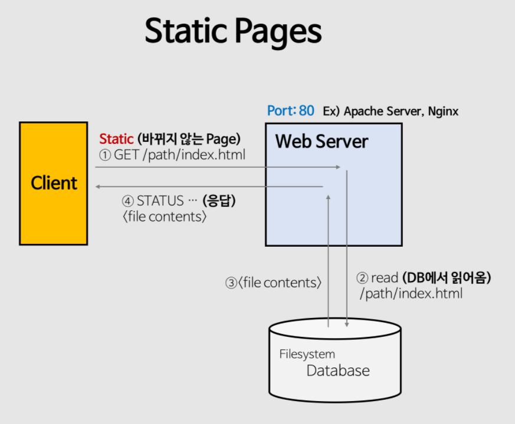
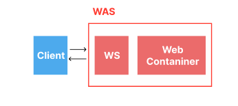
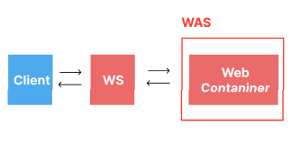
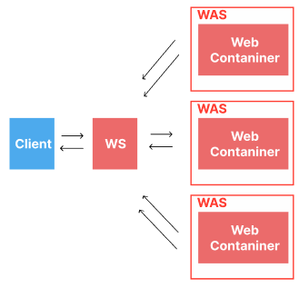

## WS

- 클라이언트로부터 HTTP 요청을 받으면 HTML 문서처럼 정적인 데이터를 반환하는 서버
- Apache Server
  - BSD, 리눅스 등 유닉스 계열 뿐만 아니라 윈도우같은 OS에도 운용가능한 서버
- NginX
  - Apache 보다 효율적이다. 비동기 event 방식으로 http request를 처리하기에 context switching 비용이 낮고 memory 효율성이 높기 때문

### WS 한계

- 동적인 컨텐츠 제공하지 못한다.

  → 따라서, 바뀌는 부분만 동적으로 가져와 페이지를 렌더링해주는 작업이 필요.
  이를 위해 데이터베이스 접근 및 동적 컨텐츠 처리 작업을 해줄 수 있는 WAS 사용

## WAS

- 동적 콘텐츠를 제공하는 서버이다.(DB조회, 웹 컨테이너 등)
- HTTP 프로토콜을 기반으로 사용자 컴퓨터나 장치에 애플리케이션을 수행해주는 미들웨어로서, 주로 데이터베이스 서버와 같이 수행된다.
- tomcat
  - http 서버 및 Java servlet container 웹서버와 연동해 실행할 수 있는 자바환경을 제공, JSP, 자바서블릿을 실행할 수 있음 메모리가 작기 때문에, 단순한 웹 응용 프로그램이나 전체 Java EE 서버가 필요없는 Spring과 같은 프레임 워크를 사용하는 응용 프로그램에 널리 사용됨
- WAS 별로 다양한 종류의 컨테이너를 내장
  - Container란 JSP, Servlet을 실행시킬 수 있는 소프트웨어를 말한다.
  - Servlet은 동적 웹 페이지를 만들 때 사용되는 자바 기반의 웹 애플리케이션 프로그래밍 기술
  - **Web Container는 Java 서블릿과 상호작용하는 WAS의 구성요소이다. 서블릿의 생명 주기를 관리(초기화, 메소드 호출, 가비지 컬렉션)하고, 서블릿과 웹서버의 통신과 멀티스레딩을 지원하며 선언적 보안 관리가 가능하게 한다.

→ WAS는 웹 서버의 기능들을 구조적으로 분리하여 처리하고자 하는 목적으로 제시되었다. 분산 트랜잭션, 보안, 메시징, 쓰레드 처리 등의 기능을 처리하는 분산 환경에서 사용된다. WAS는 프로그램 실행 환경과 DB 접속 기능을 제공하고, 여러 개의 트랜잭션을 관리 가능하다. 또한 비즈니스 로직을 수행할 수 있다.

### WAS 구조

1. **WAS에 WS가 포함된 구조**

   

  - WAS가 정적 컨텐츠를 처리하는 웹서버와 동적데이터를 처리하는 컨테이너를 모두 가지고 있는 경우
  - 사용자가 많아지고 처리해야 할 비즈니스 로직이 증가한다면 서버에 부담
2. **WS와 WAS를 분리**

   

  - 서버 부화 방지 WS와 WAS를 분리하면 WS는 정적 데이터만을 처리하고, WAS는 동적데이터만을 처리하기에, 위에서 언급한 서버과부화 문제를 해결할 수 있다.
  - 보안 강화 또 WS와 WAS 사이에 방화벽을 두거나, SSL을 통해 데이터를 패킷화하고 암호복호화를 통해 전달할 수 있어 보안 강화에 좋음
3. **WS에 여러대의 WAS가 존재**

   

  - Web Sever를 통해 WAS의 부하가 최소화되는 쪽으로 처리 가능(로드 밸런싱)
  - 에러 핸들링 가능 → 하나의 WAS가 작동하지 않을 떄 다른 WAS가 해당 요청을 처리
  - 여러 웹 어플리케이션 서비스 가능 하나의 서버에 PHP, JAVA 어플리케이션을 함께 사용할 수 있어 기존 WAS에 새로운 웹 어플리케이션을 추가하는 경우 유동적으로 프로그래밍 가능.

---

## 예상질문

**번거롭게 Web Server와 WAS 둘 다 사용하지 않고 WAS만 사용하면 되지 않을까요? 둘을 분리한 이유가 있을까요?**

이는 Web Server를 WAS 앞에 둠으로써 얻는 이점을 살펴보면 이유를 알 수 있습니다.

1. 기능을 분리하여 서버 부하 방지

Web Server를 두는 가장 큰 이유입니다.  만약 정적 콘텐츠 요청까지 WAS가 처리한다면 정적 데이터 처리로 인해 부하가 커지게 되고, 동적 콘텐츠의 처리가 지연됨에 따라 수행 속도가 느려집니다.  그렇기에 단순한 정적 컨텐츠 요청은 Web Server에서 빠르게 클라이언트에 제공하여 WAS로 넘어오지 않게 막는 것이 좋습니다.

2. 물리적으로 분리하여 보안 강화

WebServer와 WAS는 Port번호가 다릅니다. 이렇게 물리적으로 두 개의 서버를 완전히 분리하여 보안을 강화시켜 줄 수 있습니다. 또한 SSL에 대한 암복호화 처리에 Web Server를 사용하여 웹 서비스에 대한 보안을 강화시켜줄 수 있습니다.

3. 여러 대의 WAS를 연결 가능

Web Server하나에 여러 대의 WAS를 설치하고 Load Balancing을 하여 WAS의 부하를 더 낮춰줄 수도 있습니다.