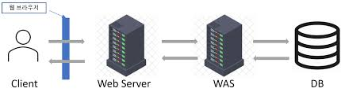

# Web Sever

- 정적인 콘텐츠(HTML, CSS, 이미지 등)를 제공하는 서버
- HTTP  프로토콜을 이용하여 클라이언트에게 웹 페이지를 제공
- Apache, Nginx, IIS

# Web Application Sever(WAS) 

- 동적인 콘텐츠(웹 애플리케이션)를 처리하고 제공하는 서버 (정적인 콘텐츠도 처리는 가능함.)
- 웹 애플리케이션 실행 및 데이터 처리
- Tomcat, JBoss, WebLogic, WebSphere

# Web Sever와 WAS를 같이 사용 하는 이유
1. 서버 부하 방지   
WAS와 웹 서버를 분리하여 WAS는 DB 조회나 다양한 로직을 처리하고, 단순한 정적 컨텐츠는 웹 서버에서 처리함으로써 WAS에서는 비즈니스 로직에 대한 부분만 담당해서 처리할 수 있음.
2. 보안 강화   
SSL에 대한 암호화, 복호화 처리에 웹 서버를 사용 가능 SSL에 대한 암호화, 복호화 처리에 웹 서버를 사용 가능
3. 여러 대의 WAS 연결 가능   
여러 개의 서버를 사용하는 대용량 웹 어플리케이션의 경우 웹 서버와 WAS를 분리하여 로드 밸런싱을 수행할 수 있고 무중단 배포가 가능하다.
4. 여러 웹 어플리케이션 서비스 가능   
하나의 서버에서 PHP, JAVA 애플리케이션을 함께 사용할 수 있다.

### 면접 질문
- **Web Server와 Web Application Server의 차이점을 설명해주세요"**  
동적인 컨텐츠를 다룰 수 있는가? 의 차이입니다. Web Sever의 경우 html, css, 이미지 등 정적인 컨텐츠만 처리가 가능한데 비해,   
WAS의 경우 동적인 컨텐츠와 정적인 컨텐츠 둘 다 처리가 가능합니다.   
다만 WAS의 경우 정적인 컨텐츠까지도 처리가 가능한데 WebSever를 보통 WAS의 앞에 두고 정적과 동적 컨텐츠를 따로 처리하는 이유는   
정적 컨텐츠를 WebSever에서 담당해서 처리함으로써 WAS가 비즈니스 로직 부분에만 집중할 수 있게 하여 서버 부하를 줄일 수 있고  
최근 WebSever 소프트웨어의 경우 기본적인 역할을 넘어서 리버스 프록시 서버의 역할로 로드 밸런싱, 보안, 캐싱 등 다양한 기능을 수행할 수 있기 때문입니다.
