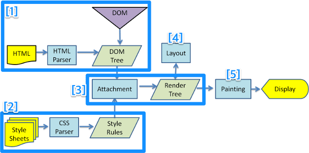
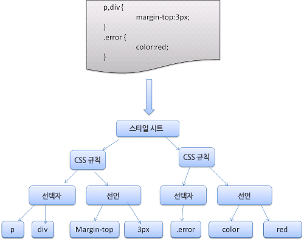

# 브라우저 동작 방법

## 웹 브라우저

- 웹 서버에서 양방향으로 통신을 하며 HTML 문서, 멀티미디어 등의 컨텐츠를 열람할 수 있게 해주는
  **GUI 기반의 소프트웨어 프로그램**
- 브라우저는 페이지를 다운로드하기 위해 응용 계층의 **HTTP 프로토콜**을 이용해 데이터를 송신/수신

## 웹 브라우저 동작원리

- 자원(Resource)을 서버에 **요청**(Request)하고, **응답**(Response)을 브라우저에 **렌더링**한다.(Render).

1. **사용자**
   1. 브라우저를 통해 찾고 싶은 웹 페이지의 **URL 주소**를 입력
2. **DNS 서버**
   1. 사용자가 입력한 URL 주소 중 **도메인 네임을 검색**하고, 도메인 네임에 일치하는 **IP 주소**를 찾아, 사용자가 입력한 **URL 정보와 함께 전달**
3. **HTTP 프로토콜**
   1. 전달 받은 IP 주소와 웹 페이지 URL 정보는 HTTP 프로토콜을 사용해 **HTTP 요청 메세지**를 생성
4. **TCP/IP 프로토콜**
   1. HTTP 요청 메세지는 **TCP 프로토콜** 사용해 인터넷을 거쳐 해당 IP 컴퓨터로 전송
   2. 도착한 HTTP 요청 메세지는, HTTP 프로토콜을 이용해 **웹 페이지 URL 정보**로 변환
5. **웹 서버**
   1. 변환된 정보에 해당하는 데이터를 검색하여 찾아낸 뒤, **HTTP 응답 메세지**를 생성
   2. 생성된 HTTP 응답 메세지는 다시 **TCP 프로토콜**을 사용해 인터넷을 거쳐 **사용자의 컴퓨터로 전송**
   3. 도착한 HTTP 응답 메세지는, HTTP 프로토콜을 이용해 **웹 페이지 데이터**로 변환
6. **웹 브라우저**
   1. 변환된 데이터가 웹 브라우저에 출력되어 사용자가 볼 수 있게 된다

## 브라우저 구조

1. 사용자인터페이스 : 주소 표시줄, 이전/다음 버튼, 북마크 메뉴 등 유저와 가장 밀접하게 맞닿아있는 부분
2. 브라우저 엔진 : **사용자 인터페이스와 렌더링 엔진 사이의 동작을 제어**하는 엔진
   1. HTML 문서와 기타 지원의 웹페이지를 사용자의 장치에 **시각 표현으로 변환**시키며, **문서 객체 모델(DOM) 자료구조를 구현**한다.
   2. **레이아웃 엔진(Layout Engine)**이라고도 불리며, 렌더링 엔진과 밀접하게 연관이 있어 브라우저 엔진과 렌더링 엔진을 묶어 브라우저 엔진이라고 부르기도 한다.
   3. 웹 브라우저마다 전용 브라우저 엔진을 사용한다.
      1. 크롬, 사파리 : 웹킷(Webkit) 엔진 사용
      2. 파이어폭스 : 게코(Gecko) 엔진 사용
3. 렌더링 엔진 : 요청한 **콘텐츠를 화면에 출력**하는 엔진
4. 통신(networking) : HTTP 요청과 같은 **네트워크 호출**에 사용, 플랫폼의 독립적인 인터페이스로 구성
5. UI 백엔드 : 플랫폼에서 명시하지 않은 일반적 인터페이스. 콤보 박스 창같은 기본적 장치를 그림
6. 자바스크립트 해석기 : 자바스크립트 코드를 해석하고 실행
7. 자료저장소 : 쿠키 등 모든 종류의 자원을 하드 디스크에 저장하는 계층

### 렌더링 엔진의 동작 원리

1. 브라우저는 서버로부터 HTML 문서를 모두 전달 받는다.
2. 렌더링 엔진은 전달받은 HTML 문서 파싱하여 DOM 트리를 구축한다.
3. 외부 CSS 파일과 함께 포함된 스타일 요소를 파싱한다.
4. DOM 트리와 3의 결과물을 합쳐 렌더 트리를 구축한다.
5. 렌더 트리의 각 노드에 대해서 화면 상에서 어디에 배치할 지 결정한다.
6. UI백엔드에서 렌더 트리를 그리게 되고, 화면에 우리가 볼 수 있도록 출력된다.

### 렌더링 엔진의 동작과정 예시 - 웹킷 렌더링 엔진(크롬, 사파리)

1. DOM 트리 구축

   

   **브라우저**는 서버로부터 **HTML 문서를 모두 전달 받는다.**

   - 어휘와 구문을 분석하여 **HTML 문서를 파싱**하고, **파싱 트리를 생성**한다. 문서 파싱은 브라우저가 코드를 이해하고 사용할 수 있는 구조로 변환하는 것을 의미한다.
   - 파싱 트리를 기반으로 DOM 요소와 속성 노드를 가지는 **DOM 트리를 생성**한다.

1. CSSOM(CSS Object Model) 생성

   

   1. 1의 **DOM**을 **생성**할 때 거쳤던 **과정**을 그대로 **CSS에 반복**
   2. 결과로 **브라우저가 이해하고 처리할 수 있는 형식(Style Rules)으로 변환**

1. 렌더 트리(DOM + CSSOM) 생성

   

   1. DOM Tree가 구축이 되어가는 동안 브라우저는 **DOM Tree를 기반으로 렌더 트리를 생성**
   2. 문서를 **시각적인 구성** 요소로 만들어주는 역할

1. 렌더 트리 배치 : 렌더링 트리는 위치와 크기를 가지고 있지 않기 때문에, 객체들에게 **위치와 크기를 결정**
1. 렌더 트리 그리기
   1. 렌더 트리의 각 노드를 화면의 픽셀로 나타낸다.
   2. 렌더 트리 그리기가 완료되면, 화면에 콘텐츠가 표현된다.

## 요약

- 주소창에 url을 입력하고 Enter를 누르면, **서버에 요청이 전송**
- 해당 페이지에 존재하는 여러 자원들(text, image 등등)이 보내짐
- 이제 브라우저는 해당 자원이 담긴 html과 스타일이 담긴 css를 W3C 명세에 따라 해석
  - 이 역할을 하는 것이 **'렌더링 엔진'**
- 렌더링 엔진은 우선 html 파싱 과정을 시작. html 파서가 문서에 존재하는 어휘와 구문을 분석하면서 DOM 트리를 구축
- 다음엔 css 파싱 과정 시작. css 파서가 모든 css 정보를 스타일 구조체로 생성
- 이 2가지를 연결시켜 **렌더 트리**를 만듬. 렌더 트리를 통해 문서가 **시각적 요소를 포함한 형태로 구성**된 상태
- 화면에 배치를 시작하고, UI 백엔드가 노드를 돌며 형상을 그림
- 이때 빠른 브라우저 화면 표시를 위해 '배치와 그리는 과정'은 페이지 정보를 모두 받고 한꺼번에 진행되지 않음. 자원을 전송받으면, **기다리는 동시에 일부분 먼저 진행하고 화면에 표시**함

---
